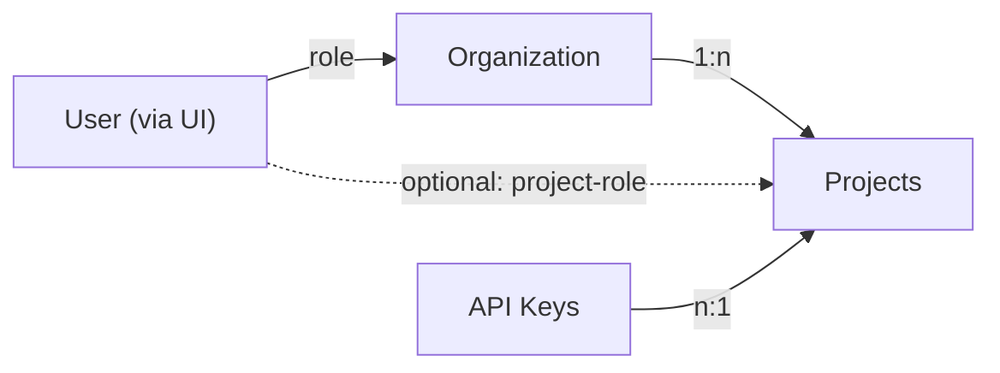

# Langfuse의 역할 기반 접근 제어

Langfuse의 역할 기반 접근 제어(RBAC)는 사용자, 조직, 프로젝트, 역할을 기반으로 합니다:

- `Users`는 Langfuse에 접근하는 [인증](/docs/administration/authentication-and-sso)된 개인입니다.
- `Organizations`는 프로젝트를 포함하는 최상위 엔터티입니다.
- `Projects`는 세밀한 역할 기반 접근 제어(RBAC)를 위해 모든 Langfuse 데이터를 그룹화합니다.
- `Roles`는 조직 및 프로젝트 내에서 사용자의 권한을 정의합니다:
  - 기본적으로 사용자는 조직 수준에서 역할이 할당됩니다.
  - 더 세밀한 제어를 위해 사용자에게 프로젝트 역할을 할당할 수 있습니다. 이는 동일한 조직 내의 여러 프로젝트에 대해 서로 다른 권한을 구분하고자 할 때 유용합니다.

`API Keys`는 Langfuse API를 인증하는 데 사용됩니다. API 키는 프로젝트와 연결되어 있으며 해당 프로젝트의 데이터에 프로그래밍 방식으로 접근하는 데 사용할 수 있습니다. API 키는 사용자에 연결되지 않습니다.

## 조직 및 프로젝트 접근

상단 내비게이션 바의 드롭다운을 사용하여 조직과 프로젝트 간에 쉽게 전환할 수 있습니다.

<Video
  src="https://static.langfuse.com/docs-videos/project_menu.mp4"
  gifStyle
  aspectRatio={768 / 452}
  className="max-w-sm"
/>

## 역할 및 범위

- `Owner`: 모든 권한을 가집니다
- `Admin`: 프로젝트 설정을 편집하고 다른 사용자에게 접근 권한을 부여할 수 있습니다
- `Member`: 모든 메트릭을 조회하고 점수를 생성할 수 있지만 프로젝트를 구성할 수는 없습니다
- `Viewer`: 프로젝트 및 조직에 대한 읽기 전용 접근 권한을 가지며, 대부분의 구성이 숨겨집니다
- `None`: 조직에 대한 기본 접근 권한이 없으며, 사용자가 단일 프로젝트에만 접근해야 할 때 사용됩니다

import {
  Accordion,
  AccordionContent,
  AccordionItem,
  AccordionTrigger,
} from "@/components/ui/accordion";

export function RolePermissionTable({ roleScopes }) {
  return (
    

      {Object.entries(roleScopes).map(([role, scopes]) => (
        

          
{role}

          {scopes
            .sort((a, b) => a.localeCompare(b))
            .map((scope) => (
              

                {scope}
              

            ))}
        

      ))}
    

  );
}

<Accordion type="single" collapsible>
  <AccordionItem value="organization-scopes">
    <AccordionTrigger>조직 수준 범위</AccordionTrigger>
    <AccordionContent className="overflow-x-auto">
      <RolePermissionTable
        roleScopes={{
          OWNER: [
            "projects:create",
            "projects:transfer_org",
            "organization:CRUD_apiKeys",
            "organization:update",
            "organization:delete",
            "organizationMembers:CUD",
            "organizationMembers:read",
            "langfuseCloudBilling:CRUD",
          ],
          ADMIN: [
            "projects:create",
            "projects:transfer_org",
            "organization:CRUD_apiKeys",
            "organization:update",
            "organizationMembers:CUD",
            "organizationMembers:read",
          ],
          MEMBER: ["organizationMembers:read"],
          VIEWER: [],
          NONE: [],
        }}
      />
    </AccordionContent>
  </AccordionItem>
  <AccordionItem value="project-scopes">
    <AccordionTrigger>프로젝트 수준 범위</AccordionTrigger>
    <AccordionContent className="overflow-x-auto">
      <RolePermissionTable
        roleScopes={{
          OWNER: [
            "project:read",
            "project:update",
            "project:delete",
            "projectMembers:read",
            "projectMembers:CUD",
            "apiKeys:read",
            "apiKeys:CUD",
            "integrations:CRUD",
            "objects:publish",
            "objects:bookmark",
            "objects:tag",
            "traces:delete",
            "scores:CUD",
            "scoreConfigs:CUD",
            "scoreConfigs:read",
            "datasets:CUD",
            "prompts:CUD",
            "prompts:read",
            "promptProtectedLabels:CUD",
            "models:CUD",
            "evalTemplate:CUD",
            "evalTemplate:read",
            "evalJob:CUD",
            "evalJob:read",
            "evalJobExecution:read",
            "evalDefaultModel:CUD",
            "evalDefaultModel:read",
            "llmApiKeys:read",
            "llmApiKeys:create",
            "llmApiKeys:update",
            "llmApiKeys:delete",
            "llmSchemas:CUD",
            "llmSchemas:read",
            "llmTools:CUD",
            "llmTools:read",
            "batchExports:create",
            "batchExports:read",
            "comments:CUD",
            "comments:read",
            "annotationQueues:read",
            "annotationQueues:CUD",
            "annotationQueueAssignments:read",
            "annotationQueueAssignments:CUD",
            "promptExperiments:CUD",
            "promptExperiments:read",
            "auditLogs:read",
            "dashboards:read",
            "dashboards:CUD",
            "TableViewPresets:CUD",
            "TableViewPresets:read",
            "automations:CUD",
            "automations:read",
          ],
          ADMIN: [
            "project:read",
            "project:update",
            "projectMembers:read",
            "projectMembers:CUD",
            "apiKeys:read",
            "apiKeys:CUD",
            "integrations:CRUD",
            "objects:publish",
            "objects:bookmark",
            "objects:tag",
            "traces:delete",
            "scores:CUD",
            "scoreConfigs:CUD",
            "scoreConfigs:read",
            "datasets:CUD",
            "prompts:CUD",
            "prompts:read",
            "promptProtectedLabels:CUD",
            "models:CUD",
            "evalTemplate:CUD",
            "evalTemplate:read",
            "evalJob:CUD",
            "evalJob:read",
            "evalJobExecution:read",
            "evalDefaultModel:CUD",
            "evalDefaultModel:read",
            "llmApiKeys:read",
            "llmApiKeys:create",
            "llmApiKeys:update",
            "llmApiKeys:delete",
            "llmSchemas:CUD",
            "llmSchemas:read",
            "llmTools:CUD",
            "llmTools:read",
            "batchExports:create",
            "batchExports:read",
            "comments:CUD",
            "comments:read",
            "annotationQueues:read",
            "annotationQueues:CUD",
            "annotationQueueAssignments:read",
            "annotationQueueAssignments:CUD",
            "promptExperiments:CUD",
            "promptExperiments:read",
            "auditLogs:read",
            "dashboards:read",
            "dashboards:CUD",
            "TableViewPresets:CUD",
            "TableViewPresets:read",
            "automations:CUD",
            "automations:read",
          ],
          MEMBER: [
            "project:read",
            "projectMembers:read",
            "apiKeys:read",
            "objects:publish",
            "objects:bookmark",
            "objects:tag",
            "scores:CUD",
            "scoreConfigs:CUD",
            "scoreConfigs:read",
            "datasets:CUD",
            "prompts:CUD",
            "prompts:read",
            "evalTemplate:CUD",
            "evalTemplate:read",
            "evalJob:read",
            "evalJob:CUD",
            "evalJobExecution:read",
            "evalDefaultModel:read",
            "evalDefaultModel:CUD",
            "llmApiKeys:read",
            "llmSchemas:read",
            "llmTools:read",
            "batchExports:create",
            "batchExports:read",
            "comments:CUD",
            "comments:read",
            "annotationQueues:read",
            "annotationQueues:CUD",
            "annotationQueueAssignments:read",
            "promptExperiments:CUD",
            "promptExperiments:read",
            "dashboards:read",
            "dashboards:CUD",
            "TableViewPresets:CUD",
            "TableViewPresets:read",
            "automations:read",
          ],
          VIEWER: [
            "project:read",
            "prompts:read",
            "evalTemplate:read",
            "scoreConfigs:read",
            "evalJob:read",
            "evalJobExecution:read",
            "evalDefaultModel:read",
            "llmApiKeys:read",
            "llmSchemas:read",
            "llmTools:read",
            "comments:read",
            "annotationQueues:read",
            "promptExperiments:read",
            "dashboards:read",
            "TableViewPresets:read",
            "automations:read",
          ],
          NONE: [],
        }}
      />
    </AccordionContent>
  </AccordionItem>
</Accordion>

## 사용자 관리

### 조직에 새 사용자 추가

조직 설정에서 이메일 주소를 통해 사용자를 추가하고 역할을 할당할 수 있습니다. 사용자는 이메일 알림을 받게 되며, 로그인하면 조직에 접근할 수 있게 됩니다. 아직 Langfuse 계정이 없는 사용자는 가입할 때까지 대기 중인 초대로 표시됩니다.

### 사용자 역할 변경

`members:CUD` 권한을 가진 사용자는 누구나 조직 설정에서 사용자의 역할을 변경할 수 있습니다. 이는 조직 내 모든 프로젝트에 걸쳐 해당 사용자의 권한에 영향을 미칩니다. 사용자는 자신의 역할과 같거나 낮은 역할만 할당할 수 있습니다.

## 프로젝트 관리

### 새 프로젝트 추가

`projects:create` 권한을 가진 사용자는 누구나 Langfuse 조직 내에서 새 프로젝트를 생성할 수 있습니다.

### 다른 조직으로 프로젝트 이전

`projects:transfer_organization` 권한을 가진 사용자만 프로젝트를 다른 조직으로 이전할 수 있습니다. 이렇게 하면 프로젝트가 현재 조직에서 제거되고 새 조직에 추가됩니다. 프로젝트에 대한 접근 권한은 새 조직에 구성된 역할에 따라 달라집니다.

이 과정에서 데이터는 손실되지 않으며, 모든 프로젝트 설정, 데이터, 구성이 새 조직으로 이전됩니다. API 키, 설정(접근 관리 제외), 데이터가 변경되지 않고 프로젝트와 계속 연결되므로 프로젝트는 완전히 정상적으로 작동합니다. 모든 기능(예: 트레이싱, 프롬프트 관리)이 중단 없이 계속 작동합니다.

## 프로젝트 수준 역할

<AvailabilityBanner
  availability={{
    hobby: "not-available",
    core: "not-available",
    pro: "team-add-on",
    enterprise: "full",
    selfHosted: "ee",
  }}
/>

사용자는 기본적으로 자신이 속한 조직의 역할을 상속받습니다. 더 세밀한 제어를 위해 프로젝트 수준에서 사용자에게 역할을 할당할 수 있습니다. 이는 동일한 조직 내의 여러 프로젝트에 대해 서로 다른 권한을 구분하고자 할 때 유용합니다.

프로젝트 수준 역할이 할당되면 해당 프로젝트에 대해 조직 수준 역할을 재정의합니다.

조직 내 특정 프로젝트에만 사용자에게 접근 권한을 부여하려면, 조직 수준에서 역할을 `None`으로 설정한 다음 프로젝트 수준에서 역할을 할당하면 됩니다.

## 관련 리소스

- 사용자, 역할, 프로젝트, API 키를 프로그래밍 방식으로 관리하기 위한 [SCIM & 조직 API](/docs/administration/scim-and-org-api)
- 프로덕션, 스테이징, 개발을 위한 [프로젝트 및 환경 구성 방법](/faq/all/managing-different-environments)

## GitHub 토론

import { GhDiscussionsPreview } from "@/components/gh-discussions/GhDiscussionsPreview";

<GhDiscussionsPreview labels={["feat-rbac"]} />
