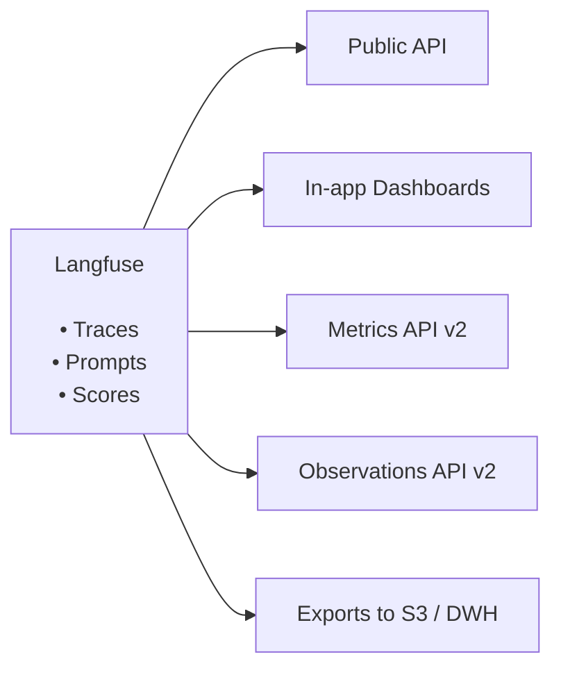

# API & 데이터 플랫폼

**Langfuse는 열려 있고, 확장 가능하며, 유연하게 설계되었습니다** ([_왜 langfuse인가?_](/why) 참고). Langfuse를 사용하는 사람들은 이를 기반으로 다양한 워크플로우와 커스터마이징을 구축하고 있습니다. 이는 저희의 오픈 데이터 플랫폼을 통해 지원됩니다.

예시 사용 사례:

- Langfuse에서 추적한 LLM 비용을 기반으로 한 청구
- 외부 대시보드에서의 온라인 평가 리포팅
- 트레이스의 원본 데이터 내보내기를 활용한 파인튜닝
- 데이터 웨어하우스에서 관찰된 사용자 행동과 LLM 평가 간의 상관관계 분석

## 시작하기

무엇을 만들고자 하는지에 따라 데이터 접근 경로를 선택하세요:

| 목표                                                        | 권장 경로                                                                          |
| ----------------------------------------------------------- | ---------------------------------------------------------------------------------- |
| 집계된 비용, 사용량, 지연 시간, 볼륨, 또는 점수 메트릭 조회 | [Metrics API v2](/docs/metrics/features/metrics-api#v2)                            |
| 행 단위의 스팬, 생성, 또는 이벤트 조회                      | [Observations API v2](/docs/api-and-data-platform/features/observations-api#v2)    |
| Python 또는 JS/TS에서 API 사용                              | [SDK를 통한 쿼리](/docs/api-and-data-platform/features/query-via-sdk)              |
| 대량의 데이터를 정기적으로 내보내기                         | [Blob Storage Export](/docs/api-and-data-platform/features/export-to-blob-storage) |
| 필터링된 일회성 내보내기 다운로드                           | [UI에서 내보내기](/docs/api-and-data-platform/features/export-from-ui)             |
| 프롬프트, 데이터셋, 프로젝트 및 기타 리소스 관리            | [Public API](/docs/api-and-data-platform/features/public-api)                      |

## 기능

import {
  Globe,
  Code,
  LayoutDashboard,
  Activity,
  Download,
  Cloud,
  Blocks,
  BarChart3,
  ListTree,
  Bot,
} from "lucide-react";

<Cards num={3}>
  <Card
    title="Langfuse for Agents"
    href="/agents"
    icon={<Bot />}
    arrow
  />
  <Card
    title="MCP Server"
    href="/docs/api-and-data-platform/features/mcp-server"
    icon={<Blocks />}
    arrow
  />
  <Card
    title="Public API"
    href="/docs/api-and-data-platform/features/public-api"
    icon={<Globe />}
    arrow
  />
  <Card
    title="Query via SDKs"
    href="/docs/api-and-data-platform/features/query-via-sdk"
    icon={<Code />}
    arrow
  />
  <Card
    title="Observations API"
    href="/docs/api-and-data-platform/features/observations-api"
    icon={<ListTree />}
    arrow
  />
  <Card
    title="Metrics API"
    href="/docs/metrics/features/metrics-api"
    icon={<BarChart3 />}
    arrow
  />
  <Card
    title="Export from UI"
    href="/docs/api-and-data-platform/features/export-from-ui"
    icon={<Download />}
    arrow
  />
  <Card
    title="Export to Blob Storage"
    href="/docs/api-and-data-platform/features/export-to-blob-storage"
    icon={<Cloud />}
    arrow
  />
  <Card
    title="Export to PostHog"
    href="/integrations/analytics/posthog"
    icon={
      

        
      

    }
    arrow
  />
  <Card
    title="Export to Mixpanel"
    href="/integrations/analytics/mixpanel"
    icon={
      

        
      

    }
    arrow
  />
</Cards>
