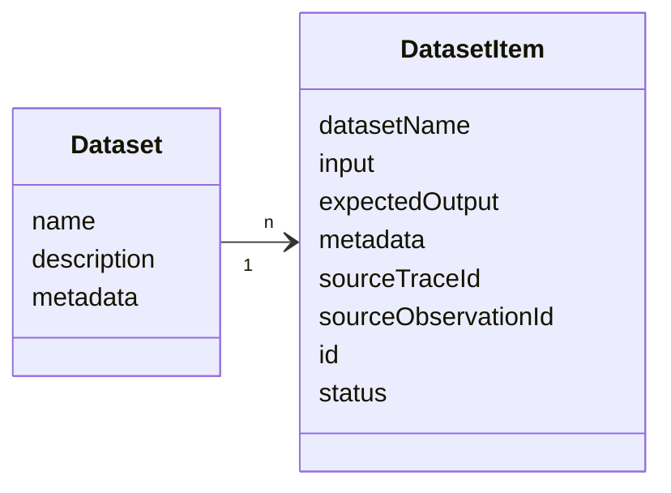
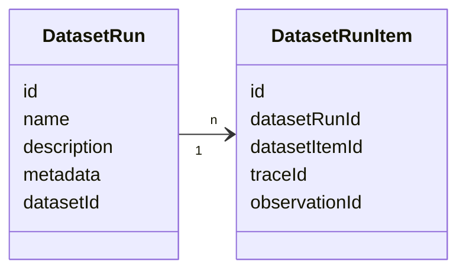
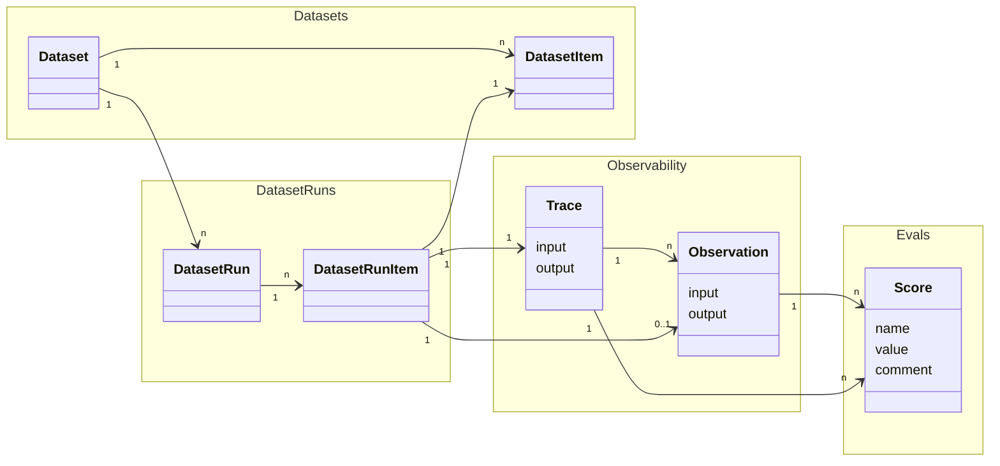

# 실험 데이터 모델

이 페이지에서는 Langfuse의 실험 관련 객체에 대한 데이터 모델을 설명합니다. 이러한 객체가 어떻게 함께 작동하는지에 대한 개요는 [개념](/docs/evaluation/core-concepts) 페이지를 참고하세요. 점수 및 점수 설정 객체에 대해서는 [점수 데이터 모델](/docs/evaluation/scores/data-model)을 참고하세요.

자세한 참고 자료는 다음을 확인하세요

- [Python SDK 레퍼런스](https://python.reference.langfuse.com)
- [JS/TS SDK 레퍼런스](https://js.reference.langfuse.com)
- [API 레퍼런스](https://api.reference.langfuse.com)

## 객체

### 데이터셋 [#datasets]

데이터셋은 Dataset run 중에 사용할 수 있는 입력값과, 선택적으로 예상 출력값의 모음입니다.

`Dataset`은 `DatasetItem`의 모음입니다.

#### Dataset 객체 [#dataset-object]

| Attribute                 | Type   | Required | Description                            |
| ------------------------- | ------ | -------- | -------------------------------------- |
| `id`                      | string | Yes      | 데이터셋의 고유 식별자                 |
| `name`                    | string | Yes      | 데이터셋 이름                          |
| `description`             | string | No       | 데이터셋 설명                          |
| `metadata`                | object | No       | 데이터셋에 대한 추가 메타데이터        |
| `remoteExperimentUrl`     | string | No       | 실험을 트리거하기 위한 웹훅 엔드포인트 |
| `remoteExperimentPayload` | object | No       | 실험을 트리거하기 위한 페이로드        |

#### DatasetItem 객체 [#datasetitem-object]

| Attribute             | Type          | Required | Description                                                                                                                                               |
| --------------------- | ------------- | -------- | --------------------------------------------------------------------------------------------------------------------------------------------------------- |
| `id`                  | string        | Yes      | 데이터셋 항목의 고유 식별자입니다. 데이터셋 항목은 id를 기준으로 upsert됩니다. id는 (프로젝트 수준에서) 고유해야 하며 데이터셋 간에 재사용할 수 없습니다. |
| `datasetId`           | string        | Yes      | 이 항목이 속한 데이터셋의 ID                                                                                                                              |
| `input`               | object        | No       | 데이터셋 항목의 입력 데이터                                                                                                                               |
| `expectedOutput`      | object        | No       | 데이터셋 항목의 예상 출력 데이터                                                                                                                          |
| `metadata`            | object        | No       | 데이터셋 항목에 대한 추가 메타데이터                                                                                                                      |
| `mediaReferences`     | object[]      | No       | `input`, `expectedOutput`, `metadata`에서 발견된 해석된 미디어 참조입니다. 해석된 데이터셋 미디어를 포함하는 SDK 데이터셋 fetch 및 API 응답에 포함됩니다. |
| `sourceTraceId`       | string        | No       | 이 데이터셋 항목을 연결할 소스 트레이스의 ID                                                                                                              |
| `sourceObservationId` | string        | No       | 이 데이터셋 항목을 연결할 소스 observation의 ID                                                                                                           |
| `status`              | DatasetStatus | No       | 데이터셋 항목의 상태입니다. 새로 생성된 항목은 기본적으로 ACTIVE입니다. 가능한 값: `ACTIVE`, `ARCHIVED`                                                   |

#### DatasetItemMediaReference 객체 [#datasetitemmediareference-object]

데이터셋 항목 미디어 참조는 `input`, `expectedOutput`, `metadata`에 저장된 미디어 토큰을 서명된 미디어 다운로드 URL과 연결합니다.

| Attribute         | Type   | Required       | Description                                                                                                                             |
| ----------------- | ------ | -------------- | --------------------------------------------------------------------------------------------------------------------------------------- |
| `field`           | string | Yes            | 참조가 포함된 데이터셋 항목 속성에 대한 필드 enum입니다. `input`, `expected_output`(`expectedOutput`에 해당), `metadata` 중 하나입니다. |
| `referenceString` | string | Yes            | 데이터셋 항목에 저장된 원본 Langfuse 미디어 참조 문자열입니다.                                                                          |
| `jsonPath`        | string | Yes            | 필드 내에서 참조를 담고 있는 문자열의 JSONPath입니다. 예: `$['image']`.                                                                 |
| `media`           | object | Yes (nullable) | 해석된 미디어 메타데이터입니다. 참조된 미디어가 존재하지 않거나 업로드에 성공하지 못한 경우 `null`입니다.                               |

중첩된 `media` 객체에는 `mediaId`, `contentType`, `contentLength`, `url`, `urlExpiry`가 포함됩니다. `url`은 서명된 다운로드 URL이며 만료일 이전에 사용해야 합니다. 서명된 URL을 갱신하려면 데이터셋을 다시 가져오세요.

### DatasetRun (Experiment Run) [#datasetrun-experiment-run]

Dataset run은 데이터셋을 LLM 애플리케이션에 통과시키고, 선택적으로 그 결과에 평가 방법을 적용하는 데 사용됩니다. 이는 흔히 Experiment run이라고 불립니다.

 

#### DatasetRun 객체 [#datasetrun-object]

| Attribute     | Type   | Required | Description                        |
| ------------- | ------ | -------- | ---------------------------------- |
| `id`          | string | Yes      | Dataset run의 고유 식별자          |
| `name`        | string | Yes      | Dataset run의 이름                 |
| `description` | string | No       | Dataset run에 대한 설명            |
| `metadata`    | object | No       | Dataset run에 대한 추가 메타데이터 |
| `datasetId`   | string | Yes      | 이 run이 속한 데이터셋의 ID        |

#### DatasetRunItem 객체 [#datasetrunitem-object]

| Attribute       | Type   | Required | Description                        |
| --------------- | ------ | -------- | ---------------------------------- |
| `id`            | string | Yes      | Dataset run item의 고유 식별자     |
| `datasetRunId`  | string | Yes      | 이 항목이 속한 dataset run의 ID    |
| `datasetItemId` | string | Yes      | 이 run에 연결할 데이터셋 항목의 ID |
| `traceId`       | string | Yes      | 이 run에 연결할 트레이스의 ID      |
| `observationId` | string | No       | 이 run에 연결할 observation의 ID   |

<Callout type="info">
대부분의 경우, DatasetRunItem이 TraceID를 직접 참조하는 것을 권장합니다. ObservationID에 대한 참조는 이전 SDK 버전과의 하위 호환성을 위해 존재합니다.
</Callout>

### End to End 데이터 관계 [#end-to-end-data-relations]

하나의 실험은 여러 Langfuse 객체를 결합할 수 있습니다:

- `DatasetRun`(또는 Experiment run)은 `Dataset`의 전체 또는 선택된 `DatasetItem`을 LLM 애플리케이션과 함께 순회하여 생성됩니다.
- LLM 애플리케이션에 입력으로 전달된 각 `DatasetItem`에 대해 `DatasetRunItem`과 `Trace`가 생성됩니다.
- 선택적으로, `DatasetRun` 중 LLM 애플리케이션의 출력을 평가하기 위해 `Trace`에 `Score`를 추가할 수 있습니다.

 

이러한 객체가 개념적으로 어떻게 함께 작동하는지에 대한 자세한 내용은 [개념 페이지](/docs/evaluation/core-concepts)를 참고하세요.
트레이스와 observation에 대한 자세한 내용은 [관측성 핵심 개념 페이지](/docs/observability/data-model)를 참고하세요.
점수 및 점수 설정 객체에 대한 자세한 내용은 [점수 데이터 모델](/docs/evaluation/scores/data-model)을 참고하세요.

## 함수 정의 [#function-definitions]

SDK를 통해 실험을 실행할 때, **task**와 **evaluator** 함수를 정의합니다. 이는 실험 러너가 각 데이터셋 항목에 대해 호출하는 사용자 정의 함수입니다. 실험이 개념적으로 어떻게 작동하는지에 대한 자세한 내용은 [개념 페이지](/docs/evaluation/core-concepts)를 참고하세요.

### Task [#task]

Task는 데이터셋 항목을 받아 실험 실행 중 출력을 반환하는 함수입니다.

함수 시그니처와 매개변수에 대해서는 SDK 레퍼런스를 참고하세요:

- [Python SDK: `TaskFunction`](https://python.reference.langfuse.com/langfuse/experiment#TaskFunction)
- [JS/TS SDK: `ExperimentTask`](https://js.reference.langfuse.com/types/_langfuse_client.ExperimentTask.html)

### Evaluator [#evaluator]

Evaluator는 단일 데이터셋 항목에 대해 task의 출력을 평가하는 함수입니다. Evaluator는 입력, 출력, 예상 출력, 메타데이터를 받아 Langfuse에서 Score가 되는 `Evaluation` 객체를 반환합니다.

함수 시그니처와 매개변수에 대해서는 SDK 레퍼런스를 참고하세요:

- [Python SDK: `EvaluatorFunction`](https://python.reference.langfuse.com/langfuse/experiment#EvaluatorFunction)
- [JS/TS SDK: `Evaluator`](https://js.reference.langfuse.com/types/_langfuse_client.Evaluator.html)

### Run Evaluator [#run-evaluator]

Run evaluator는 전체 실험 결과를 평가하고 집계 메트릭을 계산하는 함수입니다. Langfuse 데이터셋에서 실행되는 경우, 결과 점수는 dataset run에 연결됩니다.

함수 시그니처와 매개변수에 대해서는 SDK 레퍼런스를 참고하세요:

- [Python SDK: `RunEvaluatorFunction`](https://python.reference.langfuse.com/langfuse/experiment#RunEvaluatorFunction)
- [JS/TS SDK: `RunEvaluator`](https://js.reference.langfuse.com/types/_langfuse_client.RunEvaluator.html)

<Callout type="info">
Task와 evaluator의 자세한 사용 예시는 [SDK를 통한 실험](/docs/evaluation/experiments/experiments-via-sdk)을 참고하세요.
</Callout>

## 로컬 데이터셋 [#local-datasets]

현재 [SDK를 통한 실험](/docs/evaluation/experiments/experiments-via-sdk)을 사용하여 로컬 데이터셋에서 실험을 실행하는 경우, Langfuse에는 트레이스만 생성되며 dataset run은 생성되지 않습니다. 각 task 실행은 관측성과 디버깅을 위한 개별 트레이스를 생성합니다.

<Callout type="info">

Langfuse 데이터셋과 마찬가지로 로컬 데이터셋에서의 실험에 대해서도 run 개요, 비교 뷰 등과 같은 유사한 기능을 지원하기 위한 개선 사항을 로드맵에 반영하고 있습니다.

</Callout>
