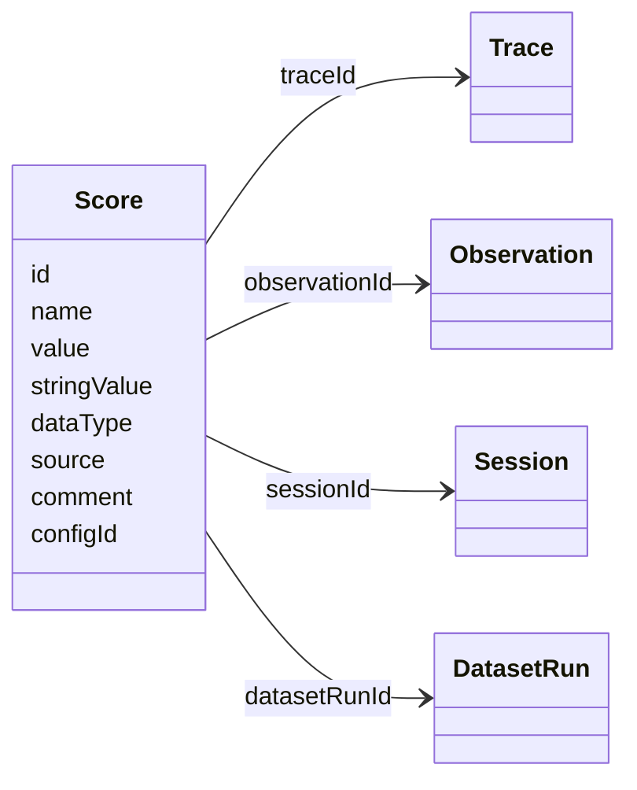
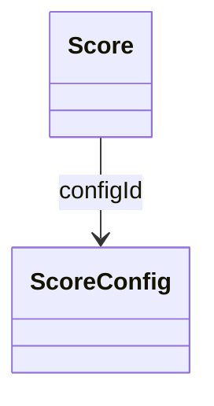

# 점수 데이터 모델

이 페이지에서는 Langfuse의 점수 관련 객체에 대한 데이터 모델을 설명합니다. 점수가 무엇이고 언제 사용해야 하는지에 대한 개요는 [점수 개요](/docs/evaluation/scores/overview)를 참고하세요. 데이터셋, 실험 실행, 함수 정의에 대해서는 [실험 데이터 모델](/docs/evaluation/experiments/data-model)을 참고하세요.

자세한 레퍼런스는 다음을 참고하세요

- [Python SDK 레퍼런스](https://python.reference.langfuse.com)
- [JS/TS SDK 레퍼런스](https://js.reference.langfuse.com)
- [API 레퍼런스](https://api.reference.langfuse.com)

## 점수 [#scores]

점수는 평가 결과를 저장하는 데이터 객체입니다. 트레이스, 관찰(observation), 세션, 또는 데이터셋 실행에 평가 점수를 할당하는 데 사용됩니다. 점수는 주석을 통해 수동으로 추가하거나, SDK/API를 통해 프로그래밍 방식으로 추가하거나, LLM-as-a-Judge 평가기를 통해 자동으로 추가할 수 있습니다.

 

점수는 다음과 같은 속성을 가집니다:

- 각 점수는 `Trace`, `Observation`, `Session`, `DatasetRun` 중 **정확히 하나**를 참조합니다
- 점수는 **숫자형(numeric)**, **범주형(categorical)**, **불리언(boolean)**, 또는 **텍스트(text)** 중 하나입니다 (자세한 내용은 [점수 유형](/docs/evaluation/scores/overview#score-types) 참고)
- 점수는 특정 스키마를 준수하도록 하기 위해 **선택적으로 `ScoreConfig`에 연결**할 수 있습니다

### Score 객체 [#score-object]

| 속성            | 유형   | 필수 여부 | 설명                                                                                                                                                                     |
| --------------- | ------ | --------- | ------------------------------------------------------------------------------------------------------------------------------------------------------------------------ |
| `id`            | string | Yes       | 점수의 고유 식별자입니다. SDK에 의해 자동으로 생성됩니다. 선택적으로 점수를 업데이트하기 위한 멱등성 키(idempotency key)로도 사용할 수 있습니다.                         |
| `name`          | string | Yes       | 점수의 이름입니다. 예: user_feedback, hallucination_eval                                                                                                                 |
| `value`         | number | No        | 점수의 숫자 값입니다. 숫자형 및 불리언 점수에는 항상 정의됩니다. 범주형 점수에는 선택 사항입니다. 텍스트 점수에는 사용되지 않습니다.                                     |
| `stringValue`   | string | No        | 점수의 문자열 값입니다. 범주형, 불리언(문자열 형태), 텍스트 데이터 유형에 사용됩니다. `configId`가 제공된 경우 config를 기반으로 범주형 점수에 대해 자동으로 설정됩니다. |
| `dataType`      | string | No        | `configId`가 제공된 경우 config의 데이터 유형을 기반으로 자동 설정됩니다. 그렇지 않으면 `NUMERIC`, `CATEGORICAL`, `BOOLEAN`, `TEXT` 중 하나로 직접 정의할 수 있습니다    |
| `source`        | string | Yes       | 점수의 출처를 기반으로 자동 설정됩니다. `API`, `EVAL`, `ANNOTATION` 중 하나입니다                                                                                        |
| `comment`       | string | No        | 평가 코멘트입니다. 사용자 피드백, 평가 근거(reasoning) 출력, 내부 메모 등에 흔히 사용됩니다                                                                              |
| `traceId`       | string | No        | 점수와 관련된 트레이스의 ID입니다                                                                                                                                        |
| `observationId` | string | No        | 점수와 관련된 관찰(예: LLM 호출)의 ID입니다                                                                                                                              |
| `sessionId`     | string | No        | 점수와 관련된 세션의 ID입니다                                                                                                                                            |
| `datasetRunId`  | string | No        | 점수와 관련된 데이터셋 실행의 ID입니다                                                                                                                                   |
| `configId`      | string | No        | 점수가 특정 스키마를 따르도록 하는 점수 config ID입니다. Langfuse UI 또는 API를 통해 정의할 수 있습니다.                                                                 |

### 일반적인 사용 사례 [#common-use-cases]

| 레벨        | 설명                                                                  |
| ----------- | --------------------------------------------------------------------- |
| Trace       | 단일 상호작용의 평가에 사용됩니다. (가장 일반적)                      |
| Observation | 트레이스 레벨 아래의 단일 관찰(observation)에 대한 평가에 사용됩니다. |
| Session     | 여러 상호작용에 걸친 출력의 종합적인 평가에 사용됩니다.               |
| Dataset Run | 데이터셋 실행(Dataset Run)의 성능 점수에 사용됩니다.                  |

## 점수 Config [#score-config]

점수 config는 점수가 특정 스키마를 따르도록 보장하는 데 사용됩니다. 점수 config를 사용하면 팀 전체에서 채점 스키마를 표준화하고, 향후 분석을 위해 점수가 일관되고 비교 가능하도록 할 수 있습니다.

`ScoreConfig`는 Langfuse UI 또는 API를 통해 정의할 수 있습니다. Config는 불변(immutable)이지만 보관(archive)할 수 있으며 언제든지 복원할 수 있습니다.

점수 config에는 다음이 포함됩니다:

- **점수 이름**
- **데이터 유형:** `NUMERIC`, `CATEGORICAL`, `BOOLEAN`, `TEXT`
- **점수 값 범위에 대한 제약 조건** (숫자형의 경우 최소/최대값, 범주형 데이터 유형의 경우 사용자 정의 카테고리, 텍스트의 경우 1~500자)

### ScoreConfig 객체 [#scoreconfig-object]

| 속성          | 유형    | 필수 여부 | 설명                                                                                      |
| ------------- | ------- | --------- | ----------------------------------------------------------------------------------------- |
| `id`          | string  | Yes       | 점수 config의 고유 식별자입니다.                                                          |
| `name`        | string  | Yes       | 점수 config의 이름입니다. 예: user_feedback, hallucination_eval                           |
| `dataType`    | string  | Yes       | `NUMERIC`, `CATEGORICAL`, `BOOLEAN`, `TEXT` 중 하나입니다                                 |
| `isArchived`  | boolean | No        | 점수 config가 보관(archive)되었는지 여부입니다. 기본값은 false입니다                      |
| `minValue`    | number  | No        | 숫자형 점수의 최소값을 설정합니다. 설정하지 않으면 최소값은 기본적으로 -∞입니다           |
| `maxValue`    | number  | No        | 숫자형 점수의 최대값을 설정합니다. 설정하지 않으면 최대값은 기본적으로 +∞입니다           |
| `categories`  | list    | No        | 범주형 점수에 대한 카테고리를 정의합니다. label-value 쌍으로 이루어진 객체의 리스트입니다 |
| `description` | string  | No        | 점수 config에 대한 추가 설명을 제공합니다                                                 |
