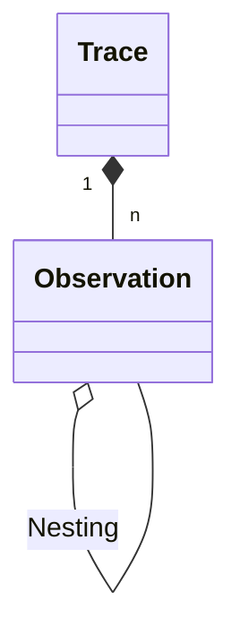
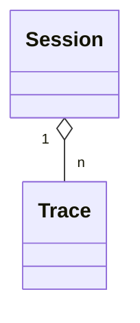
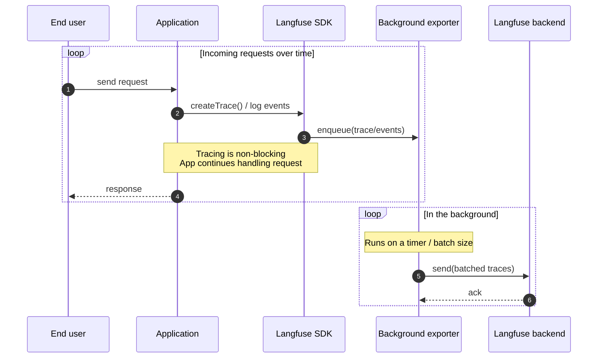
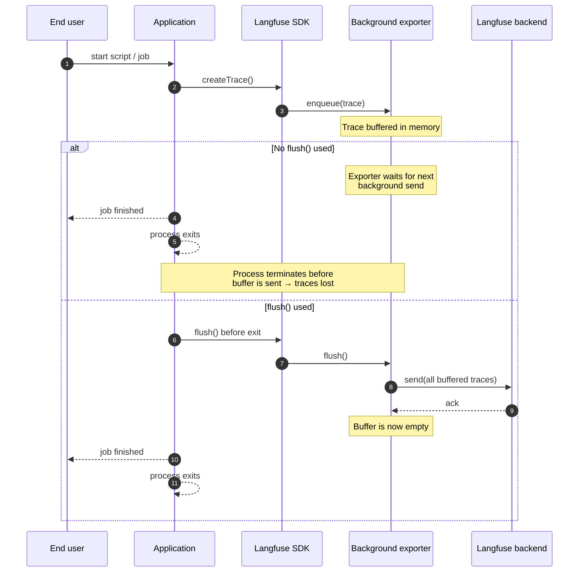

# 핵심 개념

이 페이지에서는 Langfuse가 데이터를 구조화하고 캡처하는 방식에 대한 기본 개념을 자세히 다룹니다. 이러한 개념을 이해하면 트레이스를 디버깅하고 다루기가 더 쉬워집니다.

바로 시작하고 싶다면 [Get Started 가이드](/docs/observability/get-started)를 확인하고 첫 번째 트레이스를 수집해 보세요.

## Observation, 트레이스, 세션

Langfuse는 애플리케이션의 데이터를 observation, 트레이스, 세션이라는 세 가지 핵심 개념으로 구성합니다.

<TracingHierarchyDiagram />

import ObservationTypesList from "@/components-mdx/observation-types-list.mdx";

### Observation

`Observation`은 트레이스 내의 개별 단계입니다. Langfuse는 LLM 애플리케이션에 특화된 다양한 [observation 타입](/docs/observability/features/observation-types)을 지원합니다. 예를 들어 _generation_, _toolcall_, _RAG 검색 단계_ 등이 있습니다.

Observation은 중첩될 수 있습니다. 아래 예시는 중첩된 observation을 가진 트레이스를 보여줍니다.

Langfuse에서 observation의 계층 구조

Langfuse UI의 트레이스 예시

Langfuse UI의 트레이스 예시

### 트레이스

`트레이스`는 일반적으로 단일 요청 또는 작업을 나타냅니다.
예를 들어 사용자가 챗봇에 질문을 하면, 사용자의 질문부터 봇의 응답까지의 상호작용이 하나의 트레이스로 캡처됩니다.

트레이스는 observation의 컨테이너 역할을 합니다. `user_id`, `session_id`, `tags`, `metadata` 등의 트레이스 속성은 트레이스 내의 모든 observation에 전파됩니다.

### 세션

트레이스는 선택적으로 [세션](/docs/observability/features/sessions)으로 그룹화할 수 있습니다.
세션은 동일한 사용자 상호작용의 일부인 트레이스를 그룹화하는 데 사용됩니다.
대표적인 예시로 채팅 인터페이스의 스레드가 있습니다.

세션은 선택적으로 트레이스를 집계합니다

Langfuse UI의 세션 예시

<Frame fullWidth></Frame>

멀티턴 대화나 워크플로가 있는 애플리케이션에는 세션 사용을 권장합니다. 트레이스에 세션을 추가하는 방법은 [세션](/docs/observability/features/sessions) 문서를 참고하세요.

## 속성 추가하기

데이터를 트레이스와 observation으로 구조화한 후에는 추가 속성으로 이를 보강할 수 있습니다. 이러한 속성은 특정 사용 사례에 맞춰 트레이스를 필터링, 세분화, 분석하는 데 도움이 되는 레이블 역할을 합니다.

추가할 수 있는 속성 유형은 다음과 같습니다.

| 속성                                                                      | 설명                                                                          |
| ------------------------------------------------------------------------- | ----------------------------------------------------------------------------- |
| [Environment](/docs/observability/features/environments)                  | `production`, `staging`, `development` 등 서로 다른 배포 환경의 데이터를 분리 |
| [Tags](/docs/observability/features/tags)                                 | 기능, API 엔드포인트, 워크플로별로 트레이스를 분류하는 유연한 레이블          |
| [User](/docs/observability/features/users)                                | 각 트레이스를 발생시킨 최종 사용자를 추적                                     |
| [Metadata](/docs/observability/features/metadata)                         | 사용자 지정 정보를 위한 유연한 키-값 저장소                                   |
| [Release & Version](/docs/observability/features/releases-and-versioning) | 애플리케이션 버전 및 구성 요소 변경 사항을 추적                               |

## Langfuse가 데이터를 캡처하는 방식

데이터 모델을 이해했으니, 이제 Langfuse가 실제로 트레이스를 캡처하고 처리하는 방식을 살펴보겠습니다.

### OpenTelemetry 기반

Langfuse는 애플리케이션에서 텔레메트리 데이터를 수집하기 위한 개방형 표준인 [OpenTelemetry](https://opentelemetry.io/)를 기반으로 구축되었습니다.

이는 Langfuse 전용 SDK만 사용해야 하는 것이 아니라는 의미입니다. LLM 관측성을 위한 Langfuse와 인프라 모니터링을 위한 Datadog처럼, 여러 대상으로 동시에 트레이스를 전송할 수도 있습니다.

Langfuse와 OpenTelemetry를 통합하는 방법에 대한 자세한 문서는 [OpenTelemetry 통합 가이드](/integrations/native/opentelemetry)를 참고하세요.

#### 계측(Instrumentation)

계측(instrumentation)이란 애플리케이션이 수행하는 작업을 기록하기 위해 코드를 추가하는 과정입니다. 이 기록 기능이 활성화되면 Langfuse는 (OpenTelemetry를 통해) 이러한 이벤트를 자동으로 캡처하여 트레이스와 observation으로 구조화할 수 있습니다.

[Get Started 가이드](/docs/observability/get-started)에서는 애플리케이션의 함수를 계측하는 과정을 안내합니다.

### 백그라운드 처리

애플리케이션 속도 저하를 방지하기 위해 Langfuse는 트레이스가 생성되는 즉시 동기적으로 전송하지 않습니다.
대신 Langfuse는 트레이스를 로컬에서 배치로 묶어 백그라운드에서 전송함으로써 애플리케이션을 빠르고 응답성 있게 유지합니다.

#### 장기 실행 애플리케이션

위와 같은 방식은 웹 서버나 API처럼 장기 실행되는 애플리케이션에 적합합니다. 백그라운드 exporter가 계속 실행되면서 자체적으로 배치를 플러시할 충분한 시간을 가지기 때문입니다.

#### 단기 실행 애플리케이션

시작하여 무언가를 실행하고 빠르게 종료되는 애플리케이션(단기 실행 애플리케이션)의 경우, 아직 전송되지 않은 트레이스가 큐에 남아 있는 상태에서 애플리케이션이 종료될 위험이 있습니다.

데이터 손실을 방지하려면 단기 실행 애플리케이션은 **종료하기 전에 반드시 [`flush()`](/docs/observability/features/queuing-batching#manual-flushing)를 명시적으로 호출해야 합니다**. 이렇게 하면 exporter가 버퍼에 있는 모든 트레이스를 즉시 전송하도록 강제되어, 프로세스가 종료될 때 데이터가 손실되지 않습니다.

