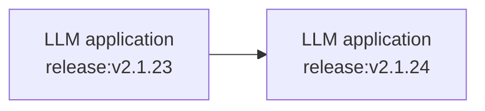
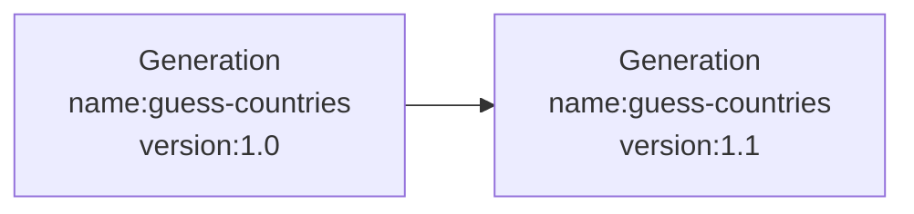

import { PropagationRestrictionsCallout } from "@/components/PropagationRestrictionsCallout";

# 릴리스 및 버전 관리

LLM 앱에 대한 변경 사항이 Langfuse의 메트릭에 미치는 영향을 추적할 수 있습니다. 이를 통해 다음이 가능합니다:

- 프로덕션 환경에서 **실험(A/B 테스트)을 실행**하여 비용, 지연 시간, 품질에 미치는 영향을 측정합니다.
  - _예시_: "새로운 모델로 전환하면 어떤 영향이 있을까?"
- 시간에 따른 **메트릭 변화를 설명**합니다.
  - _예시:_ "이 체인의 지연 시간이 왜 증가했을까?"

## 릴리스



`release`는 애플리케이션의 전체 버전을 추적합니다. 일반적으로 애플리케이션의 _시맨틱 버전_ 또는 *git 커밋 해시*로 설정합니다.

SDK는 다음 순서로 `release`를 탐색합니다:

1. SDK 초기화
2. 환경 변수
3. 널리 사용되는 배포 플랫폼에서 자동으로 설정되는 릴리스 식별자

### 초기화

<LangTabs items={["Python SDK", "JS/TS SDK", "Environment variable"]}>

<Tab title="Python SDK">

Python SDK는 클라이언트를 초기화할 때 릴리스를 설정할 수 있습니다:

```python
from langfuse import Langfuse

# 클라이언트를 초기화할 때 릴리스를 설정합니다
langfuse = Langfuse(release="v2.1.24")
```

</Tab>
<Tab>

JS/TS SDK는 `LANGFUSE_RELEASE` 환경 변수를 탐색합니다. CI/CD 파이프라인 등에서 이를 사용해 릴리스를 설정하세요.

```bash
LANGFUSE_RELEASE = "<release_tag>" # <- github sha or other identifier
```

</Tab>
<Tab title="Environment variable">

SDK는 `LANGFUSE_RELEASE` 환경 변수를 탐색합니다. CI/CD 파이프라인 등에서 이를 사용해 릴리스를 설정하세요.

```bash
LANGFUSE_RELEASE = "<release_tag>" # <- github sha or other identifier
```

</Tab>

</LangTabs>

**널리 사용되는 플랫폼에서 자동 설정**

다른 `release`가 설정되어 있지 않으면 Langfuse SDK는 알려진 릴리스 환경 변수 집합을 기본값으로 사용합니다.

지원되는 플랫폼은 Vercel, Heroku, Netlify 등입니다. 지원되는 환경 변수의 전체 목록은 [JS/TS](https://github.com/langfuse/langfuse-js/blob/v3-stable/langfuse-core/src/release-env.ts) 및 [Python](https://github.com/langfuse/langfuse-python/blob/main/langfuse/_utils/environment.py)에서 확인할 수 있습니다.

## 버전



`version` 매개변수는 모든 관측(observation) 유형(예: `span`, `generation`, `event` 및 [기타 관측 유형](/docs/observability/features/observation-types))에 추가할 수 있습니다. 이를 통해 [Langfuse 분석](/docs/analytics)을 사용하여 특정 `name`을 가진 객체의 메트릭에 새로운 `version`이 미치는 영향을 추적할 수 있습니다.

<LangTabs items={["Python SDK", "JS/TS SDK", "Langchain (Python)","Langchain (JS)"]}>
<Tab>
**컨텍스트 내 모든 관측에 버전 설정하기:**

```python /propagate_attributes(version="1.0")/
from langfuse import observe, propagate_attributes

@observe()
def process_data():
    # 하위 관측 전체에 버전을 전파합니다
    with propagate_attributes(version="1.0"):
        # 중첩된 모든 작업이 자동으로 버전을 상속받습니다
        result = perform_processing()

        return result
```

관측을 직접 생성할 때:

```python /propagate_attributes(version="1.0")/
from langfuse import get_client, propagate_attributes

langfuse = get_client()

with langfuse.start_as_current_observation(as_type="span", name="process-data") as span:
    # 하위 관측 전체에 버전을 전파합니다
    with propagate_attributes(version="1.0"):
        # 여기서 생성된 모든 관측은 자동으로 version="1.0"을 갖습니다
        with span.start_as_current_observation(
            as_type="generation",
            name="guess-countries",
            model="gpt-4o"
        ) as generation:
            # 이 generation은 자동으로 version="1.0"을 갖습니다
            pass
```

**특정 관측에 버전 지정하기:**

```python
from langfuse import get_client

langfuse = get_client()

with langfuse.start_as_current_observation(as_type="span", name="process-data", version="1.0") as span:
    # 이 span은 version="1.0"을 갖습니다
    pass
```

</Tab>
<Tab>

**컨텍스트 내 모든 관측에 버전 전파하기:**

```ts /propagateAttributes/
import { startActiveObservation, propagateAttributes } from "@langfuse/tracing";

await startActiveObservation("process-data", async (span) => {
  // 하위 관측 전체에 버전을 전파합니다
  await propagateAttributes(
    {
      version: "1.0",
    },
    async () => {
      // 여기서 생성된 모든 관측은 자동으로 version="1.0"을 갖습니다
      const generation = startObservation(
        "guess-countries",
        { model: "gpt-4" },
        { asType: "generation" }
      );
      // 이 generation은 자동으로 version="1.0"을 갖습니다
      generation.end();
    }
  );
});
```

**특정 관측에 버전 지정하기:**

```ts
import { startObservation } from "@langfuse/tracing";

const generation = startObservation(
  "guess-countries",
  { model: "gpt-4" },
  { asType: "generation" }
);
generation.update({ version: "1.0" });
generation.end();
```

</Tab>
<Tab>

```python /version="1.0"/
from langfuse import propagate_attributes
from langfuse.langchain import CallbackHandler

handler = CallbackHandler()

# 해당 범위 내에서 생성되는 모든 관측에 버전을 전파합니다
with propagate_attributes(version="1.0"):
    chain.invoke({"input": "<user_input>"}, config={"callbacks": [handler]})
```

</Tab>
<Tab>

```ts /version: "1.0"/
import { CallbackHandler } from "@langfuse/langchain";

const handler = new CallbackHandler({
  version: "1.0",
});
```

</Tab>
</LangTabs>

<PropagationRestrictionsCallout attributes={["version"]} />

_Langfuse 인터페이스의 버전 매개변수_

<Frame>
  
</Frame>
