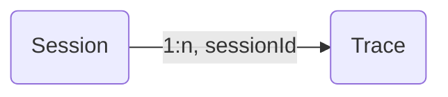

import { PropagationRestrictionsCallout } from "@/components/PropagationRestrictionsCallout";

# 세션

LLM 애플리케이션과의 상호작용은 여러 트레이스와 관측에 걸쳐 이루어지는 경우가 많습니다. Langfuse의 `Sessions`는 여러 트레이스에 걸친 이러한 관측들을 함께 그룹화하고, 전체 상호작용에 대한 간단한 **세션 리플레이**를 볼 수 있게 해주는 특별한 기능입니다. 관측 전반에 걸쳐 `sessionId` 속성을 전파하는 것으로 시작하세요.



여러 트레이스에 걸친 관측 전반에 `sessionId`를 전파하세요. `sessionId`는 세션을 식별하는 데 사용하는 200자 미만의 US-ASCII 문자열이면 됩니다. 동일한 `sessionId`를 가진 모든 관측은 이를 감싸는 트레이스와 함께 그룹화됩니다. 세션 ID가 200자를 초과하면 삭제됩니다.

<LangTabs items={["Python SDK", "JS/TS SDK", "OpenAI (Python)", "Langchain (Python)", "Langchain (JS/TS)", "Flowise"]}>

<Tab title="Python SDK (v3)">
`@observe()` 데코레이터를 사용하는 경우:

```python /propagate_attributes(session_id="your-session-id")/
from langfuse import observe, propagate_attributes

@observe()
def process_request():
    # 모든 하위 관측에 session_id를 전파합니다
    with propagate_attributes(session_id="your-session-id"):
        # 여기서 중첩된 모든 관측은 자동으로 session_id를 상속받습니다
        result = process_chat_message()

        return result
```

관측을 직접 생성하는 경우:

```python /propagate_attributes(session_id="chat-session-123")/
from langfuse import get_client, propagate_attributes

langfuse = get_client()

with langfuse.start_as_current_observation(
    as_type="span",
    name="process-chat-message"
) as root_span:
    # 모든 하위 관측에 session_id를 전파합니다
    with propagate_attributes(session_id="chat-session-123"):
        # 여기서 생성되는 모든 관측은 자동으로 session_id를 가집니다
        with root_span.start_as_current_observation(
            as_type="generation",
            name="generate-response",
            model="gpt-4o"
        ) as gen:
            # 이 generation은 자동으로 session_id를 가집니다
            pass
```

</Tab>
<Tab title="JS/TS SDK">

컨텍스트 매니저를 사용하는 경우:

```ts /propagateAttributes/
import { startActiveObservation, propagateAttributes } from "@langfuse/tracing";

await startActiveObservation("context-manager", async (span) => {
  span.update({
    input: { query: "What is the capital of France?" },
  });

  // 모든 하위 관측에 sessionId를 전파합니다
  await propagateAttributes(
    {
      sessionId: "session-123",
    },
    async () => {
      // 여기서 생성되는 모든 관측은 자동으로 sessionId를 가집니다
      // ... your logic ...
    },
  );
});
```

`observe` 래퍼를 사용하는 경우:

```ts /propagateAttributes/
import { observe, propagateAttributes } from "@langfuse/tracing";

const processChatMessage = observe(
  async (message: string) => {
    // 모든 하위 관측에 sessionId를 전파합니다
    return await propagateAttributes({ sessionId: "session-123" }, async () => {
      // 여기서 중첩된 모든 관측은 자동으로 sessionId를 상속받습니다
      const result = await processMessage(message);
      return result;
    });
  },
  { name: "process-chat-message" },
);

const result = await processChatMessage("Hello!");
```

자세한 내용은 [JS/TS SDK 문서](/docs/sdk/typescript/guide)를 참고하세요.

</Tab>
<Tab>

```python /propagate_attributes(session_id="your-session-id")/
from langfuse import get_client, propagate_attributes
from langfuse.openai import openai

langfuse = get_client()

with langfuse.start_as_current_observation(as_type="span", name="openai-call"):
    # OpenAI generation을 포함한 모든 관측에 session_id를 전파합니다
    with propagate_attributes(session_id="your-session-id"):
        completion = openai.chat.completions.create(
            name="test-chat",
            model="gpt-3.5-turbo",
            messages=[
                {"role": "system", "content": "You are a calculator."},
                {"role": "user", "content": "1 + 1 = "}
            ],
            temperature=0,
        )
```

</Tab>
<Tab>

```python /propagate_attributes(session_id="your-session-id")/
from langfuse import get_client, propagate_attributes
from langfuse.langchain import CallbackHandler

langfuse = get_client()
handler = CallbackHandler()

with langfuse.start_as_current_observation(as_type="span", name="langchain-call"):
    # 모든 관측에 session_id를 전파합니다
    with propagate_attributes(session_id="your-session-id"):
        # 체인 호출에 handler를 전달합니다
        chain.invoke(
            {"animal": "dog"},
            config={"callbacks": [handler]},
        )
```

</Tab>
<Tab title="Langchain (JS/TS)">

CallbackHandler와 함께 `propagateAttributes()`를 사용하세요:

```ts /propagateAttributes/
import { startActiveObservation, propagateAttributes } from "@langfuse/tracing";
import { CallbackHandler } from "@langfuse/langchain";

const langfuseHandler = new CallbackHandler();

await startActiveObservation("langchain-call", async () => {
  // 모든 관측에 sessionId를 전파합니다
  await propagateAttributes(
    {
      sessionId: "your-session-id",
    },
    async () => {
      // 체인 호출에 handler를 전달합니다
      await chain.invoke(
        { input: "<user_input>" },
        { callbacks: [langfuseHandler] },
      );
    },
  );
});
```

</Tab>

<Tab title="Flowise">
[Flowise 통합](/docs/flowise)은 Flowise의 chatId를 Langfuse의 sessionId에 자동으로 매핑합니다. Flowise 1.4.10 이상이 필요합니다.

</Tab>

</LangTabs>

<PropagationRestrictionsCallout attributes={["sessionId"]} />

## 예시

공개 [예시 프로젝트](/docs/demo)를 사용해 이 기능을 사용해 보세요.

_여러 트레이스에 걸친 세션 예시_

<Frame fullWidth></Frame>

## 그 외 기능

- 세션을 게시하여 다른 사람과 공개 링크로 공유할 수 있습니다 ([예시](https://cloud.langfuse.com/project/clkpwwm0m000gmm094odg11gi/sessions/lf.docs.conversation.TL4KDlo))
- 세션을 북마크하여 나중에 쉽게 찾을 수 있습니다
- Langfuse UI를 통해 `scores`를 추가하여 세션에 주석을 달고 사람이 참여하는(human-in-the-loop) 평가를 기록할 수 있습니다
- [사용자 피드백 폼](/docs/observability/features/user-feedback), 모더레이션 검사, 대화 수준의 QA 파이프라인 등을 통해 SDK나 API로 `session-level` 점수를 프로그래밍 방식으로 추가할 수 있습니다. [SDK/API를 통한 점수 등록](/docs/evaluation/evaluation-methods/scores-via-sdk)을 참고하세요.
- Langfuse에서 [세션을 평가하는 방법](/faq/all/evaluating-sessions-conversations)은 무엇인가요?

## 관련 자료

- 여러 트레이스를 그룹화하는 것이 아니라 여러 서비스에 걸친 작업을 하나의 트레이스로 그룹화해야 하는 경우 [트레이스 ID와 분산 트레이싱](/docs/observability/features/trace-ids-and-distributed-tracing)을 참고하세요.

## GitHub 토론

import { GhDiscussionsPreview } from "@/components/gh-discussions/GhDiscussionsPreview";

<GhDiscussionsPreview labels={["feat-sessions"]} />
