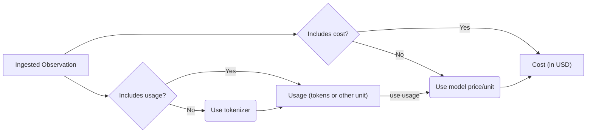

# 모델 사용량 및 비용 트래킹

<Frame>
  
</Frame>

Langfuse는 LLM generation의 사용량과 비용을 트래킹하고 사용 유형별로 세분화된 내역을 제공합니다. 사용량과 비용은 [type](/docs/observability/features/observation-types)이 `generation`과 `embedding`인 observation에서 트래킹할 수 있습니다.

- **사용량 상세 정보(Usage details)**: 사용 유형별로 소비된 단위 수
- **비용 상세 정보(Cost details)**: 사용 유형별 USD 비용

사용 유형(usage type)은 임의의 문자열일 수 있으며 LLM 제공업체마다 다릅니다. 가장 높은 수준에서는 단순히 `input`과 `output`일 수 있습니다. LLM이 점점 더 정교해짐에 따라 `cached_tokens`, `audio_tokens`, `image_tokens`와 같은 추가 사용 유형이 필요해집니다.

UI에서 Langfuse는 문자열 `input`을 포함하는 모든 사용 유형을 input 사용 유형으로, 마찬가지로 `output`을 포함하는 유형을 output 사용 유형으로 합산하여 보여줍니다. `total` 사용 유형이 수집되지 않은 경우, Langfuse는 모든 사용 유형 단위를 합산하여 총합을 계산합니다. 이를 위해서는 사용 유형이 [상호 배타적인 버킷](#usage-details-contract)이어야 합니다.

사용량 상세 정보와 비용 상세 정보는 모두 다음 중 하나의 방식으로 처리됩니다.

- API, SDK 또는 통합을 통해 [**수집**](#ingest)되거나
- generation의 `model` 파라미터를 기반으로 [**추론**](#infer)됩니다. Langfuse에는 OpenAI, Anthropic, Google 모델을 포함하여 인기 있는 모델과 해당 토크나이저의 목록이 미리 정의되어 있습니다. 자체 [커스텀 모델 정의](#custom-model-definitions)를 추가하거나 [GitHub](/issue)를 통해 새로운 모델에 대한 공식 지원을 요청할 수도 있습니다. 추론된 비용은 수집 시점에 해당 시점에 사용 가능한 모델 및 가격 정보를 기반으로 계산됩니다.

수집된 사용량 및 비용은 추론된 사용량 및 비용보다 우선적으로 적용됩니다.



[Metrics API](/docs/metrics/features/metrics-api)를 통해 Langfuse에서 집계된 사용량 및 비용 메트릭을 가져와 분석, 청구, 속도 제한(rate-limiting) 등에 활용할 수 있습니다. 이 API는 애플리케이션 유형, 사용자 또는 태그별로 필터링할 수 있도록 지원합니다.

## 사용량 및/또는 비용 수집하기 [#ingest]

LLM 응답에서 사용 가능한 경우, 사용량 및/또는 비용을 수집하는 것이 Langfuse에서 사용량을 트래킹하는 가장 정확하고 안정적인 방법입니다.

Langfuse 통합 중 다수는 LLM 응답에서 사용량 상세 정보 및 비용 상세 정보 데이터를 자동으로 캡처합니다. 예상대로 동작하지 않는 경우 GitHub에 [issue](/issue)를 생성해 주세요.

<LangTabs items={["Python SDK", "JS/TS SDK"]}>
<Tab>

`@observe()` 데코레이터를 사용하는 경우:

```python
from langfuse import observe, get_client
import anthropic

langfuse = get_client()
anthropic_client = anthropic.Anthropic()

@observe(as_type="generation")
def anthropic_completion(**kwargs):
  # optional, extract some fields from kwargs
  kwargs_clone = kwargs.copy()
  input = kwargs_clone.pop('messages', None)
  model = kwargs_clone.pop('model', None)
  langfuse.update_current_generation(
      input=input,
      model=model,
      metadata=kwargs_clone
  )

  response = anthropic_client.messages.create(**kwargs)

  langfuse.update_current_generation(
      usage_details={
          "input": response.usage.input_tokens,
          "output": response.usage.output_tokens,
          "cache_read_input_tokens": response.usage.cache_read_input_tokens
          # "total": int,  # if not set, it is derived as the sum of all usage types
        },
      # Optionally, also ingest usd cost. Alternatively, you can infer it via a model definition in Langfuse.
      cost_details={
          # Here we assume the input and output cost are 1 USD each and half the price for cached tokens.
          "input": 1,
          "cache_read_input_tokens": 0.5,
          "output": 1,
          # "total": float, # if not set, it is derived as the sum of all usage types
      }
  )

  # return result
  return response.content[0].text

@observe()
def main():
  return anthropic_completion(
      model="claude-3-opus-20240229",
      max_tokens=1024,
      messages=[
          {"role": "user", "content": "Hello, Claude"}
      ]
  )

main()
```

수동으로 generation을 생성하는 경우:

```python
from langfuse import get_client
import anthropic

langfuse = get_client()
anthropic_client = anthropic.Anthropic()

with langfuse.start_as_current_observation(
    as_type="generation",
    name="anthropic-completion",
    model="claude-3-opus-20240229",
    input=[{"role": "user", "content": "Hello, Claude"}]
) as generation:
    response = anthropic_client.messages.create(
        model="claude-3-opus-20240229",
        max_tokens=1024,
        messages=[{"role": "user", "content": "Hello, Claude"}]
    )

    generation.update(
        output=response.content[0].text,
        usage_details={
            "input": response.usage.input_tokens,
            "output": response.usage.output_tokens,
            "cache_read_input_tokens": response.usage.cache_read_input_tokens
            # "total": int,  # if not set, it is derived as the sum of all usage types
        },
        # Optionally, also ingest usd cost. Alternatively, you can infer it via a model definition in Langfuse.
        cost_details={
            # Here we assume the input and output cost are 1 USD each and half the price for cached tokens.
            "input": 1,
            "cache_read_input_tokens": 0.5,
            "output": 1,
            # "total": float, # if not set, it is derived as the sum of all usage types
        }
    )
```

</Tab>
<Tab title="JS/TS SDK">

컨텍스트 매니저를 사용하는 경우:

```ts /usageDetails/, /costDetails/
import {
  startActiveObservation,
  startObservation,
  updateActiveObservation,
} from "@langfuse/tracing";

await startActiveObservation("context-manager", async (span) => {
  span.update({
    input: { query: "What is the capital of France?" },
  });

  // This generation will automatically be a child of "user-request"
  const generation = startObservation(
    "llm-call",
    {
      model: "gpt-4",
      input: [{ role: "user", content: "What is the capital of France?" }],
    },
    { asType: "generation" }
  );

  // ... LLM call logic ...

  generation.update({
    usageDetails: {
      input: 10,
      output: 5,
      cache_read_input_tokens: 2,
      some_other_token_count: 10,
      total: 27, // optional, it is derived as the sum of all usage types
    },
    costDetails: {
      // If you don't want the costs to be calculated based on model definitions, you can pass the costDetails manually.
      input: 1,
      output: 1,
      cache_read_input_tokens: 0.5,
      some_other_token_count: 1,
      total: 3.5,
    },
    output: { content: "The capital of France is Paris." },
  });

  generation.end();
});
```

`observe` 래퍼를 사용하는 경우:

```ts /usageDetails/, /costDetails/
import { observe, updateActiveObservation } from "@langfuse/tracing";

// An existing function
async function fetchData(source: string) {
  updateActiveObservation(
    {
      usageDetails: {
        input: 10,
        output: 5,
        cache_read_input_tokens: 2,
        some_other_token_count: 10,
        total: 27, // optional, it is derived as the sum of all usage types
      },
      costDetails: {
        // If you don't want the costs to be calculated based on model definitions, you can pass the costDetails manually.
        input: 1,
        output: 1,
        cache_read_input_tokens: 0.5,
        some_other_token_count: 1,
        total: 3.5,
      },
    },
    { asType: "generation" }
  );

  // ... logic to fetch data
  return { data: `some data from ${source}` };
}

// Wrap the function to trace it
const tracedFetchData = observe(fetchData, {
  name: "observe-wrapper",
  asType: "generation",
});

const result = await tracedFetchData("API");
```

observation을 수동으로 생성하는 경우:

```ts /usageDetails/, /costDetails/
const span = startObservation("manual-observation", {
  input: { query: "What is the capital of France?" },
});

const generation = span.startObservation(
  "llm-call",
  {
    model: "gpt-4",
    input: [{ role: "user", content: "What is the capital of France?" }],
    output: { content: "The capital of France is Paris." },
  },
  { asType: "generation" }
);

generation.update({
  usageDetails: {
    input: 10,
    output: 5,
    cache_read_input_tokens: 2,
    some_other_token_count: 10,
    total: 27, // optional, it is derived as the sum of all usage types
  },
  costDetails: {
    // If you don't want the costs to be calculated based on model definitions, you can pass the costDetails manually.
    input: 1,
    output: 1,
    cache_read_input_tokens: 0.5,
    some_other_token_count: 1,
    total: 3.5,
  },
});

generation
  .update({
    output: { content: "The capital of France is Paris." },
  })
  .end();

span.update({ output: "Successfully answered user request." }).end();
```

`generation.update()`를 통해 사용량과 비용을 업데이트할 수도 있습니다.

</Tab>
</LangTabs>

### 사용 유형은 상호 배타적인 버킷입니다 [#usage-details-contract]

Langfuse는 `usage_details`의 각 키를 겹치지 않는 별도의 버킷으로 취급합니다. 즉, 각 토큰은 정확히 하나의 키에서만 카운트되어야 합니다. 특히 `input`은 다른 `input_*` 키(예: `input_cached_tokens` 또는 `input_cache_creation`)에서 이미 카운트된 토큰을 제외해야 하며, `output`은 다른 `output_*` 키(예: `output_reasoning_tokens`)에서 카운트된 토큰을 제외해야 합니다. 유일한 예외는 `total`로, 이는 그 자체로 버킷이 아니라 모든 버킷을 아우르며 그 합계와 같습니다.

Langfuse는 다음 세 곳에서 이 규약(contract)에 의존합니다.

- **표시(Display)**: UI는 `input`을 포함하는 모든 사용 유형을 합산해 총 input 사용량을 표시하고, `output`을 포함하는 모든 사용 유형을 합산해 총 output 사용량을 표시합니다.
- **비용 추론(Cost inference)**: 각 사용 유형은 모델 정의의 사용 유형별 가격과 정확히 매칭되며, 결과 비용이 합산됩니다.
- **총합(Total)**: `total`이 수집되지 않은 경우, Langfuse는 모든 버킷의 합으로 이를 도출합니다.

버킷이 겹치는 경우 — 예를 들어 `input`에 `input_cached_tokens`에 보고된 토큰이 여전히 포함되어 있는 경우 — 해당 토큰은 두 번 표시되며, 추론된 비용도 이를 이중으로 계산하게 되어 Langfuse에 표시되는 비용이 실제로 제공업체가 청구한 금액보다 과다하게 계산됩니다. 직접 수집된 `cost_details`는 그대로 사용되며 이 문제의 영향을 받지 않습니다.

많은 LLM 제공업체는 **포함형(inclusive)** 카운트를 보고합니다. 예를 들어 OpenAI의 `prompt_tokens`(Chat Completions API)와 `input_tokens`(Responses API)는 캐시된 토큰을 포함합니다. 반면 Anthropic의 `input_tokens`는 캐시 읽기와 캐시 쓰기를 이미 제외합니다. 포함형 카운트는 저장되기 전에 최상위 카운트에서 세부 카운트를 빼서 배타적 버킷으로 변환해야 합니다.

예를 들어, 17,903개의 prompt 토큰(그중 17,817개는 캐시 히트)과 188개의 completion 토큰을 포함하는 OpenAI 스타일 응답은 다음과 같이 처리됩니다.

| Provider reports (inclusive)                      | Stored in Langfuse (exclusive) |
| ------------------------------------------------- | ------------------------------ |
| `prompt_tokens: 17903`                            | `input: 86`                    |
| `prompt_tokens_details: { cached_tokens: 17817 }` | `input_cached_tokens: 17817`   |
| `completion_tokens: 188`                          | `output: 188`                  |
| `total_tokens: 18091`                             | `total: 18091`                 |

#### Langfuse가 대신 변환해주는 경우 [#usage-details-normalization]

이 변환을 직접 수행해야 하는지 여부는 사용량 데이터가 Langfuse에 도달하는 방식에 따라 달라집니다.

- **Langfuse 통합 및 SDK 래퍼**(예: [OpenAI wrapper](/integrations/model-providers/openai-py)): 제공업체 응답에서 사용량을 캡처하여 자동으로 변환합니다.
- **OpenTelemetry 사용량 속성**(OpenTelemetry GenAI semantic conventions에 정의된 `gen_ai.usage.*`, 그리고 일부 계측 라이브러리에서 사용하는 `llm.token_count.*` 네임스페이스): 포함형으로 취급됩니다. Langfuse는 수집 시 `input`에서 캐시 읽기 및 캐시 생성 토큰을 빼서 정규화합니다.
- **OpenAI 사용량 스키마**로 전달된 사용량 상세 정보(중첩된 `prompt_tokens_details` / `completion_tokens_details`, [OpenAI와의 호환성](#openai-usage-schema) 참고): 수집 시 인식되어 정규화됩니다. 매칭은 엄격하게 이루어지며, 객체에 OpenAI 사용량 필드 외의 키가 하나라도 포함되어 있으면 대신 flat 키로 취급됩니다.
- **Langfuse 스타일 flat 키**로 SDK 또는 API를 통해 전달된 사용량 상세 정보(`usage_details` / `usageDetails`, OTel 속성 `langfuse.observation.usage_details`): 그대로 저장되며 정규화가 적용되지 않습니다. **값은 이미 배타적이어야 합니다.**

flat 키로 사용량 상세 정보를 설정하는 자체 계측(instrumentation)을 작성하는 경우, 제공업체가 사용량을 어떻게 보고하는지 확인하고 Langfuse에 전달하기 전에 캐시 또는 세부 토큰 카운트를 최상위 `input`/`output` 카운트에서 정확히 한 번만 빼야 합니다.

### OpenAI와의 호환성 [#openai-usage-schema]

OpenAI와의 호환성을 높이기 위해 OpenAI Usage 스키마도 사용할 수 있습니다. `prompt_tokens`는 `input`으로, `completion_tokens`는 `output`으로, `total_tokens`는 `total`로 매핑됩니다. `prompt_tokens_details`에 중첩된 키는 `input_` 접두사가 붙어 평탄화(flatten)되고, `completion_tokens_details`는 `output_` 접두사가 붙어 평탄화됩니다. OpenAI는 이러한 세부 카운트를 포함형으로 보고하므로, Langfuse는 저장된 버킷이 [상호 배타적](#usage-details-contract)이 되도록 각각 `input`과 `output`에서 이를 빼줍니다.

<Callout type="warning">

스키마 인식은 엄격합니다. 사용량 객체에는 아래에 표시된 OpenAI 사용량 필드만 포함되어야 합니다. 추가 키가 포함된 경우(예: 일부 게이트웨이가 `cost` 필드를 추가하는 경우), OpenAI 스타일 사용량으로 인식되지 않고 대신 매핑 및 차감 없이 [flat 키](#usage-details-contract)로 그대로 저장됩니다. 이 실패 모드는 조용히(silent) 발생하므로, 수집하기 전에 불필요한 키를 제거하세요.

</Callout>

<LangTabs items={["Python SDK", "JS/TS SDK"]}>
<Tab>

```python
from langfuse import get_client

langfuse = get_client()

with langfuse.start_as_current_observation(
    as_type="generation",
    name="openai-style-generation",
    model="gpt-4o"
) as generation:
    # Simulate LLM call
    # response = openai_client.chat.completions.create(...)

    generation.update(
        usage_details={
            # usage (OpenAI-style schema)
            "prompt_tokens": 10,
            "completion_tokens": 25,
            "total_tokens": 35,
            "prompt_tokens_details": {
                "cached_tokens": 5,
                "audio_tokens": 2,
            },
            "completion_tokens_details": {
                "reasoning_tokens": 15,
            },
        }
    )
```

</Tab>
<Tab>

```ts
import { startObservation } from "@langfuse/tracing";

const generation = startObservation(
  "openai-style-generation",
  {
    model: "gpt-4o",
    usageDetails: {
      // usage (OpenAI-style schema)
      prompt_tokens: 10,
      completion_tokens: 25,
      total_tokens: 35,
      prompt_tokens_details: {
        cached_tokens: 5,
        audio_tokens: 2,
      },
      completion_tokens_details: {
        reasoning_tokens: 15,
      },
    },
  },
  { asType: "generation" },
);
generation.end();
```

</Tab>
</LangTabs>

`generation.update()`와 `generation.end()`를 통해서도 OpenAI 스타일 사용량을 수집할 수 있습니다.

## 사용량 및/또는 비용 추론하기 [#infer]

사용량 또는 비용이 수집되지 않은 경우, Langfuse는 수집 시점에 generation의 `model` 파라미터를 기반으로 누락된 값을 추론하려고 시도합니다. 이는 응답에 사용량이나 비용을 포함하지 않는 일부 모델 제공업체 또는 셀프 호스팅 모델에 특히 유용합니다.

Langfuse에는 **OpenAI, Anthropic, Google**을 포함하여 인기 있는 모델과 해당 토크나이저의 **미리 정의된 목록**이 포함되어 있습니다. [전체 목록](https://cloud.langfuse.com/project/clkpwwm0m000gmm094odg11gi/models)을 확인하세요(로그인이 필요합니다).

자체 **커스텀 모델 정의**를 추가([아래](#custom-model-definitions) 참고)하거나 [GitHub](/issue)를 통해 새로운 모델에 대한 공식 지원을 요청할 수도 있습니다.

### 사용량

모델에 토크나이저가 지정된 경우, Langfuse는 수집된 generation에 대해 토큰 수를 자동으로 계산합니다.

현재 다음 토크나이저가 지원됩니다.

| Model     | Tokenizer     | Used package                                                                       | Comment                                                                                                                               |
| --------- | ------------- | ---------------------------------------------------------------------------------- | ------------------------------------------------------------------------------------------------------------------------------------- |
| `gpt-4o`  | `o200k_base`  | [`tiktoken`](https://www.npmjs.com/package/tiktoken)                               |                                                                                                                                       |
| `gpt*`    | `cl100k_base` | [`tiktoken`](https://www.npmjs.com/package/tiktoken)                               |                                                                                                                                       |
| `claude*` | `claude`      | [`@anthropic-ai/tokenizer`](https://www.npmjs.com/package/@anthropic-ai/tokenizer) | According to Anthropic, their tokenizer is not accurate for Claude 3 models. If possible, send us the tokens from their API response. |

### 비용

모델 정의에는 사용 유형별 가격이 포함됩니다. 사용 유형은 generation의 `usage_details` 객체에 있는 키와 정확히 일치해야 합니다.

Langfuse는 (1) 사용량이 수집되었거나 추론된 경우, (2) 그리고 일치하는 모델 정의에 가격이 포함되어 있는 경우, 수집 시점에 수집된 generation의 비용을 자동으로 계산합니다.

### 가격 티어(Pricing Tiers) [#pricing-tiers]

일부 모델 제공업체는 사용된 input 토큰 수에 따라 다른 요율을 부과합니다. 예를 들어 Anthropic의 Claude Sonnet 4.5와 Google의 Gemini 2.5 Pro는 input 토큰이 200K를 초과하는 경우 더 높은 가격을 적용합니다.

Langfuse는 모델에 대한 **가격 티어**를 지원하여 이러한 컨텍스트 종속적 가격 구조에 대한 정확한 비용 계산을 가능하게 합니다.

#### 티어 매칭 방식

각 모델은 다음과 같은 요소를 가진 여러 개의 가격 티어를 가질 수 있습니다.

- **이름(Name)**: 설명적인 이름(예: "Standard", "Large Context")
- **우선순위(Priority)**: 평가 순서(0은 기본 티어를 위해 예약됨)
- **조건(Conditions)**: 티어가 적용되는 시점을 결정하는 규칙
- **가격(Prices)**: 해당 티어에 대한 사용 유형별 비용

비용을 계산할 때 Langfuse는 우선순위 순서대로 티어를 평가합니다(기본 티어는 제외). 조건이 충족되는 첫 번째 티어가 사용됩니다. 조건부 티어가 하나도 일치하지 않으면 기본 티어가 적용됩니다.

**조건 형식:**

- `usageDetailPattern`: 사용량 상세 정보 키를 매칭하기 위한 정규식 패턴(예: `input`은 `input_tokens`, `input_cached_tokens` 등과 매칭됩니다)
- `operator`: 비교 연산자(`gt`, `gte`, `lt`, `lte`, `eq`, `neq`)
- `value`: 비교 대상 임계값
- `caseSensitive`: 패턴 매칭 시 대소문자를 구분할지 여부(기본값: false)

예를 들어 Claude Sonnet 4.5의 "Large Context" 티어에는 `input > 200000` 조건이 있으며, 이는 패턴 "input"과 일치하는 모든 사용량 상세 정보의 합이 200,000 토큰을 초과할 때 적용된다는 의미입니다.

### 커스텀 모델 정의 [#custom-model-definitions]

Langfuse에 [가격 티어](#pricing-tiers)를 포함한 자체 모델 정의를 유연하게 추가할 수 있습니다. 이는 Langfuse가 유지 관리하는 모델 목록에 포함되지 않은 셀프 호스팅 또는 파인튜닝된 모델에 특히 유용합니다.

<LangTabs items={["Langfuse UI", "API"]}>

<Tab>

Langfuse UI에서 커스텀 모델 정의를 추가하려면 모델 이름 옆의 "+" 기호를 클릭하거나 **Project Settings > Models**로 이동하여 새 모델 정의를 추가하면 됩니다.

그런 다음 토큰 유형별 가격을 추가하고 모델 정의를 저장할 수 있습니다. 이제 이 모델을 사용하는 모든 **새로운 트레이스**에 대해 올바른 토큰 사용량과 비용이 추론됩니다.

  <Video
  src="https://static.langfuse.com/docs-videos/2025-10-20-custom-model-definition-169.mp4"
  aspectRatio={16 / 9}
/>
</Tab>

<Tab>

모델 정의는 Models [API](/docs/api)를 통해 프로그래밍 방식으로도 관리할 수 있습니다.

```bash
GET    /api/public/models
POST   /api/public/models
GET    /api/public/models/{id}
DELETE /api/public/models/{id}
```

</Tab>

</LangTabs>

모델은 다음을 기준으로 generation과 매칭됩니다.

| Generation Attribute | Model Attribute | Notes                                                                                     |
| -------------------- | --------------- | ----------------------------------------------------------------------------------------- |
| `model`              | `match_pattern` | Uses regular expressions, e.g. `(?i)^(gpt-4-0125-preview)$` matches `gpt-4-0125-preview`. |

사용자가 정의한 모델은 Langfuse가 유지 관리하는 모델보다 우선적으로 적용됩니다.

**추가 세부 정보**

`openai` 토크나이저를 사용하는 경우, 다음 토큰화 설정을 지정해야 합니다. 미리 정의된 OpenAI 모델 목록에서 설정을 복사할 수도 있습니다. 자세한 내용은 OpenAI [documentation](https://github.com/openai/openai-cookbook/blob/main/examples/How_to_count_tokens_with_tiktoken.ipynb)을 참고하세요. `tokensPerName`과 `tokensPerMessage`는 채팅 모델에 필수입니다.

```json
{
  "tokenizerModel": "gpt-3.5-turbo", // tiktoken model name
  "tokensPerName": -1, // OpenAI Chatmessage tokenization config
  "tokensPerMessage": 4 // OpenAI Chatmessage tokenization config
}
```

### reasoning 모델에 대한 비용 추론

LLM input과 output을 토큰화하여 비용을 추론하는 방식은 OpenAI o1 모델 계열과 같은 reasoning 모델에서는 지원되지 않습니다. 즉, 토큰 수가 수집되지 않은 경우 Langfuse는 reasoning 모델의 비용을 추론할 수 없습니다.

reasoning 모델은 응답에 도달하기까지 여러 단계를 거칩니다. 각 단계의 결과는 output 토큰으로 청구되는 reasoning 토큰을 생성합니다. 따라서 비용에 영향을 미치는 output 토큰 수는 모든 reasoning 토큰과 최종 completion의 토큰 수를 합한 값입니다. Langfuse는 reasoning 토큰에 대한 가시성이 없기 때문에, 토큰 사용량이 제공되지 않은 generation에 대해서는 올바른 비용을 추론할 수 없습니다.

Langfuse의 비용 트래킹을 활용하려면 o1 모델 generation을 수집할 때 토큰 사용량을 제공해 주세요. [Langfuse OpenAI wrapper](/integrations/model-providers/openai-py)를 사용하거나 [Langchain](/integrations/frameworks/langchain), [LlamaIndex](/integrations/frameworks/llamaindex), [LiteLLM](/integrations/gateways/litellm)과 같은 통합을 사용하는 경우, 토큰 사용량이 자동으로 수집되어 제공됩니다.

reasoning 모델의 작동 방식에 대한 자세한 내용은 [the OpenAI guide](https://platform.openai.com/docs/guides/reasoning)를 참고하세요.

## 문제 해결

- 모델 정의를 변경하면 업데이트된 비용은 Langfuse에 새로 기록되는 generation에만 적용됩니다.
- `generation`과 `embedding` 유형의 observation만 비용과 사용량을 트래킹할 수 있습니다.
- OpenRouter를 사용하는 경우, Langfuse는 OpenRouter 비용 정보를 직접 캡처할 수 있습니다. 자세한 내용은 [여기](/integrations/gateways/openrouter#cost-tracking)를 참고하세요.
- LiteLLM을 사용하는 경우, Langfuse는 각 LiteLLM 응답에서 반환된 비용 정보를 직접 캡처합니다.

## GitHub Discussions

import { GhDiscussionsPreview } from "@/components/gh-discussions/GhDiscussionsPreview";

<GhDiscussionsPreview labels={["feat-cost-tracking"]} />
