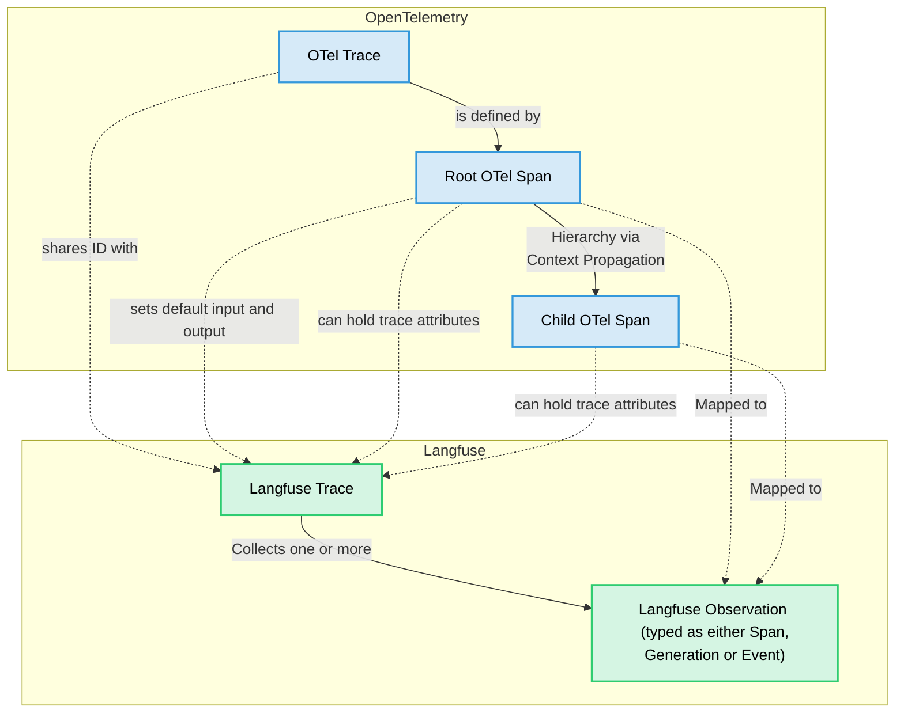

import { Details, Summary } from "@/components/Details";
import GetStartedPythonSdk from "@/components-mdx/get-started/python-sdk.mdx";
import EnvJS from "@/components-mdx/env-js.mdx";
import JSSDKPackages from "@/components-mdx/js-sdk-packages.mdx";
import { Rocket, Plug, Settings, LifeBuoy, BookOpen } from "lucide-react";

# Langfuse SDK

Langfuse는 두 가지 SDK를 제공합니다.

- **Python SDK v4** <a href="https://github.com/langfuse/langfuse-python"></a> <a href="https://pypi.org/project/langfuse/"></a>
- **JS/TS SDK v5** <a href="https://github.com/langfuse/langfuse-js"></a> <a href="https://www.npmjs.com/package/@langfuse/tracing"></a>
- [**다른 언어**](#other-languages) OpenTelemetry를 통한 지원

Langfuse SDK는 [커스텀 관측 및 트레이스](/docs/observability/sdk/instrumentation#custom-instrumentation)를 생성하고 Langfuse의 [프롬프트 관리](/docs/prompt-management/overview) 및 [평가](/docs/evaluation/overview) 기능을 사용하는 데 권장되는 방법입니다.

**주요 이점**

- [OpenTelemetry](https://opentelemetry.io/) 기반이므로 LLM 스택에 어떤 OTEL 기반 계측 라이브러리든 사용할 수 있습니다.
- 완전히 [비동기 요청](/docs/observability/data-model#background-processing)으로 처리되어 Langfuse가 지연 시간을 거의 추가하지 않습니다.
- Langfuse [네이티브 통합](/integrations)과 상호 운용됩니다.
- 동기식 타임스탬프를 통해 정확한 지연 시간을 추적합니다.
- 다운스트림에서 사용할 수 있는 ID를 제공합니다.
- 관측을 중첩할 때 훌륭한 개발자 경험을 제공합니다.
- 애플리케이션을 중단시키지 않습니다: SDK 오류는 포착되어 로그로 기록됩니다.

<Callout type="info">
이 섹션에서는 Langfuse SDK의 트레이싱 관련 기능을 다룹니다. Langfuse SDK를 [프롬프트 관리](/docs/prompt-management/overview) 및 [평가](/docs/evaluation/overview)에 사용하려면 각각의 문서를 참고하세요.
</Callout>

<Details>
<Summary>셀프 호스팅 Langfuse에 대한 요구 사항</Summary>

<Callout type="info">
Langfuse를 셀프 호스팅하는 경우, Python SDK v3는 모든 기능이 올바르게 작동하려면 [**Langfuse 플랫폼 버전 ≥ 3.125.0**](https://github.com/langfuse/langfuse/releases/tag/v3.125.0)이 필요하며, TypeScript SDK v4는 [**Langfuse 플랫폼 버전 ≥ 3.95.0**](https://github.com/langfuse/langfuse/releases/tag/v3.95.0)이 필요합니다.
</Callout>

</Details>

<Details>
<Summary>레거시 문서</Summary>

이 문서는 최신 버전의 Langfuse SDK를 위한 것입니다.

- 레거시 Python SDK v3에 대한 문서는 [여기](https://python-sdk-v3.docs-snapshot.langfuse.com/docs/observability/sdk/overview/)에서 확인할 수 있습니다.
- 레거시 TypeScript SDK v4에 대한 문서는 [여기](https://js-sdk-v4-docs-snapshot.langfuse.com/docs/observability/sdk/overview/)에서 확인할 수 있습니다.

</Details>

## 퀵스타트

퀵스타트 가이드를 따라 첫 번째 트레이스를 Langfuse에 전송해 보세요. 자세한 내용은 [설정](#setup) 섹션을 참고하세요.

<LangTabs items={["Python SDK", "JS/TS SDK"]}>
<Tab title="Python SDK">
<GetStartedPythonSdk />
</Tab>
<Tab title="JS/TS SDK">

**1. 패키지 설치:**

```bash
npm install @langfuse/tracing @langfuse/otel @opentelemetry/sdk-node
```

**2. 환경 변수 설정:**

<EnvJS />

**3. OpenTelemetry 초기화:**

트레이스가 Langfuse에 도달하도록 Langfuse 스팬 프로세서를 등록하는 `instrumentation.ts`를 생성합니다.

```ts filename="instrumentation.ts" /LangfuseSpanProcessor/
import { NodeSDK } from "@opentelemetry/sdk-node";
import { LangfuseSpanProcessor } from "@langfuse/otel";

export const sdk = new NodeSDK({
  spanProcessors: [new LangfuseSpanProcessor()],
});

sdk.start();
```

이 파일을 애플리케이션 진입점(예: `index.ts`)의 최상단에서 import하세요.

**4. 애플리케이션 계측하기:**

계측(instrumentation)이란 애플리케이션에서 일어나는 일을 기록해 Langfuse로 전송할 수 있도록 코드를 추가하는 것을 의미합니다. TypeScript SDK로 코드를 계측하는 방법은 크게 세 가지가 있습니다.

이 예제에서는 [컨텍스트 매니저](/docs/observability/sdk/instrumentation#context-manager)를 사용합니다. [데코레이터](/docs/observability/sdk/instrumentation#observe-wrapper)를 사용하거나 [수동 관측](/docs/observability/sdk/instrumentation#manual-observations)을 생성할 수도 있습니다.

```ts filename="index.ts" /startActiveObservation/
import { sdk } from "./instrumentation";
import { startActiveObservation } from "@langfuse/tracing";

async function main() {
  await startActiveObservation("my-first-trace", async (span) => {
    span.update({
      input: "Hello, Langfuse!",
      output: "This is my first trace!",
    });
  });
}

// Shutdown flushes events and is required for short-lived applications
main().finally(() => sdk.shutdown());
```

_[`shutdown()`은 언제 사용해야 하나요?](/docs/observability/data-model#background-processing)_

**5. 애플리케이션을 실행하고 Langfuse에서 트레이스 확인하기:**

```bash
npx tsx index.ts
```

<Frame>

</Frame>

[Langfuse의 트레이스](https://cloud.langfuse.com/project/cloramnkj0002jz088vzn1ja4/traces/ef10df7b3f9e4a8adc834c18934bace0?timestamp=2025-12-03T14%3A44%3A10.907Z&observation=c71b480595bbe18c)를 확인해 보세요.

</Tab>
</LangTabs>

## 설정

이 섹션에서는 Langfuse SDK 설정에 관한 모든 세부 사항을 다룹니다. 첫 번째 트레이스를 생성하려면 [퀵스타트](#quickstart) 가이드를 따르세요.

<Steps>

### SDK 설치

<LangTabs items={["Python SDK", "JS/TS SDK"]}>
<Tab title="Python SDK">

[Langfuse Python SDK](https://pypi.org/project/langfuse/)를 pip로 설치합니다.

```bash
pip install langfuse
```

</Tab>
<Tab title="JS/TS SDK">

Langfuse JS/TS SDK는 모듈식으로 설계되었습니다. 전체 트레이싱 설정을 위해 관련 패키지를 설치하세요.

```bash
npm install @langfuse/tracing @langfuse/otel @opentelemetry/sdk-node
```

<JSSDKPackages />

</Tab>
</LangTabs>

### 자격 증명 구성

Langfuse에 인증하려면 Langfuse 자격 증명을 환경 변수로 추가하세요. 무료 [Langfuse Cloud](https://langfuse.com/cloud) 계정에 가입하거나 [Langfuse를 셀프 호스팅](https://langfuse.com/self-hosting)하여 자격 증명을 받을 수 있습니다.

Langfuse를 셀프 호스팅하거나 기본값(EU, https://cloud.langfuse.com)이 아닌 [데이터 리전](/security/data-regions)을 사용하는 경우, base URL 인수 또는 `LANGFUSE_BASE_URL` 환경 변수를 구성해야 합니다.

자격 증명을 [생성자에 직접 전달](#client-setup)할 수도 있습니다.

<EnvJS />

### OpenTelemetry 초기화 (JS/TS 전용)

<LangTabs items={["Python SDK", "JS/TS SDK"]}>
<Tab title="Python SDK">

Python SDK는 [클라이언트를 초기화](#client-setup)할 때 OpenTelemetry를 자동으로 설정합니다.

기본적으로 SDK는 Langfuse 및 GenAI/LLM 스팬을 내보냅니다. 이를 커스터마이즈하려면 `should_export_span`을 사용하는 것을 권장합니다. `blocked_instrumentation_scopes`는 여전히 작동하지만 사용이 중단(deprecated)되었으며 향후 버전에서 제거될 예정입니다.

</Tab>
<Tab title="JS/TS SDK">

JS/TS SDK의 트레이싱은 OpenTelemetry 위에 구축되어 있으므로 OpenTelemetry SDK를 설정해야 합니다. [`LangfuseSpanProcessor`](https://langfuse-js-git-main-langfuse.vercel.app/classes/_langfuse_otel.LangfuseSpanProcessor.html)는 트레이스를 Langfuse로 전송하는 핵심 구성 요소입니다.

```ts filename="instrumentation.ts" /LangfuseSpanProcessor/
import { NodeSDK } from "@opentelemetry/sdk-node";
import { LangfuseSpanProcessor } from "@langfuse/otel";

const sdk = new NodeSDK({
  spanProcessors: [new LangfuseSpanProcessor()],
});

sdk.start();
```

기본적으로 이 프로세서는 Langfuse 및 GenAI/LLM 스팬을 내보냅니다. 이를 커스터마이즈하려면 `shouldExportSpan`을 사용하세요.

마스킹, 필터링 등 [`LangfuseSpanProcessor`](https://langfuse-js-git-main-langfuse.vercel.app/classes/_langfuse_otel.LangfuseSpanProcessor.html)를 구성하는 더 많은 옵션은 [고급 기능](/docs/observability/sdk/advanced-features#filtering-by-instrumentation-scope)을 참고하세요.

JS 환경에서 OpenTelemetry를 설정하는 방법은 [여기](https://opentelemetry.io/docs/languages/js/getting-started/nodejs/)에서 더 자세히 알아볼 수 있습니다.

<Callout type="info">
**Next.js 사용자:**

Next.js를 사용하는 경우 `@vercel/otel` v2 이상을 사용하고 있다면 `@vercel/otel`의 `registerOTel`을 통해 `LangfuseSpanProcessor`를 등록할 수 있습니다. [이전 버전은 `@langfuse/tracing` 및 `@langfuse/otel` 패키지가 기반으로 하는 OpenTelemetry JS SDK v2를 지원하지 않았지만](https://github.com/vercel/otel/issues/154), `@vercel/otel` v2에서 이 문제가 해결되었습니다. 위에서 설명한 `NodeSDK` 설정 방식도 버전 요구 사항 없이 사용할 수 있습니다.

[Vercel에서 NextJS와 함께 Vercel AI SDK를 사용하는 전체 예제는 여기를 참고하세요](/docs/observability/sdk/typescript/instrumentation#native-instrumentation).

</Callout>

</Tab>
</LangTabs>

### 클라이언트 설정 [#client-setup]

<LangTabs items={["Python SDK", "JS/TS SDK"]}>
<Tab title="Python SDK">

[`get_client()`](https://python.reference.langfuse.com/langfuse#get_client)로 Langfuse 클라이언트를 초기화하여 Langfuse와 상호 작용합니다. 위에서 설정한 환경 변수를 자동으로 사용합니다.

```python filename="Initialize client"
from langfuse import get_client

langfuse = get_client()

# Verify connection
if langfuse.auth_check():
    print("Langfuse client is authenticated and ready!")
else:
    print("Authentication failed. Please check your credentials and host.")
```

Langfuse 클라이언트는 싱글턴입니다. 애플리케이션 어디에서든 [`get_client()`](https://python.reference.langfuse.com/langfuse#get_client) 함수를 사용해 접근할 수 있습니다.

<Details>
<Summary>대안: 생성자를 통한 구성</Summary>

원한다면 [`Langfuse()`](https://python.reference.langfuse.com/langfuse#Langfuse)를 통해 클라이언트를 초기화하고 구성 옵션을 전달할 수 있습니다(아래 참고). 그렇지 않으면 [`get_client()`](https://python.reference.langfuse.com/langfuse#get_client)를 호출할 때 환경 변수를 기반으로 자동 생성됩니다.

<Callout type="info">
동일한 `public_key`로 여러 `Langfuse` 인스턴스를 생성하면 싱글턴 인스턴스가 재사용되고 새 인수는 무시됩니다.
</Callout>

```python filename="Initialize client"
from langfuse import Langfuse

langfuse = Langfuse(
  public_key="your-public-key",
  secret_key="your-secret-key",
  base_url="https://cloud.langfuse.com", # 🇪🇺 EU region
  # Other Langfuse data regions include 🇺🇸 US: https://us.cloud.langfuse.com, 🇯🇵 Japan: https://jp.cloud.langfuse.com and ⚕️ HIPAA: https://hipaa.cloud.langfuse.com
)
```

전체 주요 구성 옵션은 [Python SDK 레퍼런스](https://python.reference.langfuse.com/langfuse#Langfuse)에 나열되어 있습니다.

</Details>

</Tab>
<Tab title="JS/TS SDK">

Langfuse와 상호 작용하려면 [`LangfuseClient`](https://langfuse-js-git-main-langfuse.vercel.app/classes/_langfuse_client.LangfuseClient.html)를 초기화하세요. 클라이언트는 위에서 설정한 환경 변수를 자동으로 사용합니다.

```ts filename="client.ts"
import { LangfuseClient } from "@langfuse/client";

const langfuse = new LangfuseClient();
```

<Details>
<Summary>대안: 생성자를 통한 구성</Summary>

Langfuse 자격 증명을 생성자에 직접 전달할 수도 있습니다.

```ts filename="client.ts"
import { LangfuseClient } from "@langfuse/client";

const langfuse = new LangfuseClient({
  publicKey: "your-public-key",
  secretKey: "your-secret-key",
  baseUrl: "https://cloud.langfuse.com", // or your self-hosted instance
});
```

</Details>

</Tab>
</LangTabs>

### SDK 사용하기

SDK 설정을 마쳤다면 다음과 같은 작업을 할 수 있습니다.

- [애플리케이션 계측](/docs/observability/sdk/instrumentation#custom-observations)
- [Langfuse 프롬프트 관리](/docs/prompt-management/get-started) 사용
- [실험](/docs/evaluation/experiments/experiments-via-sdk) 실행 및 [점수](/docs/evaluation/evaluation-methods/custom-scores) 생성
- [데이터 조회](/docs/api-and-data-platform/features/query-via-sdk)

</Steps>

## OpenTelemetry 기반

Langfuse SDK는 [OpenTelemetry](https://opentelemetry.io/) 위에 구축되었습니다. 이를 통해 다음이 가능합니다.

- **표준화**: 더 넓은 관측성 생태계 및 도구와 호환됩니다.
- **견고한 컨텍스트 전파**: 비동기 워크로드에서도 중첩된 스팬이 연결된 상태를 유지합니다.
- **속성 전파**: `userId`, `sessionId`, `metadata`, `version`, `tags`가 관측 전반에서 일관되게 유지됩니다.
- **생태계 상호 운용성**: 서드파티 계측이 Langfuse 트레이스 내에 자동으로 나타납니다.

다음 다이어그램은 Langfuse가 네이티브 OpenTelemetry 개념에 어떻게 매핑되는지를 보여줍니다.



- [**OTel Trace**](https://opentelemetry.io/docs/concepts/observability-primer/#distributed-traces): OTel 트레이스는 요청 또는 트랜잭션이 애플리케이션과 그 서비스들을 거쳐 진행되는 전체 생애 주기를 나타냅니다. 트레이스는 일반적으로 LLM이 응답을 생성한 후 파싱 단계가 뒤따르는 것과 같은 일련의 연산으로 구성됩니다. 시퀀스에서 처음 생성된 루트(첫 번째) 스팬이 OTel 트레이스를 정의합니다. OTel 트레이스는 별도의 시작 및 종료 시간을 갖지 않으며, 루트 스팬에 의해 정의됩니다.
- [**OTel Span**](https://opentelemetry.io/docs/concepts/observability-primer/#spans): 스팬은 트레이스 내에서 하나의 작업 단위 또는 연산을 나타냅니다. 스팬은 시작 및 종료 시간, 이름을 가지며 속성(메타데이터의 키-값 쌍)을 가질 수 있습니다. 스팬은 중첩되어 계층 구조를 형성할 수 있으며, 이를 통해 연산 간의 부모-자식 관계를 보여줍니다.
- [**Langfuse Trace**](/docs/observability/data-model#traces): Langfuse 트레이스는 관측을 수집하고 `session_id`, `user_id`와 같은 트레이스 속성뿐 아니라 전체 입력 및 출력을 보관합니다. OTel 트레이스와 동일한 ID를 공유하며, 그 속성은 특정 OTel 스팬 속성을 통해 설정되어 자동으로 Langfuse 트레이스에 전파됩니다.
- [**Langfuse Observation**](/docs/observability/data-model#observations): Langfuse 용어로 "observation(관측)"은 OTel 스팬을 Langfuse 특유의 방식으로 표현한 것입니다. 일반 스팬(Langfuse-span), 특화된 "generation"(Langfuse-generation), 특정 시점의 이벤트(Langfuse-event), 또는 [기타 관측 유형](/docs/observability/features/observation-types)이 될 수 있습니다.
  - **Langfuse Span**: Langfuse-span은 Langfuse의 일반 OTel 스팬으로, LLM이 아닌 연산을 위해 설계되었습니다.
  - **Langfuse Generation**: Langfuse-generation은 Langfuse의 특화된 OTel 스팬 유형으로, 대규모 언어 모델(LLM) 호출을 위해 특별히 설계되었습니다. `model`, `model_parameters`, `usage_details`(토큰), `cost_details`와 같은 추가 필드를 포함합니다.
  - **Langfuse Event**: Langfuse-event는 특정 시점의 액션을 추적합니다.
  - [**기타 관측 유형**](/docs/observability/features/observation-types): Langfuse는 도구 호출, RAG 검색 단계 등 다양한 관측 유형을 지원합니다.
- **컨텍스트 전파**: OpenTelemetry는 현재 트레이스 및 스팬 컨텍스트의 전파를 자동으로 처리합니다. 즉, 다른 함수를 호출할 때(그 함수가 Langfuse로 트레이싱되든, OTel로 계측된 라이브러리든, 수동으로 생성한 스팬이든) 새 스팬은 현재 활성화된 스팬의 자식으로 자동 편입되어 올바른 트레이스 계층 구조를 형성합니다.
- [**속성 전파**](/docs/observability/sdk/instrumentation#add-attributes-to-observations): 특정 트레이스 속성(`user_id`, `session_id`, `metadata`, `version`, `tags`, 그리고 Python SDK의 요청 범위 `environment`)은 `propagate_attributes()`를 사용해 모든 자식 관측에 자동으로 전파될 수 있습니다. 이를 통해 트레이스 내 모든 관측에서 속성이 일관되게 적용됩니다. 자세한 내용은 [계측 문서](/docs/observability/sdk/python/instrumentation#propagating-trace-attributes)를 참고하세요.

Langfuse SDK는 OTel 스팬을 감싸는 래퍼([`LangfuseSpan`](https://python.reference.langfuse.com/langfuse#LangfuseSpan), [`LangfuseGeneration`](https://python.reference.langfuse.com/langfuse#LangfuseGeneration))를 제공합니다. 이 래퍼는 내부적으로는 여전히 네이티브 OTel 스팬이면서도 점수 매기기, 미디어 처리와 같은 Langfuse 고유 기능과 상호 작용할 수 있는 편리한 메서드를 제공합니다. 이 래퍼 객체를 사용해 [`update_trace()`](https://python.reference.langfuse.com/langfuse#LangfuseEvent.update)로 Langfuse 트레이스 속성을 추가하거나, [`propagate_attributes()`](https://python.reference.langfuse.com/langfuse#propagate_attributes)를 사용해 모든 자식 관측에 자동으로 전파할 수도 있습니다.

## 더 알아보기

<Cards num={2}>
  <Card
    icon={<Rocket size="24" />}
    title="애플리케이션 계측하기"
    href="/docs/observability/sdk/instrumentation"
    arrow
  />
  <Card
    icon={<Plug size="24" />}
    title="고급 기능"
    href="/docs/observability/sdk/advanced-features"
    arrow
  />
  <Card
    icon={<Settings size="24" />}
    title="업그레이드 경로"
    href="/docs/observability/sdk/upgrade-path"
    arrow
  />
  <Card
    icon={<LifeBuoy size="24" />}
    title="문제 해결 및 FAQ"
    href="/docs/observability/sdk/troubleshooting-and-faq"
    arrow
  />
  <Card
    icon={<BookOpen size="24" />}
    title="Python API 레퍼런스"
    href="https://python.reference.langfuse.com"
    newWindow
    arrow
  />
  <Card
    icon={<BookOpen size="24" />}
    title="JS/TS API 레퍼런스"
    href="https://js.reference.langfuse.com/"
    newWindow
    arrow
  />
</Cards>

## 다른 언어 [#other-languages]

Langfuse는 Python과 JavaScript/TypeScript용 SDK를 유지 관리합니다. 다른 언어의 경우 [OpenTelemetry 엔드포인트](/integrations/native/opentelemetry)를 사용해 애플리케이션을 계측하고, [공개 API](/docs/api-and-data-platform/features/public-api)를 사용해 Langfuse 프롬프트 관리, 평가, 조회 기능을 사용할 수 있습니다.

### 계측

애플리케이션을 계측하려면 [Langfuse OTel 엔드포인트](/integrations/native/opentelemetry)로 OpenTelemetry 스팬을 전송하면 됩니다. 이를 위해 다음 OpenTelemetry SDK를 사용할 수 있습니다.

- [JetBrains Tracy for Kotlin/Java](https://github.com/JetBrains/tracy)
- [OpenTelemetry Java](https://opentelemetry.io/docs/languages/java/)
- [OpenTelemetry .NET](https://opentelemetry.io/docs/languages/net/)
- [OpenTelemetry Go](https://opentelemetry.io/docs/languages/go/)
- [OpenTelemetry C++](https://opentelemetry.io/docs/languages/cpp/)
- [OpenTelemetry Erlang/Elixir](https://opentelemetry.io/docs/languages/erlang/)
- [OpenTelemetry Ruby](https://opentelemetry.io/docs/languages/ruby/)
- [OpenTelemetry PHP](https://opentelemetry.io/docs/languages/php/)
- [OpenTelemetry Rust](https://opentelemetry.io/docs/languages/rust/)
- [OpenTelemetry Swift](https://opentelemetry.io/docs/languages/swift/)

### 프롬프트 관리, 평가, 조회:

다른 Langfuse 기능을 사용하려면 [공개 API](/docs/api-and-data-platform/features/public-api)를 사용해 어떤 런타임에서든 Langfuse를 통합할 수 있습니다. 커뮤니티에서 유지 관리하는 SDK 목록은 [여기](https://github.com/langfuse/langfuse-examples?tab=readme-ov-file#community-maintained-sdks)에서 확인할 수 있습니다.
