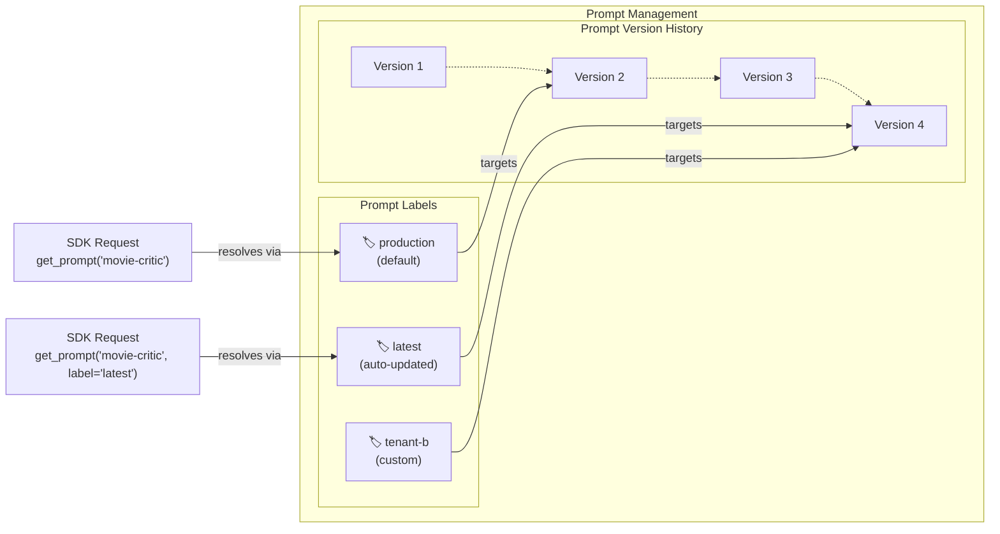

# 핵심 개념

이 페이지에서는 프롬프트 관리 개념과 모범 사례를 다룹니다. 아직 확인하지 않았다면, 관측성(observability)에 왜 유용한지에 대해 [개요](/docs/prompt-management/overview) 페이지를 참고하세요.

바로 시작하고 싶으신가요? 첫 번째 프롬프트를 생성하려면 [시작하기 가이드](/docs/prompt-management/get-started)를 확인하세요.

## 프롬프트 객체

Langfuse는 프롬프트를 LLM에 대한 지시사항(단일 문자열이거나 메시지 배열일 수 있음)과, 선택적으로 동작에 영향을 주는 [추가 구성](/docs/prompt-management/features/config)의 조합으로 간주합니다.

프롬프트 객체는 서로 다른 버전, 변형(variant), 배포를 관리하기 위한 몇 가지 속성도 가지고 있습니다. 이 페이지에서는 프롬프트를 생산적으로 사용하기 위한 가장 중요한 원칙들을 안내합니다.

프롬프트 객체의 모든 필드와 메서드에 대한 자세한 정보는 [SDK 참조 문서](https://langfuse-js-git-main-langfuse.vercel.app/interfaces/_langfuse_core.Prompt.Chat.html)를 참고하세요.

### 채팅 프롬프트 vs 텍스트 프롬프트 [#text-vs-chat-prompts]

Langfuse는 두 가지 프롬프트 유형을 지원합니다. `type` 필드는 형식을 결정하며 생성 후에는 변경할 수 없습니다.

**텍스트 프롬프트**는 단일 문자열로, 단순한 사용 사례이거나 시스템 메시지만 필요한 경우에 적합합니다.

**채팅 프롬프트**는 특정 역할(시스템, 사용자, 어시스턴트)을 가진 메시지 배열로, 전체 대화 구조를 관리하거나, 예시 대화를 포함하거나, 채팅 히스토리를 처리하고 싶을 때 유용합니다.

<div className="grid grid-cols-1 md:grid-cols-2 mt-6 gap-4">

<div className="[&_pre]:break-words [&_pre]:whitespace-pre-wrap">

```json filename="Text prompt example"
{
  "name": "movie-critic",
  "type": "text",
  "prompt": "As a movie critic, do you like Dune 2?",
  "version": 1
}
```

</div>

<div className="[&_pre]:break-words [&_pre]:whitespace-pre-wrap">

```json filename="Chat prompt example"
{
  "name": "movie-critic-chat",
  "type": "chat",
  "prompt": [
    {
      "role": "system",
      "content": "You are a movie critic."
    },
    {
      "role": "user",
      "content": "Do you like Dune 2?"
    }
  ],
  "version": 1
}
```

</div>

</div>

<Callout type="info">
**채팅 프롬프트를 사용해야 하는 경우:** 대부분의 애플리케이션은 텍스트 프롬프트로 시작합니다. 여러 메시지, 역할 기반 구조, 또는 채팅 히스토리를 관리해야 하는 더 복잡한 로직을 구축하게 되면 채팅 프롬프트로 전환하는 것이 합리적입니다. 이를 통해 프롬프트 관리 시스템에서 전체 대화 구조를 관리할 수 있습니다.
</Callout>

### 프롬프트의 동적 렌더링 [#dynamic-rendering-of-prompts]

런타임에 동적으로 채워질 수 있는 변수를 프롬프트에 추가할 수 있습니다. 사용할 수 있는 여러 유형의 변수가 아래에 설명되어 있습니다.

프롬프트는 런타임에 동적 콘텐츠를 삽입하는 세 가지 방법을 지원합니다.

| 유형                                                                         | 사용 사례                                                 |
| ---------------------------------------------------------------------------- | --------------------------------------------------------- |
| [변수](/docs/prompt-management/features/variables)                           | 메시지에 동적 텍스트 삽입                                 |
| [프롬프트 참조](/docs/prompt-management/features/composability)              | 다른 프롬프트 간 프롬프트 재사용, 공통 지시사항 중복 방지 |
| [메시지 플레이스홀더](/docs/prompt-management/features/message-placeholders) | 메시지 배열 삽입 (예: 채팅 히스토리)                      |

## 프롬프트 캐싱 [#prompt-caching]

Langfuse 프롬프트 관리는 다음 두 가지 주요 이유로 캐시된 프롬프트를 사용합니다.

1. 애플리케이션에 지연 시간을 추가하지 않습니다.
2. 가용성 위험을 제거합니다.

즉, 프롬프트를 업데이트한 이후 처음 발생하는 몇 개의 트레이스는 여전히 이전 버전을 사용할 수 있습니다. 사용 사례에서 즉각적인 업데이트가 중요하다면, 캐싱을 비활성화하거나 더 짧은 TTL(time-to-live)을 설정할 수 있습니다.

캐싱이 작동하는 방식과 구성 방법에 대한 자세한 내용은 [캐싱 문서](/docs/prompt-management/features/caching)를 참고하세요.

## 버전 관리와 라벨

버전과 라벨이 함께 작동하는 방식을 이해하는 것은 프로덕션 환경에서 프롬프트를 관리하는 데 필수적입니다. 이 둘은 서로 다르지만 상호 보완적인 목적을 가지고 있습니다.

**버전**은 모든 프롬프트 변경 사항에 대한 불변의 이력을 제공합니다. 각 업데이트는 새로운 버전(1, 2, 3...)을 생성합니다.

**라벨**은 특정 버전을 가리키는 포인터입니다. 코드는 일반적으로 라벨을 참조합니다. 일반적인 라벨은 다음과 같습니다.

- `production` - 기본 라벨로, 프로덕션 애플리케이션에서 사용됨
- `latest` - 항상 최신 버전을 가리킴
- 사용자 지정 라벨 - 스테이징, 테스트, 테넌트, A/B 테스트를 위한 라벨 생성

[버전 관리와 라벨](/docs/prompt-management/features/prompt-version-control)에 대해 자세히 알아보세요.



### 배포 워크플로우

프롬프트 변경 사항을 배포하는 일반적인 워크플로우는 다음과 같습니다.

1. **생성 및 테스트:** 새 프롬프트 버전을 생성합니다 (자동으로 `latest` 라벨이 지정됨)
2. **검증:** 개발 환경 또는 플레이그라운드를 사용하여 새 버전을 테스트합니다
3. **배포:** `production` 라벨이 새 버전을 가리키도록 업데이트합니다
4. **모니터링:** 프로덕션 애플리케이션은 다음 조회 시 자동으로 새 버전을 사용합니다
5. **필요시 롤백:** `production` 라벨을 이전 버전으로 다시 지정하기만 하면 됩니다

코드가 라벨을 참조하므로, 이 모든 과정은 코드 변경 없이 이루어집니다.
