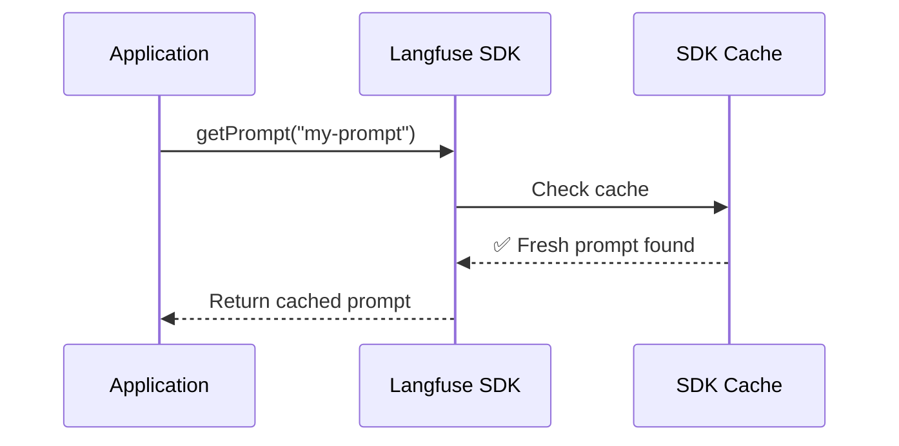
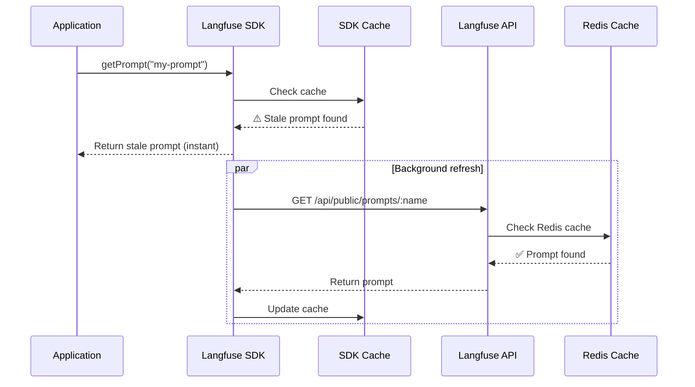
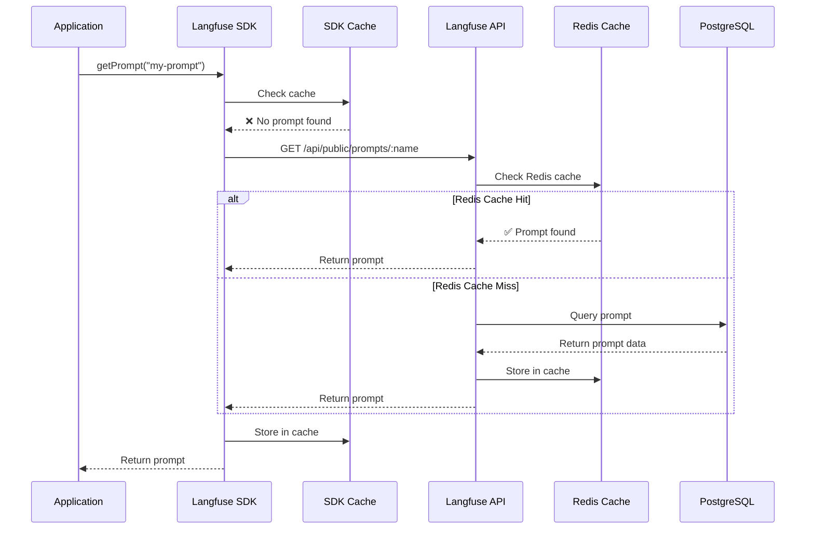
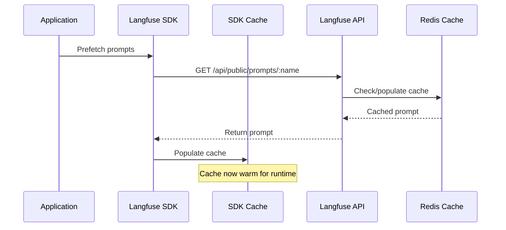
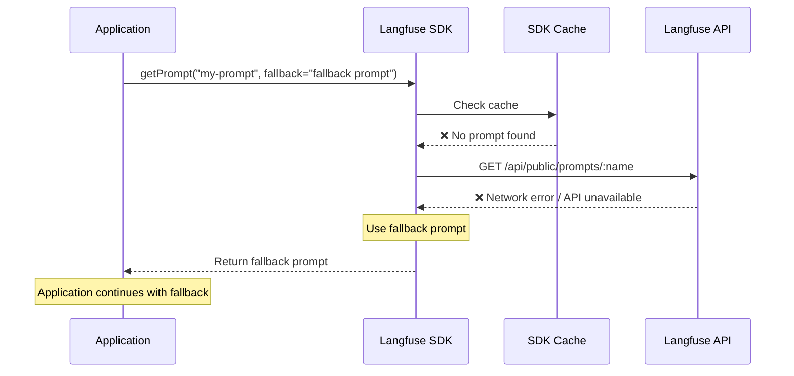

# 클라이언트 SDK에서의 프롬프트 캐싱

Langfuse 프롬프트는 SDK에서 클라이언트 측에 캐싱되므로 **최초 사용 이후에는 지연 시간에 영향을 주지 않으며** 가용성 위험도 없습니다. 또한 시작 시 프롬프트를 미리 가져와(pre-fetch) 캐시를 채우거나 폴백(fallback) 프롬프트를 제공할 수도 있습니다.

<Tabs items={["Cache Hit", "Background Revalidation", "Cache Miss", "Optional: Pre-fetch", "Optional: Fallback"]}>
<Tab>

SDK 캐시에 최신 상태의 프롬프트가 있으면, 네트워크 요청 없이 **즉시** 반환됩니다.



</Tab>
<Tab>

캐시 TTL이 만료되면, **백그라운드에서 재검증하는 동안** 오래된(stale) 프롬프트가 **즉시** 제공됩니다.



이를 통해 **높은 가용성**을 보장합니다 - 캐시가 최신 상태를 유지하는 동안 사용자는 네트워크 요청을 기다릴 필요가 없습니다.

</Tab>
<Tab>

캐싱된 프롬프트가 없는 경우(예: 애플리케이션 최초 시작), 프롬프트는 API로부터 가져옵니다. API는 낮은 지연 시간을 보장하기 위해 프롬프트를 Redis 캐시에 캐싱합니다.



여러 겹의 폴백 계층이 **복원력(resilience)**을 보장합니다 - Redis를 사용할 수 없는 경우 데이터베이스가 백업 역할을 합니다.

</Tab>
<Tab>

애플리케이션 시작 시 프롬프트를 미리 가져오면, 런타임 요청이 발생하기 전에 캐시가 채워집니다.

이 단계는 선택 사항이며 대부분의 경우 필요하지 않습니다. 일반적으로 서비스가 시작된 후 최초 사용 시 발생하는 최소한의 지연 시간은 허용 가능한 수준입니다. 이를 설정하는 방법은 아래 예제를 참고하세요.



</Tab>
<Tab>

로컬 캐시가 비어 있고 Langfuse API도 사용할 수 없는 경우, 폴백 프롬프트를 사용하여 100%의 가용성을 보장할 수 있습니다.

프롬프트 API는 가용성이 매우 높고 그 성능을 면밀히 모니터링하고 있으므로([상태 페이지](https://status.langfuse.com)) 이는 거의 필요하지 않습니다. 짧은 서비스 장애가 발생하더라도, SDK 수준의 프롬프트 캐시가 일반적으로 애플리케이션이 영향을 받지 않도록 보장합니다.



</Tab>
</Tabs>

## 선택 사항: 캐싱 기간(TTL) 사용자 지정

Langfuse 클라이언트의 네트워크 오버헤드를 줄이고자 한다면 캐싱 기간을 설정할 수 있습니다. 기본 캐시 TTL(Time To Live)은 60초입니다. TTL이 만료되면 SDK는 백그라운드에서 프롬프트를 다시 가져와 캐시를 업데이트합니다. 다시 가져오는 작업은 비동기적으로 수행되며 애플리케이션을 차단하지 않습니다.

<LangTabs items={["Python SDK", "JS/TS SDK"]}>
<Tab>

```python
# 현재 `production` 프롬프트 버전을 가져와 5분간 캐싱
prompt = langfuse.get_prompt("movie-critic", cache_ttl_seconds=300)
```

</Tab>

<Tab>

```ts
import { LangfuseClient } from "@langfuse/client";

const langfuse = new LangfuseClient();

// 현재 `production` 버전을 가져와 5분간 캐싱
const prompt = await langfuse.prompt.get("movie-critic", {
  cacheTtlSeconds: 300,
});
```

</Tab>

</LangTabs>

## 선택 사항: 캐싱 비활성화 [#disable-caching]

`cacheTtlSeconds`를 `0`으로 설정하여 캐싱을 비활성화할 수 있습니다. 이렇게 하면 호출할 때마다 Langfuse API에서 프롬프트를 가져오게 됩니다. Langfuse에 있는 최신 버전과 프롬프트가 항상 일치하도록 하고자 하는 비프로덕션 사용 사례에 권장됩니다.

<LangTabs items={["Python SDK", "JS/TS SDK"]} >
<Tab>

```python
prompt = langfuse.get_prompt("movie-critic", cache_ttl_seconds=0)

# 비프로덕션 환경에서 흔히 사용되는 방식, 캐시 없음 + 최신 버전
prompt = langfuse.get_prompt("movie-critic", cache_ttl_seconds=0, label="latest")
```

</Tab>

<Tab>

```ts
const prompt = await langfuse.prompt.get("movie-critic", {
  cacheTtlSeconds: 0,
});

// 비프로덕션 환경에서 흔히 사용되는 방식, 캐시 없음 + 최신 버전
const prompt = await langfuse.prompt.get("movie-critic", {
  cacheTtlSeconds: 0,
  label: "latest",
});
```

</Tab>
</LangTabs>

## 선택 사항: 프롬프트 가용성 보장 [#guaranteed-availability]

일반적으로는 필요하지 않지만, 애플리케이션 시작 시 프롬프트를 미리 가져오고 폴백 프롬프트를 제공하여 프롬프트의 100% 가용성을 보장할 수 있습니다. 자세한 내용은 이 [가이드](/docs/prompt-management/features/guaranteed-availability)를 참고하세요.

## 최초 조회의 성능 측정

캐싱을 완전히 비활성화한 상태에서 다음 스니펫의 실행 시간을 측정했습니다. 결과를 직접 확인하려면 [이 노트북](/guides/cookbook/prompt_management_performance_benchmark)을 직접 실행해 볼 수 있습니다.

```python
prompt = langfuse.get_prompt("perf-test", cache_ttl_seconds=0)
prompt.compile(input="test")
```

Langfuse Cloud를 사용한 1000회 순차 실행 결과입니다(네트워크 지연 시간 포함).

<div className="sm:grid sm:grid-cols-2 gap-4">

<Frame className="max-w-md">
  
</Frame>

```
count    1000.000000
mean        0.039335 sec
std         0.014172 sec
min         0.032702 sec
25%         0.035387 sec
50%         0.037030 sec
75%         0.041111 sec
99%         0.068914 sec
max         0.409609 sec
```

</div>
