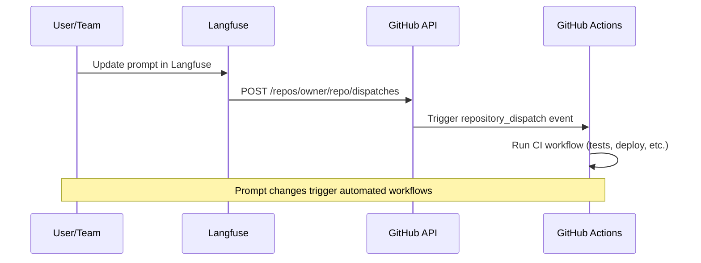
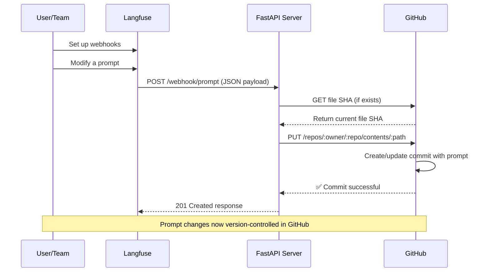

# Langfuse 프롬프트를 위한 GitHub 통합

Langfuse 프롬프트를 GitHub와 통합하는 방법은 두 가지가 있습니다.

- [**GitHub Repository Dispatch**](#trigger-github-actions) - 프롬프트가 변경될 때 CI/CD 워크플로우를 트리거합니다. 추가 인프라가 필요하지 않습니다.
- [**Langfuse 프롬프트를 저장소에 동기화**](#sync-langfuse-prompts-to-a-repository) - 저장소 내 특정 파일에 프롬프트를 저장합니다. 프롬프트 버전 변경을 감지하고 이를 저장소에 커밋하는 웹훅 서버가 필요합니다.

---

## GitHub Actions 트리거 [#trigger-github-actions]

`repository_dispatch` 이벤트를 사용하여 Langfuse 프롬프트가 변경될 때 GitHub Actions 워크플로우를 트리거합니다.



### 1. GitHub 워크플로우 생성

`.github/workflows/langfuse-ci.yml`:

```yaml
name: Langfuse Prompt CI
on:
  repository_dispatch:
    types: [langfuse-prompt-update]
  workflow_dispatch:

jobs:
  test:
    runs-on: ubuntu-latest
    steps:
      - uses: actions/checkout@v4
      - name: Run tests
        run: |
          echo "Testing prompt: ${{ github.event.client_payload.prompt.name }} v${{ github.event.client_payload.prompt.version }}"
          # Add your test commands
          # npm test
          # python -m pytest

  deploy:
    needs: test
    runs-on: ubuntu-latest
    if: contains(github.event.client_payload.prompt.labels, 'production')
    steps:
      - uses: actions/checkout@v4
      - name: Deploy to production
        run: |
          echo "Deploying ${{ github.event.client_payload.prompt.name }} v${{ github.event.client_payload.prompt.version }}"
          # Your deployment commands
```

**웹훅 데이터 접근하기:** 프롬프트 데이터에 접근하려면 `github.event.client_payload.*`를 사용합니다.

```yaml
# Example: Access webhook data in your workflow
- name: Process prompt data
  run: |
    echo "Action: ${{ github.event.client_payload.action }}"
    echo "Prompt: ${{ github.event.client_payload.prompt.name }}"
    echo "Version: ${{ github.event.client_payload.prompt.version }}"
    echo "Labels: ${{ github.event.client_payload.prompt.labels }}"

- name: Deploy only production prompts
  if: contains(github.event.client_payload.prompt.labels, 'production')
  run: echo "Deploying production prompt"
```

### 2. Actions용 GitHub 토큰 생성

**단계:**

1. **GitHub Settings > Developer settings > Personal access tokens**
2. **Generate new token (classic or fine-grained)**
3. **범위 선택** (아래 표 참조)

| 토큰 유형                        | 필요 권한                                                         |
| -------------------------------- | ----------------------------------------------------------------- |
| Personal Access Token (classic)  | `repo` 범위 (공개 저장소) 또는 `public_repo` 범위 (비공개 저장소) |
| Fine-grained PAT 또는 GitHub App | `actions`에 대한 `read` 및 `write` 권한                           |

### 3. Langfuse에서 GitHub Action 구성

1. Langfuse 프로젝트에서 **Prompts > Automations**로 이동합니다.
2. **Create Automation**을 클릭합니다.
3. **GitHub Repository Dispatch**를 선택합니다.
4. 자동화를 구성합니다.
   - **Dispatch URL**: `https://api.github.com/repos/{owner}/{repo}/dispatches` (`{owner}`와 `{repo}`를 실제 값으로 대체합니다)
   - **Event Type**: `langfuse-prompt-update` (GitHub 워크플로우의 타입과 일치해야 합니다)
   - **GitHub Token**: GitHub Personal Access Token을 입력합니다. 안전하게 저장됩니다.

### 4. GitHub Actions 통합 테스트

1. Langfuse에서 `production` 레이블을 가진 **프롬프트를 업데이트**합니다.
2. 트리거된 워크플로우를 확인하기 위해 **GitHub Actions** 탭을 확인합니다.
3. test와 deploy 작업이 모두 성공적으로 실행되는지 **확인**합니다.

---

## Langfuse 프롬프트를 저장소에 동기화 [#sync-langfuse-prompts-to-a-repository]

[Prompt Version Webhooks](/docs/prompt-management/features/webhooks)를 사용하여 Langfuse의 프롬프트 변경 사항을 GitHub로 자동 동기화합니다. 이를 통해 프롬프트 버전 관리를 할 수 있으며, 프롬프트 변경 시 CI/CD 워크플로우를 트리거할 수도 있습니다.

### 동기화 워크플로우 개요

Langfuse에서 새 프롬프트 버전을 저장할 때마다 GitHub 저장소에 자동으로 커밋됩니다. 이 설정을 통해 프롬프트가 변경될 때 CI/CD 워크플로우를 트리거할 수도 있습니다.



### 동기화를 위한 사전 준비 사항

1. **Langfuse 프로젝트:** Project Owner 권한을 가진 [프롬프트 설정](/docs/prompts/get-started)
2. **GitHub 저장소:** 프롬프트를 저장할 공개 또는 비공개 저장소
3. **GitHub PAT:** 최소 필요 권한을 가진 Personal Access Token (자세한 내용은 2단계 참조)
4. **Python 3.9+ (아래 예시에 사용, 다른 언어로도 대체 가능)** 및 FastAPI, Uvicorn, httpx, Pydantic
5. 웹훅 서버를 위한 **공개 HTTPS 엔드포인트** (Render, Fly.io, Heroku 등)

### 1단계: Langfuse에서 프롬프트 웹훅 구성

1. Langfuse 프로젝트에서 **Prompts > Webhooks**로 이동합니다.
2. **Create Webhook**을 클릭합니다.
3. (선택 사항) 이벤트 필터링: 어떤 프롬프트 버전 이벤트에 대해 웹훅을 받을지 필터링합니다 (기본값: `created`, `updated`, `deleted`).
4. 엔드포인트 URL을 설정합니다: `https://<your-domain>/webhook/prompt`
5. 저장한 후 **서명 비밀 키(Signing Secret)**를 복사합니다.

**참고:** 엔드포인트는 반드시 2xx 상태 코드를 반환해야 합니다. Langfuse는 실패한 웹훅을 지수 백오프 방식으로 재시도합니다.

#### 웹훅 페이로드 예시

웹훅 페이로드 예시:

```json
{
  "id": "550e8400-e29b-41d4-a716-446655440000",
  "timestamp": "2024-07-10T10:30:00Z",
  "type": "prompt-version",
  "action": "created",
  "prompt": {
    "id": "prompt_abc123",
    "name": "movie-critic",
    "version": 3,
    "projectId": "xyz789",
    "labels": ["production", "latest"],
    "prompt": "As a {{criticLevel}} movie critic, rate {{movie}} out of 10.",
    "type": "text",
    "config": { "...": "..." },
    "commitMessage": "Improved critic persona",
    "tags": ["entertainment"],
    "createdAt": "2024-07-10T10:30:00Z",
    "updatedAt": "2024-07-10T10:30:00Z"
  }
}
```

### 2단계: 동기화를 위한 GitHub 저장소 및 토큰 준비

GitHub 자격 증명을 담은 `.env` 파일을 생성합니다.

```bash
GITHUB_TOKEN=<your_github_pat_here>
GITHUB_REPO_OWNER=<github_username_or_org>
GITHUB_REPO_NAME=<repo_name>
# (Optional) GITHUB_FILE_PATH=langfuse_prompt.json
# (Optional) GITHUB_BRANCH=main
# (Optional) REQUIRED_LABEL=production
```

플레이스홀더를 실제 값으로 대체합니다. 서버는 기본적으로 `main` 브랜치의 `langfuse_prompt.json`에 프롬프트를 커밋합니다. `REQUIRED_LABEL`이 설정되어 있으면 해당 레이블을 가진 프롬프트만 GitHub로 동기화됩니다.

#### 동기화를 위한 GitHub PAT 권한

웹훅이 동작하려면 GitHub Personal Access Token에 **최소한의 권한**이 필요합니다.

| 권한 유형        | 필요 권한                                                                 |
| ---------------- | ------------------------------------------------------------------------- |
| 필요 권한        | Contents: Read and write, Metadata: Read-only                             |
| 레거시 토큰 범위 | 공개 저장소의 경우: `public_repo` 범위, 비공개 저장소의 경우: `repo` 범위 |

### 3단계: FastAPI 웹훅 서버 구현

다음 FastAPI 서버로 `main.py`를 생성합니다.

```python
from typing import Any, Dict
from uuid import UUID
import json
import base64

import httpx
from pydantic import BaseModel, Field
from pydantic_settings import BaseSettings, SettingsConfigDict
from fastapi import FastAPI, HTTPException, Body

class GitHubSettings(BaseSettings):
    """GitHub repository configuration."""
    GITHUB_TOKEN: str
    GITHUB_REPO_OWNER: str
    GITHUB_REPO_NAME: str
    GITHUB_FILE_PATH: str = "langfuse_prompt.json"
    GITHUB_BRANCH: str = "main"
    REQUIRED_LABEL: str = ""  # Optional: only sync prompts with this label

    model_config = SettingsConfigDict(
        env_file=".env",
        env_file_encoding="utf-8",
        case_sensitive=True
    )

config = GitHubSettings()

class LangfuseEvent(BaseModel):
    """Langfuse webhook event structure."""
    id: UUID = Field(description="Event identifier")
    timestamp: str = Field(description="Event timestamp")
    type: str = Field(description="Event type")
    action: str = Field(description="Performed action")
    prompt: Dict[str, Any] = Field(description="Prompt content")

async def sync(event: LangfuseEvent) -> Dict[str, Any]:
    """Synchronize prompt data to GitHub repository."""
    # Check if prompt has required label (if specified)
    if config.REQUIRED_LABEL:
        prompt_labels = event.prompt.get("labels", [])
        if config.REQUIRED_LABEL not in prompt_labels:
            return {"skipped": f"Prompt does not have required label '{config.REQUIRED_LABEL}'"}

    api_endpoint = f"https://api.github.com/repos/{config.GITHUB_REPO_OWNER}/{config.GITHUB_REPO_NAME}/contents/{config.GITHUB_FILE_PATH}"

    request_headers = {
        "Authorization": f"Bearer {config.GITHUB_TOKEN}",
        "Accept": "application/vnd.github.v3+json"
    }

    content_json = json.dumps(event.prompt, indent=2)
    encoded_content = base64.b64encode(content_json.encode("utf-8")).decode("utf-8")

    name = event.prompt.get("name", "unnamed")
    version = event.prompt.get("version", "unknown")
    message = f"{event.action}: {name} v{version}"

    payload = {
        "message": message,
        "content": encoded_content,
        "branch": config.GITHUB_BRANCH
    }

    async with httpx.AsyncClient() as http_client:
        try:
            existing = await http_client.get(api_endpoint, headers=request_headers, params={"ref": config.GITHUB_BRANCH})
            if existing.status_code == 200:
                payload["sha"] = existing.json().get("sha")
        except Exception:
            pass

        try:
            response = await http_client.put(api_endpoint, headers=request_headers, json=payload)
            response.raise_for_status()
            return response.json()
        except Exception as e:
            raise HTTPException(status_code=500, detail=f"Repository sync failed: {str(e)}")

app = FastAPI(title="Langfuse GitHub Sync", version="1.0")

@app.post("/webhook/prompt", status_code=201)
async def receive_webhook(event: LangfuseEvent = Body(...)):
    """Process Langfuse webhook and sync to GitHub."""
    result = await sync(event)
    return {
        "status": "synced",
        "commit_info": result.get("commit", {}),
        "file_info": result.get("content", {})
    }

@app.get("/status")
async def health_status():
    """Service health check."""
    return {"healthy": True}
```

이 서버는 웹훅 페이로드를 검증하고, 필요한 경우 기존 파일의 SHA를 조회하며, 설명이 포함된 커밋 메시지와 함께 프롬프트 변경 사항을 GitHub에 커밋합니다.

#### 의존성 설치

의존성을 설치합니다.

```bash
pip install fastapi uvicorn pydantic-settings httpx
```

#### 로컬에서 실행하기

로컬에서 실행합니다.

```bash
uvicorn main:app --reload --port 8000
```

`http://localhost:8000/health`에서 헬스 엔드포인트를 테스트합니다. 웹훅 테스트를 위해 로컬 호스트를 외부에 노출하려면 ngrok 등을 사용합니다.

### 4단계: 서버 배포 및 연결

1. **배포:** Render, Fly.io, Heroku 또는 유사한 서비스를 사용합니다. 환경 변수를 설정하고 HTTPS가 활성화되어 있는지 확인합니다.

2. **웹훅 업데이트:** Langfuse에서 웹훅을 편집하고 URL을 `https://your-domain.com/webhook/prompt`로 설정합니다.

3. **테스트:** Langfuse에서 프롬프트를 업데이트하고 GitHub 저장소에 새 커밋이 나타나는지 확인합니다.

### 보안 고려 사항

- **서명 검증:** 서명 비밀 키와 `x-langfuse-signature` 헤더를 사용하여 요청을 검증합니다.
- **PAT 범위 제한:** 특정 저장소로 범위가 제한된 fine-grained 토큰을 사용합니다.
- **재시도 처리:** 구현은 멱등성을 가지므로, 중복 이벤트가 발생해도 충돌하는 커밋이 생성되지 않습니다.
