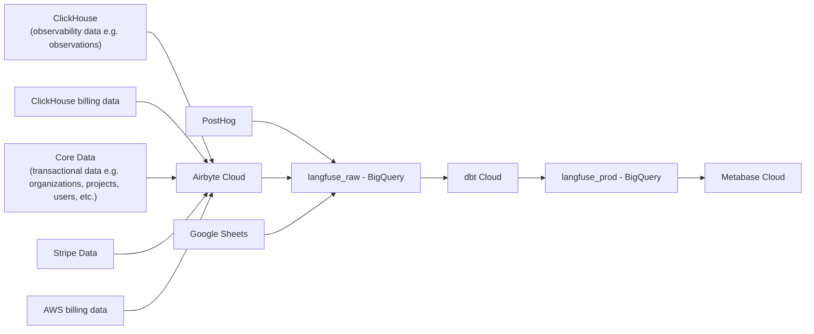

# 분석

여러 팀/기능에 걸친 내부 분석은 중앙 분석 스택을 기반으로 이루어집니다.

## 목표

- 원시 제품 데이터에서 핵심 비즈니스/제품 메트릭에 이르는 유지보수 가능한 경로를 확보합니다. 핵심 비즈니스 메트릭은 기반 시스템이 변경되더라도 유지보수/테스트가 가능해야 합니다.
- 어떤 메트릭에 대해 논의하든, 그것이 무엇을 의미하고 어떻게 계산되는지가 명확히 이해되고 문서화되어 있어야 합니다.

## 데이터 흐름

## 아키텍처

Langfuse 분석 스택은 여러 데이터 소스로 구성되며, 이 데이터는 BigQuery 데이터셋으로 유입된 후 변환 및 시각화됩니다.

1. **데이터 웨어하우스** -> **BigQuery**
   - [Analytics Project](https://console.cloud.google.com/welcome?inv=1&invt=AbylRQ&project=analytics-461014)

2. **데이터 소스** → **langfuse_raw** (BigQuery)
   - [PostHog](https://eu.posthog.com/project/7132) 직접 내보내기
   - [Airbyte Cloud](https://cloud.airbyte.com/workspaces/c1588c24-d8e8-460a-93ee-cb5987156a60/connections) 인스턴스가 다음을 가져옵니다.
     - ClickHouse 데이터 (prod-eu, prod-us, prod-hipaa에서)
     - Core 데이터 (prod-eu, prod-us, prod-hipaa에서) S3 내보내기를 통해
     - Stripe 데이터
   - Google Sheets ([메인 폴더](https://drive.google.com/drive/folders/1rFXodaQR81lcRg0QLl-3VF3hYhsJHRmI))
     - 유형: 도메인 보강(domain enrichment)
     - BigQuery 콘솔의 `langfuse_raw_google_sheets` 스키마에 추가해야 합니다.
     - 이 폴더의 모든 시트는 dbt 및 metabase 서비스 계정과 공유(보기 전용)되어 있습니다.

3. **langfuse_raw** → **langfuse_prod** (BigQuery)
   - [dbt Cloud](https://hy094.us1.dbt.com/dashboard/70471823463468/projects/70471823471745/)가 원시 데이터를 프로덕션 준비 형식으로 변환합니다.
   - DBT 쿼리는 [Analytics Repo](https://github.com/langfuse/analytics)에서 관리됩니다. dbt 사용 방법에 대한 자세한 내용은 Readme를 참고하세요.
   - 모델 레이어 (멘탈 모델):
     - Raw/Core → 복제된 제품 데이터.
     - Staging → 리전이 통합되고 타입이 지정된 테이블 (ID는 리전 프리픽스가 붙고, 타임스탬프는 파싱됨).
     - Marts → 비즈니스에 바로 사용 가능한 집계, 예: Project Hourly Metrics, Organization Hourly Metrics, 일간/월간 롤업.

4. **데이터 시각화**
   - [Metabase Cloud](https://langfuse.metabaseapp.com/)가 분석 대시보드를 제공합니다.

### 접근 권한 얻기

- 새 메트릭을 만들기 위해 dbt, Airbyte 또는 BigQuery 접근 권한이 필요하다면 요청해 주세요.
- Langfuse Google 계정으로 Metabase에 가입할 수 있습니다.

## 새 메트릭 추가하기

### "규칙"

- ✅ 비즈니스 로직은 **dbt**에 둡니다.
- ✅ 대시보드는 **marts**만을 기반으로 구축합니다.
- ❌ Metabase에서 raw 테이블에 대한 커스텀 SQL은 피합니다 (유지보수가 어렵습니다).
- ✅ 항상 **브랜치 + PR**을 사용합니다. `main`에 직접 푸시하지 **않습니다**.
- ✅ YAML에 기본적인 **스키마 테스트**(예: `unique`, `not_null`, `accepted_values`)를 추가합니다.

### 일회성 설정 (개인별)

- BigQuery, dbt Cloud 프로젝트, [analytics GitHub 저장소](https://github.com/langfuse/analytics), Metabase에 대한 접근 권한을 얻습니다.
- analytics 저장소를 클론합니다. dbt 개발에는 Cursor/자신의 IDE를 사용하세요. 자세한 내용은 analytics 저장소의 Readme를 참고하세요.

### 표준 워크플로우: 새 메트릭 추가/배포

1. **브랜치:** `main`에서 기능 브랜치를 생성합니다.
2. **Staging (필요한 경우):** 다음을 수행하는 staging 모델을 추가/확장합니다.
   - 리전을 통합합니다 (EU/US/Japan/HIPAA → 하나의 테이블).
   - **리전 프리픽스가 붙은 ID**와 파싱된 타임스탬프를 보장합니다.
   - 최소한의 YAML 테스트를 추가합니다 (ID `unique`/`not_null`).
3. **Mart 확장:** mart에 메트릭을 추가합니다.
   1. 관련 mart의 .yml에 추가합니다. 예를 들어 project_hourly_metrics부터 시작하면, 이는 이후 조직 또는 일간 도입(adoption) 메트릭을 위한 다른 mart들로 롤업됩니다.
   2. Cursor를 사용해 SQL을 생성한 후 검토합니다.
4. **PR 및 미리보기:**
   - PR을 엽니다. dbt Cloud는 **여러분의 diff만** 빌드/테스트합니다.
   - PR에 연결된 **임시 BigQuery 데이터셋**이 생성됩니다. 여기서 결과를 검증하세요.
5. **병합:** 테스트와 체크가 통과하면 병합합니다. 메트릭이 올바른지(값 + 문서화) 확신이 서지 않으면 리뷰를 요청하세요.
6. **대시보드:** Metabase에서 **marts를 대상으로** 카드를 빌드/조정합니다 (raw 테이블은 사용하지 않음).

### 예시: 프롬프트 관리 사용량 메트릭

PR: https://github.com/langfuse/analytics/pull/67 (비공개 analytics 저장소)

- **기존 상태:** prompts staging 테이블의 각 행 = **하나의 프롬프트 버전** (업데이트가 아님). `created_at`이 새 버전을 나타냅니다.
- **원했던 것:** 시간당 프로젝트/조직별로 새로 생성된 프롬프트 버전을 추적하는 메트릭.
- **변경 사항:**
  - **Project Hourly Metrics:** staging prompts에서 시간당 프로젝트별 프롬프트 버전 수를 세는 `count_prompt_versions`를 추가합니다.
  - **Org Hourly Metrics:** 프로젝트별로 `count_prompt_versions`를 합산합니다.
