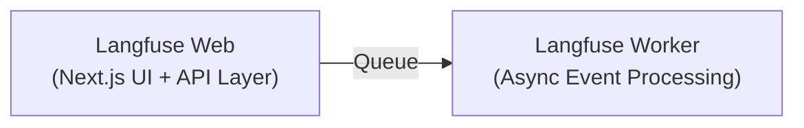
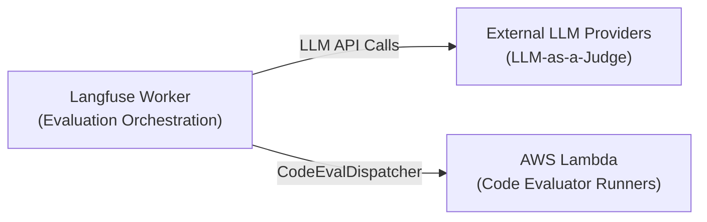
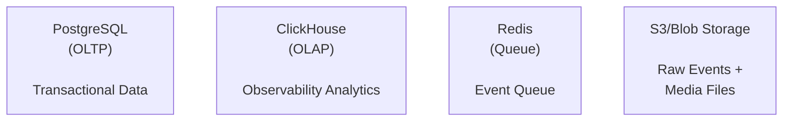
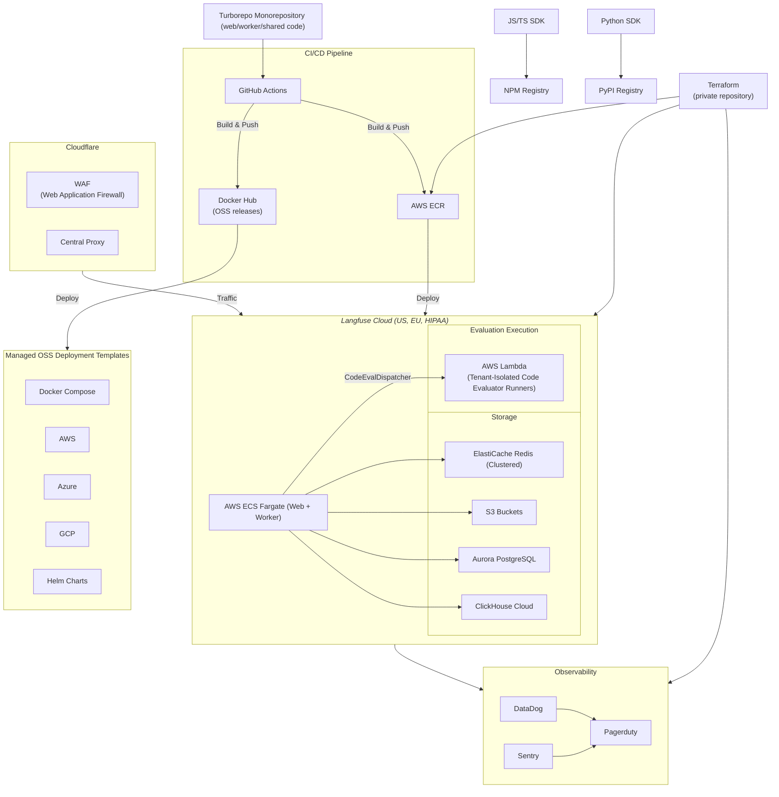

# Langfuse 플랫폼 아키텍처 - 상위 수준 개요

Langfuse의 인프라는 증가하는 규모와 새로운 제품 기능을 지원하기 위해 지속적으로 발전하고 있습니다. Vercel과 Supabase, Next.js, Postgres로 시작했으며, 이후 아래에서 설명하는 분산 아키텍처로 발전해 왔습니다. 제품과 규모 요구사항이 성장함에 따라 이러한 요구를 충족하기 위해 인프라를 계속 성숙시켜 나갈 것입니다.

Langfuse는 오픈소스 구성 요소에만 의존하며, 로컬, 클라우드 인프라, 또는 온프레미스에 배포할 수 있습니다.

import ArchitectureDiagram from "@/components-mdx/architecture-diagram-v3.mdx";

<ArchitectureDiagram />

import ArchitectureDescription from "@/components-mdx/architecture-description-v3.mdx";

<ArchitectureDescription />

## 인프라 구성 요소

### 애플리케이션 계층

- **Web 컨테이너 (NextJs)**: UI 애플리케이션과 모든 API를 제공합니다.
- **Worker 컨테이너 (Express)**: 백그라운드에서 수집 이벤트를 처리하고 비동기 작업(예: 내보내기, 평가 실행)을 실행합니다.

### 평가 계층

- **LLM-as-a-Judge**: worker가 외부 LLM 제공업체를 호출하여 모델 기반 평가기를 실행합니다.
- **코드 평가기 Lambda 러너**: `CodeEvalDispatcher` 추상화를 통해 worker 외부에서 [코드 평가기](/docs/evaluation/evaluation-methods/code-evaluators)를 실행합니다. 프로덕션 배포에서는 [AWS Lambda 테넌트 격리](https://docs.aws.amazon.com/lambda/latest/dg/tenant-isolation.html)를 적용한 테넌트 격리형 AWS Lambda 러너를 사용합니다.

### 스토리지 계층

- **PostgreSQL**: 트랜잭션 데이터(사용자, 조직, 프로젝트, API 키, 프롬프트, 데이터셋, LLM as a Judge 설정)를 저장합니다.
- **ClickHouse**: 트레이싱 데이터(트레이스, observation, 점수)를 저장합니다. 이를 사용하여 대시보드와 메트릭을 실행하고 UI의 테이블을 렌더링합니다.
- **Redis**: 이벤트 큐(BullMQ)와 캐싱 계층(API 키, 프롬프트)을 저장합니다.
- **S3**: 원시 수집 이벤트와 멀티모달 첨부 파일(이미지, 오디오)을 저장합니다.

### 관측성 데이터를 위해 왜 OLAP 데이터베이스(Clickhouse)가 필요한가?

- 우리는 처음에 Postgres 위에 Langfuse를 구축했다가 결국 Clickhouse로 마이그레이션했습니다. Postgres가 우리의 관측성 데이터에 가장 적합하지 않다는 것을 처음부터 알고 있었습니다.
- OLAP 데이터베이스는 컬럼형 레이아웃을 가지고 있습니다. 이를 통해 데이터베이스는 분석 쿼리(예: 시간 경과에 따른 LLM 비용)의 결과를 생성하는 데 필요한 데이터만 스캔합니다.
- 데이터 삽입을 확장하기 위해 멀티 노드 데이터베이스가 필요했습니다.
- 우리는 오픈소스 제품이기 때문에 오픈소스 라이선스로 실행되는 데이터베이스가 필요했습니다.

---

## 프로덕션 환경

우리의 프로덕션 인프라는 완전히 자동화된 CI/CD 파이프라인과 함께 여러 AWS 리전에 걸쳐 배포되어 있습니다. 모든 인프라는 Terraform으로 관리됩니다. Cloudflare WAF(Web Application Firewall)가 AWS 앞단의 중앙 프록시 역할을 합니다.

## SDK를 통한 데이터 수집

<Frame className="">
  
</Frame>

- **SDK**: SDK는 사용자의 애플리케이션을 계측합니다. 우리는 내부적으로 OpenTelemetry를 사용하는 자체 Python/JS SDK를 구축했습니다.
- **API**: SDK는 데이터를 우리 API로 전송하며, API는 데이터를 S3에 업로드하고 worker가 처리할 수 있도록 큐에 등록합니다.
- **Redis 큐**: 수집과 처리를 분리합니다. Redis를 통해서는 S3 참조만 전달합니다.
- **Worker 처리**: 수집 이벤트를 비동기적으로 처리하고, 이벤트를 보강하며, ClickHouse로 플러시합니다.
- **이중 데이터베이스**: 분석 쿼리를 위한 ClickHouse, 트랜잭션 데이터를 위한 Postgres
