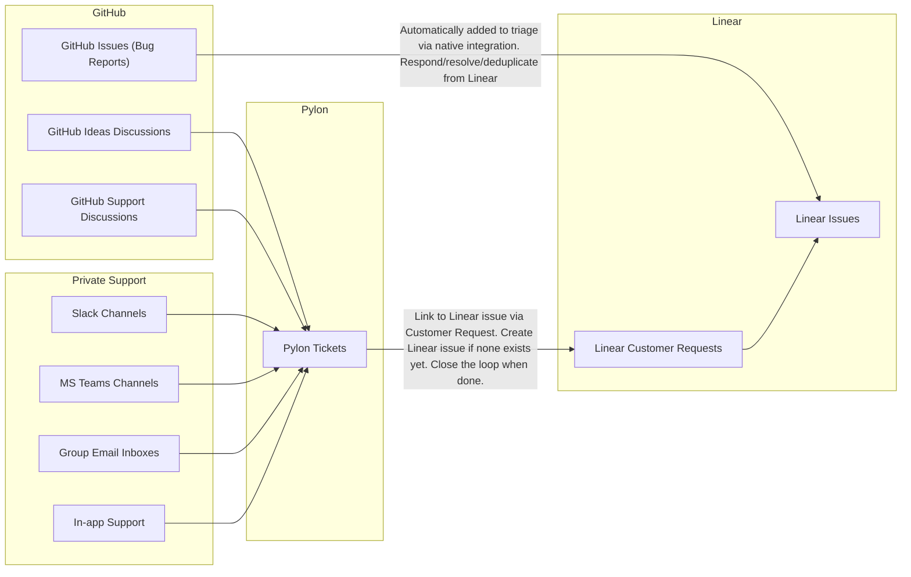

# 제품 운영

우리는 소규모 팀으로 점점 더 넓어지는 제품 범위를 유지하고 있습니다.
중요한 버그를 빠르게 수정하고, 고객이 많이 요청하는 개선 사항을 출시하기 위해서는 프로세스가 중요합니다.

## 개요

제품 엔지니어링을 위해 다음 도구를 사용합니다.

- 내부 티켓 관리 및 댓글/RFC를 통한 협업에는 Linear
- 인앱, GitHub Discussions Support, 공유 Slack 채널, 공유 MS Teams 채널, 공유 이메일 수신함 등 모든 채널의 지원을 관리하는 데는 Pylon
- GitHub
  - 버그 리포트 및 단기 개선 사항을 위한 Issues -> Linear를 통해 사용 (별도의 수신함 없음)
  - 기능 요청을 위한 Discussions -> Pylon을 통해 사용 (별도의 수신함 없음)
  - PR 리뷰 -> Linear PR을 통해 사용 (별도의 수신함 없음)

다음은 사용하지 않습니다.

- 개인 이메일 수신함

## 워크플로 통합

다음 다이어그램은 버그 리포트와 기능 요청이 어떻게 처리되는지를 보여줍니다.

