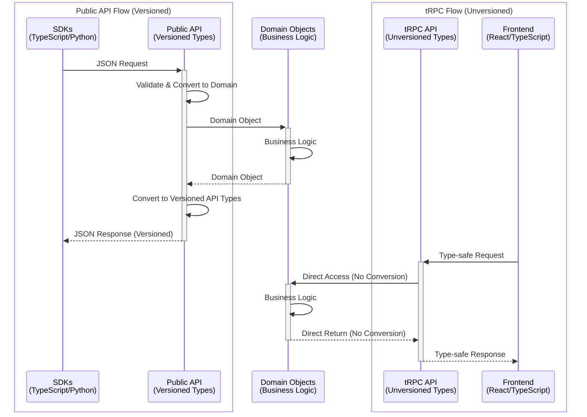
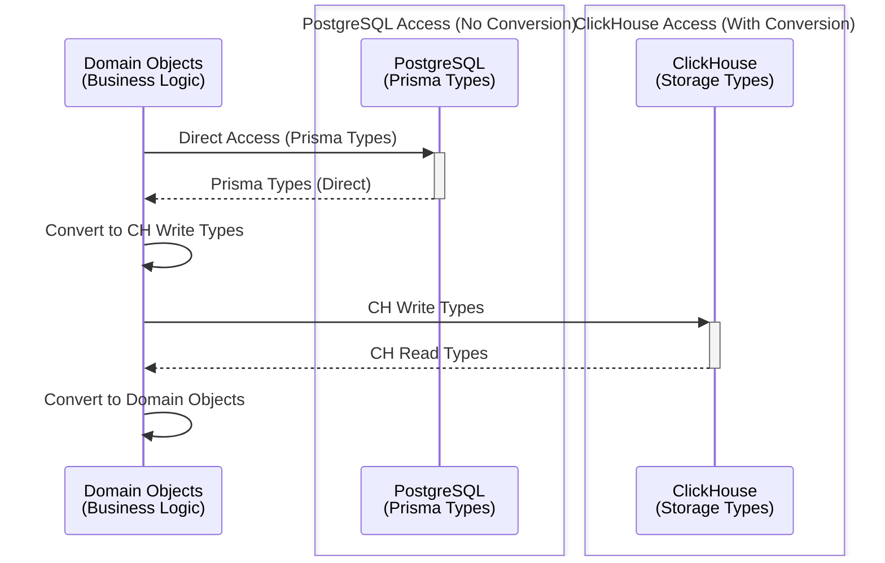

# 백엔드 코드 구조 가이드

이 가이드는 Langfuse 백엔드가 어떻게 구성되어 있는지와 우리가 확립한 패턴을 따라 코드를 작성하는 방법을 설명합니다.

## 아키텍처 개요

Langfuse는 세 가지 주요 패키지로 구성된 **모노레포** 구조를 사용합니다:

- **web** - Next.js 15 애플리케이션 (UI + tRPC API + 공개 REST API)
- **worker** - BullMQ를 사용하는 Express 기반 백그라운드 작업 처리기
- **packages/shared** - web과 worker가 모두 사용하는 공유 코드, 타입, 유틸리티

### API 요청 흐름

```
┌─ Web (NextJs): tRPC API ────┐   ┌── Web (NextJs): Public API ─┐
│                             │   │                             │
│  HTTP Request               │   │  HTTP Request               │
│      ↓                      │   │      ↓                      │
│  tRPC Procedure             │   │  withMiddlewares +          │
│  (protectedProjectProcedure)│   │  createAuthedProjectAPIRoute│
│      ↓                      │   │      ↓                      │
│  Service (business logic)   │   │  Service (business logic)   │
│      ↓                      │   │      ↓                      │
│  Prisma / ClickHouse        │   │  Prisma / ClickHouse        │
│                             │   │                             │
└─────────────────────────────┘   └─────────────────────────────┘
                 ↓
            [optional]: Publish to Redis BullMQ queue
                 ↓
┌─ Worker (Express): BullMQ Queue Job ────────────────────────┐
│                                                             │
│  BullMQ Queue Job                                           │
│      ↓                                                      │
│  Queue Processor (handles job)                              │
│      ↓                                                      │
│  Service (business logic)                                   │
│      ↓                                                      │
│  Prisma / ClickHouse                                        │
│                                                             │
└─────────────────────────────────────────────────────────────┘
```

우리는 계층형 아키텍처 패턴을 따릅니다:

- 라우터 계층: HTTP 요청 또는 BullMQ 작업 핸들러
- 서비스 계층: 모든 비즈니스 로직 포함
- 저장소(Repository) 계층: Prisma / ClickHouse

## 디렉토리 구조

### Web 패키지 (`/web/src/`)

```
web/src/
├── features/              # 기능별로 구성된 코드
│   └── [feature-name]/
│       ├── server/        # 백엔드: tRPC 라우터, 서비스
│       ├── components/    # 프런트엔드: React 컴포넌트
│       └── types/         # TypeScript 타입
│
├── server/
│   ├── api/
│   │   ├── routers/       # tRPC 라우터
│   │   ├── trpc.ts        # tRPC 설정 및 미들웨어
│   │   └── root.ts        # 루트 라우터
│   ├── auth.ts            # NextAuth 설정
│   └── db.ts              # 데이터베이스 클라이언트
│
├── pages/
│   ├── api/
│   │   ├── public/        # 공개 REST API 엔드포인트
│   │   └── trpc/          # tRPC 핸들러
│   └── [routes].tsx       # Next.js 페이지
│
├── __tests__/             # Jest 테스트
├── instrumentation.ts     # OpenTelemetry 설정
└── env.mjs                # 환경 설정
```

### Worker 패키지 (`/worker/src/`)

```
worker/src/
├── queues/                # BullMQ 작업 처리기
│   ├── evalQueue.ts
│   ├── ingestionQueue.ts
│   └── workerManager.ts
├── features/              # 비즈니스 로직
└── app.ts                 # Express 서버 + 큐 설정
```

### Shared 패키지 (`/packages/shared/src/`)

```
shared/src/
├── server/                # 서버 전용 코드
│   ├── auth/              # 인증 유틸리티
│   ├── clickhouse/        # ClickHouse 클라이언트
│   ├── repositories/      # 복잡한 쿼리 로직
│   ├── services/          # 공유 비즈니스 로직
│   ├── redis/             # 큐 및 캐시 유틸리티
│   └── instrumentation/   # 관측성 헬퍼
│
├── encryption/            # 암호화 유틸리티
├── tableDefinitions/      # 데이터베이스 스키마
├── utils/                 # 공유 유틸리티
├── db.ts                  # Prisma 클라이언트
└── index.ts               # 공개 export
```

## TypeScript 타입

우리는 모든 코드에 TypeScript를 사용하며, 계층 간 명확한 변환 경계를 갖춘 구조화된 타입 시스템을 유지합니다.

### 타입 계층

우리의 타입 시스템은 계층 간 명시적 변환을 포함하는 계층형 아키텍처를 따릅니다.

#### API 계층을 통한 타이핑



#### 저장소 계층을 통한 타이핑



**주요 차이점:**

- **공개 API는 버전이 관리됩니다** - 우리의 SDK는 반환된 JSON을 TypeScript/Python 타입으로 변환합니다. 우리는 항상 하위 호환성을 유지해야 합니다. 따라서 공개 API를 위한 전용 타입을 정의하고, 도메인 객체를 이 타입으로 변환합니다.
- **tRPC API는 버전이 관리되지 않습니다** - 우리는 백엔드와 프런트엔드를 동기화하여 배포하며, 새 배포 시 프런트엔드를 강제로 새로고침합니다. 따라서 tRPC API에는 호환성을 깨는 변경을 도입할 수 있습니다.
- 도메인 타입은 [`packages/shared/src/domain/index.ts`](https://github.com/langfuse/langfuse/blob/main/packages/shared/src/domain/index.ts)에서 확인할 수 있습니다.
