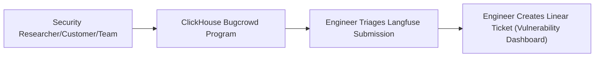
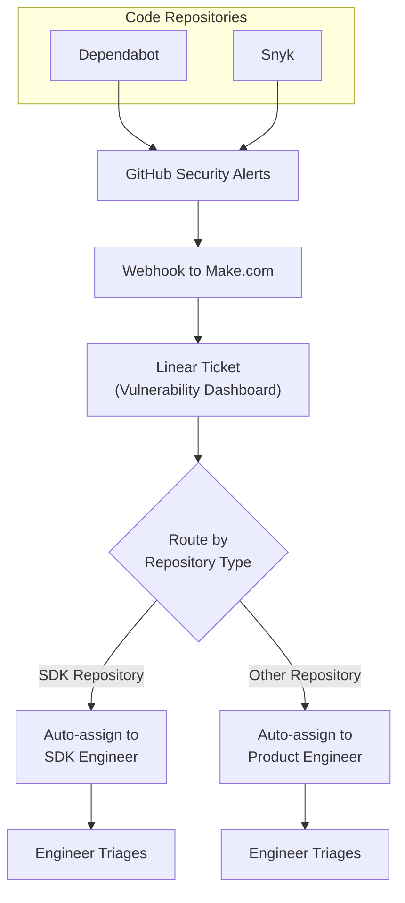

# 취약점 처리

보안 신고를 처리하는 두 가지 프로세스가 있습니다. 이러한 보안 신고는 필요시 신속하게 대응할 수 있도록 엔지니어가 항상 24시간 이내에 분류(triage)합니다.

## 프로세스 1: 수동 보안 신고

수동 취약점 신고는 [ClickHouse Bugcrowd 프로그램](https://bugcrowd.com/engagements/clickhouse)을 통해 제출해야 합니다. 엔지니어링 팀은 Langfuse에 접수된 제출 건을 분류하고 Vulnerability Dashboard에 Linear 티켓을 생성합니다. 지원팀이나 이메일을 통해 신고가 접수된 경우, 해당 채널에서 민감한 개념 증명(proof-of-concept) 세부 정보를 요청하지 말고 신고자를 Bugcrowd로 안내하세요. 활발한 익스플로잇이나 고객 데이터 노출을 시사하는 신고의 경우, Slack `#security`를 통해 즉시 엔지니어링 팀에도 알려야 합니다.

## 프로세스 2: 자동 취약점 탐지

모든 Langfuse 저장소(repository)에는 Dependabot과 Snyk가 활성화되어 있습니다. 취약점은 GitHub로 자동 보고되며, GitHub는 Make.com으로 웹훅을 전송하여 Linear 티켓을 생성하고 담당 엔지니어에게 자동으로 할당합니다.

