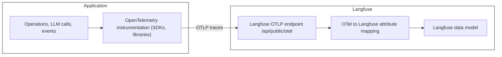
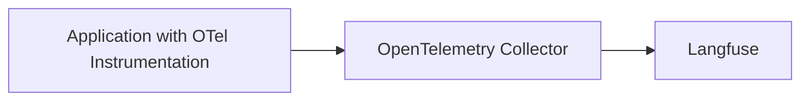

import { Details, Summary } from "@/components/Details";

# LLM 관측성을 위한 OpenTelemetry (OTEL)

[OpenTelemetry (OTEL)](https://opentelemetry.io/)은 애플리케이션에서 분산 트레이스와 메트릭을 수집하는 표준 방법을 정의하는 사양, API, 라이브러리 모음을 제공하는 [CNCF](https://www.cncf.io/) 프로젝트입니다.

애플리케이션, 프레임워크, 또는 컬렉터가 이미 OpenTelemetry (OTEL) 트레이스를 내보내고 있고 이를 Langfuse로 전송하고 싶다면 이 페이지를 참고하세요.

Langfuse는 OpenTelemetry 백엔드로 동작하여 `/api/public/otel` (OTLP) 엔드포인트에서 트레이스를 수신할 수 있습니다. [Langfuse SDK](/docs/sdk/overview)와 [네이티브 인테그레이션](/integrations) 외에도, 이 OpenTelemetry 엔드포인트는 SDK와 네이티브 인테그레이션을 넘어서는 프레임워크, 라이브러리, 언어와의 호환성을 높이도록 설계되었습니다. 대표적인 OpenTelemetry 라이브러리로는 OpenLLMetry와 OpenLIT가 있으며, 이들은 Langfuse 트레이싱의 언어 지원을 Java와 Go로 확장하고 AutoGen, Semantic Kernel 등의 프레임워크를 지원합니다.

트레이스에 대한 GenAI 속성의 [시맨틱 컨벤션(Semantic Conventions)](https://opentelemetry.io/docs/specs/semconv/attributes-registry/gen-ai/)은 아직 발전하고 있는 중이므로, Langfuse는 수신한 OTel 트레이스를 [Langfuse 데이터 모델](/docs/observability/data-model)에 매핑하고 OTel GenAI 생태계에서 널리 쓰이는 추가 속성도 지원합니다([속성 매핑](#property-mapping)). 통합이 예상대로 동작하지 않거나 올바른 속성을 파싱하지 못하는 경우 [GitHub](https://github.com/orgs/langfuse/discussions/2509)의 디스커션에 참여해 의견을 남겨주세요.

> **다른 OTEL 기반 도구를 사용 중이신가요?** Langfuse를 다른 OpenTelemetry 기반 도구와 함께 사용하는 경우 충돌이 발생할 수 있습니다. 설정 가이드는 [기존 OpenTelemetry 설정에서 Langfuse 사용하기](/faq/all/existing-otel-setup)를 참고하세요.

<Callout type="info">
  **Python이나 JS/TS를 사용하시나요?** 원시 OpenTelemetry 익스포터를 직접 연결하기보다
  Langfuse SDK를 사용하는 것을 권장합니다.
  [Python SDK v3](/docs/sdk/python/sdk-v3) 또는
  [JS/TS SDK](/docs/sdk/typescript/guide)로 시작하세요. 이 OpenTelemetry 페이지는
  기존 OTEL 설정, 컬렉터 기반 수집, 지원되지 않는 언어에 가장 유용합니다.
</Callout>

<Callout type="warning">
  **중요:** `userId`, `sessionId`, `metadata`, `version`, `release`, `tags`
  기준으로 필터링하고 집계하려면, 이 트레이스 레벨 속성을 트레이스 내 모든
  스팬에 전파해야 합니다.
  [모든 스팬에 트레이스 속성 전파하기](#propagating-attributes)부터 시작한
  뒤에 프로덕션에 적용하세요.
</Callout>



## 중요: 모든 스팬에 트레이스 속성 전파하기 [#propagating-attributes]

OpenTelemetry (OTEL) 계측(instrumentation)을 사용해 Langfuse로 트레이스를 전송할 때,
Langfuse에서 정확한 집계와 필터링을 하려면 특정 트레이스 레벨 속성을 트레이스
내 **모든 스팬**에 전파해야 합니다. 이러한 속성에는 다음이 포함됩니다:

- `userId` (`langfuse.user.id` 또는 `user.id`를 통해 설정)
- `sessionId` (`langfuse.session.id` 또는 `session.id`를 통해 설정)
- `metadata` (최상위 메타데이터 키의 경우 `langfuse.trace.metadata.*`를 통해 설정)
- `version` (`langfuse.version`을 통해 설정)
- `release` (`langfuse.release`를 통해 설정)
- `tags` (`langfuse.trace.tags`를 통해 설정)
- `trace_name` (`langfuse.trace.name`을 통해 설정)

Langfuse의 필터링과 집계는 트레이스 레벨뿐 아니라 개별 관측값(observation)
단위로 이루어지는 경우가 점점 늘고 있습니다. 이러한 속성을 기준으로 안정적으로
필터링하거나 집계하려면, 루트 스팬뿐 아니라 트레이스 내 각 스팬에도 해당
속성이 있어야 합니다.

### 권장 방법: 전파를 위해 OpenTelemetry Baggage 사용하기 [#recommended-use-opentelemetry-baggage-for-propagation]

이러한 속성을 모든 스팬에 전파하는 권장 방법은 `BaggageSpanProcessor`와 함께
[OpenTelemetry Baggage](https://opentelemetry.io/docs/concepts/signals/baggage/)를
사용하는 것입니다. Baggage는 컨텍스트 전파를 위한 OpenTelemetry의 내장
메커니즘으로, 지정된 키-값 쌍을 트레이스 컨텍스트 내 모든 스팬에 자동으로
복사합니다.

이 패턴을 구현하려면:

1. 트레이스 시작 시점에 원하는 속성을 baggage 항목으로 설정합니다.
2. 현재 활성 스팬에 해당 속성을 설정합니다.
3. OpenTelemetry 설정에서 `BaggageSpanProcessor`를 구성하여 baggage 항목을 스팬 속성으로 자동 복사합니다.
4. 이 프로세서는 트레이스 컨텍스트 내 모든 다운스트림 스팬이 이러한 속성을 받도록 보장합니다.

구현 세부 사항과 코드 예제는
[Python](https://pypi.org/project/opentelemetry-processor-baggage/) 및
[JavaScript](https://www.npmjs.com/package/@opentelemetry/baggage-span-processor)용
OpenTelemetry 문서를 참고하세요.

<Callout type="warning">
  **보안 유의 사항:** OpenTelemetry baggage는 서비스 경계를 넘어 서드파티
  API로도 전파됩니다. 이 방식을 사용할 때는 baggage에 **민감한 정보**(비밀번호,
  API 키, 개인정보 등)를 포함하지 마세요. 모든 다운스트림 서비스로 전송되기
  때문입니다.
</Callout>

### 대안: Langfuse SDK 헬퍼 사용하기

OpenTelemetry 통합과 함께 [Langfuse SDK](/docs/observability/sdk/overview)를
사용 중이라면, 속성 전파를 자동으로 처리하는 편의 메서드인
`propagate_attributes()`(Python) 또는 `propagateAttributes()`(TypeScript)를
사용할 수 있습니다. 이 메서드들은 더 단순한 인터페이스를 제공하며, Langfuse
SDK를 사용할 때 권장되는 방법입니다.

## 실험: 실험 스팬 수집하기

<Callout type="info">
  **Python이나 TypeScript를 사용하시나요?** [Langfuse
  SDK](/docs/observability/sdk/overview)와 함께 [SDK를 통한
  실험](/docs/evaluation/experiments/experiments-via-sdk)을 사용하세요. SDK가
  이러한 속성을 자동으로 처리합니다. 이 가이드는 사용 중인 언어에 Langfuse
  SDK가 없는 경우 등, OpenTelemetry를 직접 수집하는 상황을 위한 것입니다.
</Callout>

[실험(experiment)](/docs/evaluation/core-concepts#experiments)은 테스트
데이터를 대상으로 애플리케이션을 실행합니다. 각 입력은 실험 항목(experiment
item)이며, 선택적으로 기대 출력(expected output)을 가질 수 있습니다. 각
항목은 애플리케이션이 해당 입력으로부터 실제 출력을 만들어내는 과정을
보여주는 하나의 트레이스에 대응하며, 모델 호출, 도구 호출 등 작업을 위한
자식 스팬을 포함합니다.

실험 데이터가 Langfuse에 올바르게 표시되도록 하려면, 다음 순서로 세 가지
레벨의 컨텍스트를 모델링하세요:

| 레벨           | 목적                                                                                                              | 적용 방법                      | 속성                                                                                                                                                                                                                    |
| -------------- | ----------------------------------------------------------------------------------------------------------------- | ------------------------------ | ----------------------------------------------------------------------------------------------------------------------------------------------------------------------------------------------------------------------- |
| 실험 컨텍스트  | 실험의 정체성을 모든 항목 트레이스의 모든 스팬에 전파하여, Langfuse가 이를 하나의 실험으로 합성할 수 있게 합니다. | Baggage                        | `langfuse.experiment.id`, `langfuse.experiment.name`, `langfuse.experiment.dataset.id`, `langfuse.experiment.description` (선택 사항), `langfuse.experiment.metadata.*` (선택 사항), `langfuse.environment` (선택 사항) |
| 실험 항목 루트 | 하나의 항목 트레이스 루트를 식별하고 그 입력, 기대 출력, 실제 출력을 저장합니다.                                  | 루트 스팬에 직접 설정하는 속성 | `langfuse.observation.input`, `langfuse.observation.output`, `langfuse.experiment.item.expected_output` (선택 사항), `langfuse.experiment.item.metadata.*` (선택 사항)                                                  |
| 항목 컨텍스트  | 하나의 항목의 정체성을 해당 항목 트레이스의 루트 및 자식 스팬에 전파합니다.                                       | 루트 속성, 이후 Baggage        | `langfuse.experiment.item.id`, `langfuse.experiment.item.root_observation_id`, `langfuse.experiment.item.version` (선택 사항)                                                                                           |

[Baggage 전파 패턴](#recommended-use-opentelemetry-baggage-for-propagation)에서
설명한 대로 `BaggageSpanProcessor`를 구성하세요. 이는 새로 생성되는 각 스팬에
Baggage 항목을 복사합니다. 다음 섹션에서는 각 레벨이 어떻게 표현되는지
설명합니다.

<Callout type="info">
  **Baggage는 다운스트림 서비스로 전송됩니다:** OpenTelemetry는 Baggage를
  아웃바운드 요청 헤더에 주입합니다. 실험 컨텍스트에서는 보통 문제가 되지
  않지만, 민감한 값을 추가하지 마세요.
</Callout>

### 1. 실험 컨텍스트: 모든 항목 트레이스가 공유하는 Baggage

실험 Baggage를 한 번 생성하세요. 활성 부모 스팬 없이 이 Baggage로 각 항목
실행을 시작합니다. 각 실행은 별도의 트레이스로 유지되어야 합니다. 이를
감싸는 "experiment" 스팬을 만들지 마세요.

```text
experimentBaggage = baggageFromAttributes({
  "langfuse.experiment.id": experiment.id, // unique per experiment
  "langfuse.experiment.name": experiment.name, // unique per experiment
  "langfuse.experiment.dataset.id": experiment.datasetId, // recommended: Manage datasets in Langfuse
  "langfuse.experiment.description": experiment.description, // optional
  "langfuse.experiment.metadata.prompt_version": "v4", // optional
  "langfuse.environment": "experiment", // optional: separate environment for experiment traffic
})
```

### 2. 실험 항목 루트: 항목당 하나의 트레이스

실험 항목에는 입력, 기대 출력, 그리고 애플리케이션이 만들어낸 실제 출력이
있습니다. 해당 트레이스는 그 입력으로부터 실제 출력을 만들어내는 실행
과정을 담습니다. Langfuse는 실험 항목당 정확히 하나의 트레이스를
기대합니다.

Langfuse는 항목 트레이스와 그 데이터를 식별하기 위해 명확한 루트 스팬이
필요합니다. 루트의 `langfuse.observation.input`은 실험 항목의 입력이어야
하고, `langfuse.observation.output`은 실제 출력이어야 합니다. 실험
Baggage와 함께 루트를 생성한 다음, 기대 출력과 메타데이터를 루트에 직접
설정하세요. 이 스팬의 `langfuse.experiment.item.root_observation_id`는
자기 자신의 OTel `spanId`와 같아야 합니다. 이 스팬은 부모 스팬이나
Langfuse 부모 관측값 없이 OTel 트레이스의 루트이기도 한 것이 좋습니다.

```text
for each item:
  root = tracer.startSpan(
    "experiment-item",
    withBaggage(ROOT_CONTEXT, experimentBaggage),
  )
  rootId = root.spanContext().spanId

  itemAttributes = {
    "langfuse.experiment.item.id": item.id, // DatasetItem ID when linking a Langfuse-managed dataset
    "langfuse.experiment.item.version": item.version, // optional: Langfuse-managed datasets only
    "langfuse.experiment.item.root_observation_id": rootId,
  }

  root.setAttributes({
    ...itemAttributes,
    "langfuse.experiment.item.expected_output": jsonEncode(item.expectedOutput), // optional
    "langfuse.experiment.item.metadata.country": item.metadata.country, // optional
  })
```

[Langfuse가 관리하는 데이터셋](/docs/evaluation/experiments/datasets)을
연결하려면, 실험 데이터셋 ID를 `Dataset.id`로 설정하고
`langfuse.experiment.item.id`를 Langfuse가 반환하는 `DatasetItem.id`로
설정하세요. [특정 데이터셋
버전](/docs/evaluation/experiments/datasets#fetch-dataset-at-a-specific-version)을
가져오는 경우, 항목 버전을 동일한 버전 타임스탬프로 설정하세요.

로컬 데이터를 사용하는 경우, 실험 데이터셋 ID와 항목 ID를 로컬 상관관계
식별자로 설정할 수도 있습니다. 반복되는 실험 실행에서 동일한 로컬
데이터셋을 연관 지으려면 안정적인 ID를 사용하세요. 로컬 데이터에는 항목
버전을 설정하지 마세요.

### 3. 항목 컨텍스트: 하나의 항목 트레이스 내에서 공유되는 Baggage

자식 스팬을 시작하기 전에 항목의 정체성과 루트 ID를 Baggage에 추가하세요.
이를 통해 Langfuse는 모델 호출, 도구 호출, 기타 작업을 실험 항목과 연결할
수 있습니다.

```text
itemBaggage = mergeBaggage(
  experimentBaggage,
  baggageFromAttributes(itemAttributes),
)

withContext(withActiveSpan(withBaggage(ROOT_CONTEXT, itemBaggage), root)):
  runInstrumentedTask(item)

root.end()
```

<Callout type="info">
  **스코어:** 실험 항목 스코어는 루트 관측값에 첨부하세요. [Scores
  API](/docs/evaluation/evaluation-methods/scores-via-sdk#trace-or-observation-level-scores)를
  사용할 때는 루트 스팬의 `traceId`를 `traceId`로, `spanId`를
  `observationId`로 사용하세요.
</Callout>

### 실험 실행을 위한 환경 선택하기

실험 실행은 프로덕션 트래픽과 섞이지 않도록 `experiment`와 같은 별도의
환경을 사용하는 것이 좋은 경우가 많습니다. 익스포터가 실험 실행만
전송한다면 `langfuse.environment=experiment`를 리소스 속성으로
설정하세요. 동일한 익스포터가 프로덕션 트래픽도 전송한다면, 실험
Baggage에 `langfuse.environment`를 추가하세요. 이렇게 하면 실험 내 모든
항목 트레이스와 스팬에 적용됩니다. 자세한 내용은
[환경(Environments)](/docs/observability/features/environments)을
참고하세요.

## 수집 옵션

### OpenTelemetry 네이티브 Langfuse SDK v4

Langfuse로 트레이싱을 시작하는 가장 빠른 방법은 새로운 **OTEL 네이티브
Langfuse SDK v4**입니다. 이 SDK는 공식 OpenTelemetry 클라이언트 위에 얇은
레이어로 동작하며, 내보낸 스팬을 풍부한 Langfuse 관측값(스팬, 생성,
이벤트, 그리고 [기타 관측값
유형](/docs/observability/features/observation-types))으로 자동
변환하고, 토큰 사용량, 비용 추적, 프롬프트 연결, 스코어링 같은 LLM 특화
기능을 위한 일급 헬퍼를 제공합니다.

이 SDK는 공유된 OpenTelemetry 컨텍스트 안에서 동작하므로, 다른 OTEL 계측
라이브러리의 스팬도 Langfuse로 내보낼 수 있습니다. 기본적으로 Langfuse는
LLM과 관련된 스팬(Langfuse SDK 스팬, `gen_ai.*` 속성을 가진 스팬, 알려진
LLM 계측기)에 초점을 맞춥니다. 모든 것을 내보내려면 [고급 SDK
문서](/docs/observability/sdk/advanced-features#filtering-by-instrumentation-scope)에
설명된 대로 허용적인(permissive) 커스텀 필터를 사용하세요.

Python 구현을 위한 전용 가이드를 따라 시작하세요:
[/docs/observability/sdk/overview](/docs/observability/sdk/overview).

### OpenTelemetry 엔드포인트

Langfuse는 `/api/public/otel` (OTLP) 엔드포인트에서 트레이스를 수신할 수
있습니다.

OpenTelemetry SDK를 사용해 트레이스를 내보내는 컬렉터를 사용하는 경우,
다음 설정을 사용할 수 있습니다:

```bash
OTEL_EXPORTER_OTLP_ENDPOINT="https://cloud.langfuse.com/api/public/otel" # 🇪🇺 EU data region
# Other Langfuse data regions include 🇺🇸 US: https://us.cloud.langfuse.com/api/public/otel, 🇯🇵 Japan: https://jp.cloud.langfuse.com/api/public/otel and ⚕️ HIPAA: https://hipaa.cloud.langfuse.com/api/public/otel
# OTEL_EXPORTER_OTLP_ENDPOINT="http://localhost:3000/api/public/otel" # 🏠 Local deployment (>= v3.22.0)

OTEL_EXPORTER_OTLP_HEADERS="Authorization=Basic ${AUTH_STRING},x-langfuse-ingestion-version=4"
```

<Callout type="info">

Langfuse는 요청을 인증하기 위해 [Basic
Auth](https://en.wikipedia.org/wiki/Basic_access_authentication)를
사용합니다.

다음 명령으로 base64로 인코딩된 API 키(`AUTH_STRING`이라고 부름)를 얻을 수
있습니다: `echo -n "pk-lf-1234567890:sk-lf-1234567890" | base64`.
GNU 시스템에서 API 키가 긴 경우, `base64`가 컬럼을 자동으로 줄바꿈하므로
끝에 `-w 0`을 추가해야 할 수 있습니다.

</Callout>

<Callout type="info">

OpenTelemetry를 통해 직접 수집된 스팬이 Langfuse Cloud Fast Preview에
실시간으로 표시되길 원한다면, `x-langfuse-ingestion-version: 4` 헤더를
포함하세요. 설정에서 시그널별 헤더 설정을 사용하는 경우, 동일한 값을
`OTEL_EXPORTER_OTLP_TRACES_HEADERS`에도 추가하세요.

</Callout>

<Callout type="info">

컬렉터가 시그널별 환경 변수를 요구하는 경우, 트레이스 엔드포인트는
`/api/public/otel/v1/traces`입니다.

```bash
OTEL_EXPORTER_OTLP_TRACES_ENDPOINT="https://cloud.langfuse.com/api/public/otel/v1/traces" # EU data region
# Other Langfuse data regions include 🇺🇸 US: https://us.cloud.langfuse.com/api/public/otel, 🇯🇵 Japan: https://jp.cloud.langfuse.com/api/public/otel and ⚕️ HIPAA: https://hipaa.cloud.langfuse.com/api/public/otel
```

</Callout>

Langfuse는 현재 `HTTP/JSON`과 `HTTP/protobuf` 모두를 지원하는 HTTP 기반
OTLP를 지원합니다. `gRPC`는 아직 지원되지 않습니다.

### OpenTelemetry SDK를 통한 커스텀 연동

위에서 설명한 설정으로 OpenTelemetry SDK를 사용해 트레이스를 Langfuse로
직접 내보낼 수 있습니다. 이를 통해 Langfuse의 언어 지원 범위가 [Langfuse
SDK](/docs/sdk/overview)가 지원하는 언어(Python 및 JS/TS) 이외로
확장됩니다.

### OpenTelemetry GenAI 계측 라이브러리 사용하기

OpenTelemetry와 호환되는 모든 계측(instrumentation)을 사용해 트레이스를
Langfuse로 내보낼 수 있습니다. 시작하려면 다음의 대표적인 계측 SDK
엔드투엔드 예제를 참고하세요:

**라이브러리**

- [OpenLIT](/docs/opentelemetry/example-openlit)
- [OpenLLMetry](/docs/opentelemetry/example-openllmetry)
- [Arize](/docs/opentelemetry/example-arize)
- [MLflow](/docs/opentelemetry/example-mlflow)

<Details>

<Summary>OpenTelemetry 계측 라이브러리 비교</Summary>

| 카테고리   | 항목                          | OpenLLMetry | openlit | Arize |
| ---------- | ----------------------------- | ----------- | ------- | ----- |
| LLM        | AI21                          |             | ✅      |       |
|            | Aleph Alpha                   | ✅          |         |       |
|            | Amazon Bedrock                | ✅          | ✅      | ✅    |
|            | Anthropic                     | ✅          | ✅      | ✅    |
|            | Assembly AI                   |             | ✅      |       |
|            | Azure AI Inference            |             | ✅      |       |
|            | Azure OpenAI                  | ✅          | ✅      |       |
|            | Cohere                        | ✅          | ✅      |       |
|            | DeepSeek                      |             | ✅      |       |
|            | ElevenLabs                    |             | ✅      |       |
|            | GitHub Models                 |             | ✅      |       |
|            | Google AI Studio              |             | ✅      |       |
|            | Google Generative AI (Gemini) | ✅          |         |       |
|            | Groq                          | ✅          | ✅      | ✅    |
|            | HuggingFace                   | ✅          | ✅      | ✅    |
|            | IBM Watsonx AI                | ✅          |         |       |
|            | Mistral AI                    | ✅          | ✅      | ✅    |
|            | NVIDIA NIM                    |             | ✅      |       |
|            | Ollama                        | ✅          | ✅      |       |
|            | OpenAI                        | ✅          | ✅      | ✅    |
|            | OLA Krutrim                   |             | ✅      |       |
|            | Prem AI                       |             | ✅      |       |
|            | Replicate                     | ✅          |         |       |
|            | SageMaker (AWS)               | ✅          |         |       |
|            | Titan ML                      |             | ✅      |       |
|            | Together AI                   | ✅          | ✅      |       |
|            | vLLM                          |             | ✅      |       |
|            | Vertex AI                     | ✅          | ✅      | ✅    |
|            | xAI                           |             | ✅      |       |
| 벡터 DB    | AstraDB                       |             | ✅      |       |
|            | Chroma                        | ✅          |         |       |
|            | ChromaDB                      |             | ✅      |       |
|            | LanceDB                       | ✅          |         |       |
|            | Marqo                         | ✅          |         |       |
|            | Milvus                        | ✅          | ✅      |       |
|            | Pinecone                      | ✅          | ✅      |       |
|            | Qdrant                        | ✅          | ✅      |       |
|            | Weaviate                      | ✅          |         |       |
| 프레임워크 | AutoGen / AG2                 |             | ✅      | ✅    |
|            | ControlFlow                   |             | ✅      |       |
|            | CrewAI                        | ✅          | ✅      | ✅    |
|            | Crawl4AI                      |             | ✅      |       |
|            | Dynamiq                       |             | ✅      |       |
|            | EmbedChain                    |             | ✅      |       |
|            | FireCrawl                     |             | ✅      |       |
|            | Guardrails AI                 |             | ✅      | ✅    |
|            | Haystack                      | ✅          | ✅      | ✅    |
|            | Julep AI                      |             | ✅      |       |
|            | LangChain                     | ✅          | ✅      | ✅    |
|            | LlamaIndex                    | ✅          | ✅      | ✅    |
|            | Letta                         |             | ✅      |       |
|            | LiteLLM                       | ✅          | ✅      | ✅    |
|            | mem0                          |             | ✅      |       |
|            | MultiOn                       |             | ✅      |       |
|            | Phidata                       |             | ✅      |       |
|            | SwarmZero                     |             | ✅      |       |
|            | LlamaIndex Workflows          |             |         | ✅    |
|            | LangGraph                     |             |         | ✅    |
|            | DSPy                          |             |         | ✅    |
|            | Prompt flow                   |             |         | ✅    |
|            | Instructor                    |             |         | ✅    |
| GPU        | AMD Radeon                    |             | ✅      |       |
|            | NVIDIA                        |             | ✅      |       |
| JavaScript | OpenAI Node SDK               |             |         | ✅    |
|            | LangChain.js                  |             |         | ✅    |
|            | Vercel AI SDK                 |             |         | ✅    |

</Details>

**OpenTelemetry 기반 프레임워크 통합**

- [Hugging Face smolagents](/integrations/kr/frameworks/smolagents)
- [CrewAI](/integrations/kr/frameworks/crewai)
- [AutoGen](/integrations/kr/frameworks/autogen)
- [Semantic Kernel](/integrations/kr/frameworks/semantic-kernel)
- [Pydantic AI](/integrations/kr/frameworks/pydantic-ai)
- [Spring AI](/integrations/kr/frameworks/spring-ai)
- [LlamaIndex](/integrations/kr/frameworks/llamaindex)
- [LlamaIndex Workflows](/integrations/kr/frameworks/llamaindex-workflows)

### OpenTelemetry 컬렉터에서 내보내기



[OpenTelemetry Collector](https://opentelemetry.io/docs/collector)를 실행
중이라면, 다음 설정을 사용해 트레이스를 Langfuse로 내보낼 수 있습니다:

```yml
receivers:
  otlp:
    protocols:
    grpc:
      endpoint: 0.0.0.0:4317
    http:
      endpoint: 0.0.0.0:4318

processors:
  batch:
  memory_limiter:
    # 80% of maximum memory up to 2G
    limit_mib: 1500
    # 25% of limit up to 2G
    spike_limit_mib: 512
    check_interval: 5s

exporters:
  otlphttp/langfuse:
    endpoint: "https://cloud.langfuse.com/api/public/otel" # EU data region
    # Other regions: US https://us.cloud.langfuse.com/api/public/otel, Japan https://jp.cloud.langfuse.com/api/public/otel, HIPAA https://hipaa.cloud.langfuse.com/api/public/otel
    headers:
      Authorization: "Basic ${AUTH_STRING}" # Previously encoded API keys
      x-langfuse-ingestion-version: "4"

service:
  pipelines:
    traces:
      receivers: [otlp]
      processors: [memory_limiter, batch]
      exporters: [otlphttp/langfuse]
```

#### Langfuse로 전송되는 스팬 필터링하기

OTel 스팬을 선택적으로 Langfuse에 전송하고 싶다면, OTel Collector의
[filterprocessor](https://github.com/open-telemetry/opentelemetry-collector-contrib/blob/main/processor/filterprocessor/README.md)를
사용할 수 있습니다.
이를 통해 속성, 스팬 이름 등을 기준으로 스팬을 필터링할 수 있습니다.
이는 스팬 레벨에서 적용되므로 트레이스가 불완전해질 위험이 있으며,
복잡한 필터 규칙을 적용할 때는 주의해야 합니다.
또한 Langfuse는 트레이스가 올바르게 생성되도록 루트 스팬이 백엔드로
전송될 것을 요구합니다.

아래 설정을 사용하면 `gen_ai.system` 속성이 `openai`로 설정된 스팬만
전달합니다:

```yml
receivers:
  otlp:
    protocols:
    grpc:
      endpoint: 0.0.0.0:4317
    http:
      endpoint: 0.0.0.0:4318

processors:
  filter/openaisystem:
    error_mode: ignore
    traces:
      span:
        - 'attributes["gen_ai.system"] != "openai"'

exporters:
  otlphttp/langfuse:
    endpoint: "https://cloud.langfuse.com/api/public/otel" # EU data region
    # Other regions: US https://us.cloud.langfuse.com/api/public/otel, Japan https://jp.cloud.langfuse.com/api/public/otel, HIPAA https://hipaa.cloud.langfuse.com/api/public/otel
    headers:
      Authorization: "Basic ${AUTH_STRING}" # Previously encoded API keys
      x-langfuse-ingestion-version: "4"

service:
  pipelines:
    traces:
      receivers: [otlp]
      processors: [filter/openaisystem]
      exporters: [otlphttp/langfuse]
```

## 속성 매핑 [#property-mapping]

Langfuse는 [OpenTelemetry GenAI 시맨틱
컨벤션](https://opentelemetry.io/docs/specs/semconv/gen-ai/gen-ai-agent-spans/)을
준수하고 주요 LLM 계측 프레임워크를 지원하는 것을 목표로 합니다.

또한 Langfuse는 `langfuse.*` 네임스페이스 내 속성을 사용해 OpenTelemetry
스팬 속성을 Langfuse 데이터 모델에 직접 매핑합니다. 이 특정 속성들은
항상 일반 OpenTelemetry 컨벤션보다 우선하며, 애플리케이션을 수동으로
계측하는 모든 사용자에게 권장됩니다.

<Callout type="info">
  매핑이나 통합이 예상대로 동작하지 않거나 올바른 속성을 파싱하지 못하는
  경우 [GitHub에 이슈를 등록](/issues)해 주세요.
</Callout>

<Callout type="warning">
  **예약된 속성 키 세그먼트:** 경로 세그먼트로 `__proto__`, `constructor`,
  `prototype`을 포함하는 속성 키(예: `gen_ai.prompt.__proto__.foo`)는
  수집 과정에서 자동으로 제거됩니다. 이는 프로토타입 오염(prototype
  pollution)을 방지하기 위한 보안 조치입니다. 속성이 누락된 것으로
  보인다면, 키에 이 예약된 세그먼트가 포함되어 있지 않은지 확인하세요.
</Callout>

Langfuse는 트레이스 레벨 속성과 관측값 레벨 속성을 구분합니다.

- [트레이스 레벨 속성](#trace-level-attributes)은 전체 상호작용에 대한 공유 컨텍스트를 나타냅니다. Langfuse가 특정 스팬에서 이러한 속성을 감지하면, 이를 트레이스 전체의 속성으로 취급합니다.
- [관측값 레벨 속성](#observation-level-attributes)은 트레이스 내 개별 단계를 설명합니다. Langfuse는 이를 관측값 레벨에서 유지합니다.

### 메타데이터 매핑 작동 방식 [#metadata-mapping]

OpenTelemetry 스팬은 임의의 속성을 가질 수 있습니다. Langfuse는 이름
지정 방식에 따라 이러한 속성을 다르게 처리합니다:

| 속성 유형                   | Langfuse에서 나타나는 위치                | 예시                                                               |
| --------------------------- | ----------------------------------------- | ------------------------------------------------------------------ |
| **명시적 메타데이터 매핑**  | `metadata`의 최상위 키(필터링 가능)       | `langfuse.trace.metadata.customer_tier` → `metadata.customer_tier` |
| **매핑되지 않은 OTel 속성** | `metadata.attributes` 아래에 중첩(캐치올) | `http.method` → `metadata.attributes.http.method`                  |
| **리소스 속성**             | `metadata.resourceAttributes` 아래에 중첩 | `service.name` → `metadata.resourceAttributes.service.name`        |

<Callout type="info">
**Langfuse SDK 대 표준 OpenTelemetry SDK**

- **Langfuse SDK**는 `langfuse.*.metadata.*` 접두사가 붙은 속성을 자동으로 설정하는 유틸리티 함수(예: `metadata` 매개변수를 가진 `update()`)를 제공합니다. 이는 커스텀 메타데이터가 최상위 레벨에 나타나고 필터링이 가능함을 의미합니다.
- **표준 OpenTelemetry SDK**는 스팬에 속성을 직접 설정합니다. `langfuse.trace.metadata.*` 또는 `langfuse.observation.metadata.*` 접두사를 명시적으로 사용하지 않으면, 이러한 속성은 `metadata.attributes` 캐치올에 들어가며 Langfuse에서 직접 필터링할 수 없습니다.

</Callout>

### 트레이스 레벨 속성

이러한 속성은 Langfuse의 트레이스 레코드에 적용됩니다. 트레이스 내 어느
스팬에서든 설정할 수 있습니다.

| Langfuse 필드                         | 설명                                                                                                                  | 매핑되는 OTel 속성                                                          |
| ------------------------------------- | --------------------------------------------------------------------------------------------------------------------- | --------------------------------------------------------------------------- |
| <a id="name"></a>`name`               | 트레이스의 이름.                                                                                                      | • `langfuse.trace.name`: `string`<br/>• 루트 스팬의 스팬 이름               |
| <a id="userId"></a>`userId`           | 최종 사용자의 고유 식별자.                                                                                            | • `langfuse.user.id`: `string`<br/>• `user.id`: `string`                    |
| <a id="sessionId"></a>`sessionId`     | 사용자 세션의 고유 식별자.                                                                                            | • `langfuse.session.id`: `string`<br/>• `session.id`: `string`              |
| <a id="release"></a>`release`         | 애플리케이션의 릴리스 버전.                                                                                           | • `langfuse.release`: `string`                                              |
| <a id="public"></a>`public`           | 트레이스를 공개로 표시하여 URL을 통해 공유할 수 있게 하는 불리언 플래그.                                              | • `langfuse.trace.public`: `boolean`                                        |
| <a id="tags"></a>`tags`               | 트레이스를 분류하거나 라벨링하기 위한 문자열 배열.                                                                    | • `langfuse.trace.tags`: `string[]`                                         |
| <a id="metadata"></a>`metadata`       | 트레이스에 추가적인 비정형 데이터를 저장하기 위한 유연한 객체. 아래 참고 사항을 확인하세요.                           | • `langfuse.trace.metadata.*`: `string`<br/>• 루트 스팬의 관측값 메타데이터 |
| <a id="input"></a>`input`             | 전체 트레이스에 대한 초기 입력.                                                                                       | • `langfuse.trace.input`: `string`<br/>• 루트 스팬의 관측값 입력            |
| <a id="output"></a>`output`           | 전체 트레이스에 대한 최종 출력.                                                                                       | • `langfuse.trace.output`: `string`<br/>• 루트 스팬의 관측값 출력           |
| <a id="version"></a>`version`         | 애플리케이션 로직 변경을 추적하는 데 유용한, 트레이스의 [버전](/docs/observability/features/releases-and-versioning). | • `version`으로 매핑되는 루트 스팬의 속성                                   |
| <a id="environment"></a>`environment` | 트레이스가 생성된 배포 [환경](/docs/observability/features/environments).                                             | • `environment`로 매핑되는 루트 스팬의 속성                                 |

<Callout type="info">
**Langfuse에서 메타데이터 키로 필터링하기**

Langfuse는 이벤트의 `metadata` 내 최상위 키에 대해서만 필터링을 지원합니다.

기본적으로 모든 OpenTelemetry 속성과 리소스 속성은 `metadata` 안의 `attributes`와 `resourceAttributes` 키로 매핑되므로 쿼리할 수 없습니다.

특정 속성을 쿼리하고 싶다면, `langfuse.trace.metadata` 접두사를 사용해 트레이스의 최상위 `metadata` 객체로 매핑할 수 있습니다.
다음 스니펫은 트레이스의 `metadata` 객체에 필터링 가능한 `user_name` 속성을 생성합니다:

```python
with tracer.start_as_current_span("Langfuse Attributes") as span:
    span.set_attribute("langfuse.trace.metadata.user_name", "user-123")
```

</Callout>

### 관측값 레벨 속성

이러한 속성은 트레이스 내 개별 관측값(스팬)에 적용됩니다([데이터
모델](/docs/observability/data-model)).

| Langfuse 필드                                         | 설명                                                                                                                     | 매핑되는 OTel 속성                                                                                                                                  |
| ----------------------------------------------------- | ------------------------------------------------------------------------------------------------------------------------ | --------------------------------------------------------------------------------------------------------------------------------------------------- |
| <a id="type"></a>`type`                               | [관측값의 유형](/docs/observability/features/observation-types). `model` 속성이 있는 스팬은 `generation`으로 추적됩니다. | • `langfuse.observation.type`: `"span" \| "generation" \| "event"`, 기본값: `"span"`                                                                |
| <a id="level"></a>`level`                             | 관측값의 [심각도 레벨](/docs/observability/features/log-levels).                                                         | • `langfuse.observation.level`: `"DEBUG" \| "DEFAULT" \| "WARNING" \| "ERROR"`, 기본값: `"DEFAULT"`<br/>• `span.status.code`에서 추론               |
| <a id="statusMessage"></a>`statusMessage`             | 관측값의 상태를 설명하는 메시지로, 주로 오류에 사용됩니다.                                                               | • `langfuse.observation.status_message`: `string`<br/>• `span.status.message`에서 추론                                                              |
| <a id="obs-metadata"></a>`metadata`                   | 추가적인 비정형 데이터를 저장하기 위한 유연한 객체. 아래 참고 사항을 확인하세요.                                         | • `langfuse.observation.metadata.*`: `string`                                                                                                       |
| <a id="obs-input"></a>`input`                         | 이 특정 관측값에 대한 입력 데이터.                                                                                       | • `langfuse.observation.input`: `(JSON) string`<br/>• `gen_ai.prompt`<br/>• `input.value` (OpenInference)<br/>• `mlflow.spanInputs` (MLFlow)        |
| <a id="obs-output"></a>`output`                       | 이 특정 관측값의 출력 데이터.                                                                                            | • `langfuse.observation.output`: `(JSON) string`<br/>• `gen_ai.completion`<br/>• `output.value` (OpenInference)<br/>• `mlflow.spanOutputs` (MLFlow) |
| <a id="model"></a>`model`                             | 사용된 생성형 모델의 이름. _Generation 전용._                                                                            | • `langfuse.observation.model.name`<br/>• `gen_ai.request.model`<br/>• `gen_ai.response.model`<br/>• `llm.model_name`<br/>• `model`                 |
| <a id="modelParameters"></a>`modelParameters`         | 모델 호출 설정을 위한 키-값 쌍. _Generation 전용._                                                                       | • `langfuse.observation.model.parameters`: `JSON string`<br/>• `gen_ai.request.*`<br/>• `llm.invocation_parameters.*`                               |
| <a id="usage"></a>`usage`                             | 생성(generation)에 대한 토큰 수. _Generation 전용._                                                                      | • `langfuse.observation.usage_details`: `JSON string`<br/>• `gen_ai.usage.*`<br/>• `llm.token_count.*`                                              |
| <a id="cost"></a>`cost`                               | USD 단위로 계산된 비용. _Generation 전용._                                                                               | • `langfuse.observation.cost_details`: `JSON string`<br/>• `gen_ai.usage.cost`(`total` 키로 설정됨)                                                 |
| <a id="prompt"></a>`prompt`                           | Langfuse에서 관리되는 버전 관리된 프롬프트의 이름. _Generation 전용._                                                    | • `langfuse.observation.prompt.name`: `string`<br/>• `langfuse.observation.prompt.version`: `integer`                                               |
| <a id="completionStartTime"></a>`completionStartTime` | 모델이 생성을 시작한 시점의 타임스탬프. _Generation 전용._                                                               | • `langfuse.observation.completion_start_time`: `ISO 8601 date string`                                                                              |
| <a id="obs-version"></a>`version`                     | 관측값의 [버전](/docs/observability/features/releases-and-versioning).                                                   | • `langfuse.version`: `string`                                                                                                                      |
| <a id="obs-environment"></a>`environment`             | 관측값이 생성된 배포 [환경](/docs/observability/features/environments).                                                  | • `langfuse.environment`<br/>• `deployment.environment`<br/>• `deployment.environment.name`                                                         |

<Callout type="info">
**Langfuse에서 메타데이터 키로 필터링하기**

Langfuse는 이벤트의 `metadata` 내 최상위 키에 대해서만 필터링을 지원합니다.

기본적으로 모든 OpenTelemetry 속성과 리소스 속성은 `metadata` 안의 `attributes`와 `resourceAttributes` 키로 매핑되므로 쿼리할 수 없습니다.

특정 속성을 쿼리하고 싶다면, `langfuse.observation.metadata` 접두사를 사용해 관측값의 최상위 `metadata` 객체로 매핑할 수 있습니다.
다음 스니펫은 `metadata` 객체에 필터링 가능한 `user_name` 속성을 생성합니다:

```python
with tracer.start_as_current_span("Langfuse Attributes") as span:
    span.set_attribute("langfuse.observation.metadata.user_name", "user-123")
```

</Callout>

## 문제 해결

- Langfuse를 셀프 호스팅하는 중에 `4xx` 오류가 발생하면 배포를 최신 버전으로 업그레이드하세요. OpenTelemetry 엔드포인트는 Langfuse [v3.22.0](https://github.com/langfuse/langfuse/releases/tag/v3.22.0)에서 처음 도입되었으며 이후 큰 개선이 이루어졌습니다.
- Langfuse는 `HTTP/JSON`과 `HTTP/protobuf` 모두를 지원하는 HTTP 기반 OTLP를 지원합니다. `gRPC`는 아직 지원되지 않습니다.
