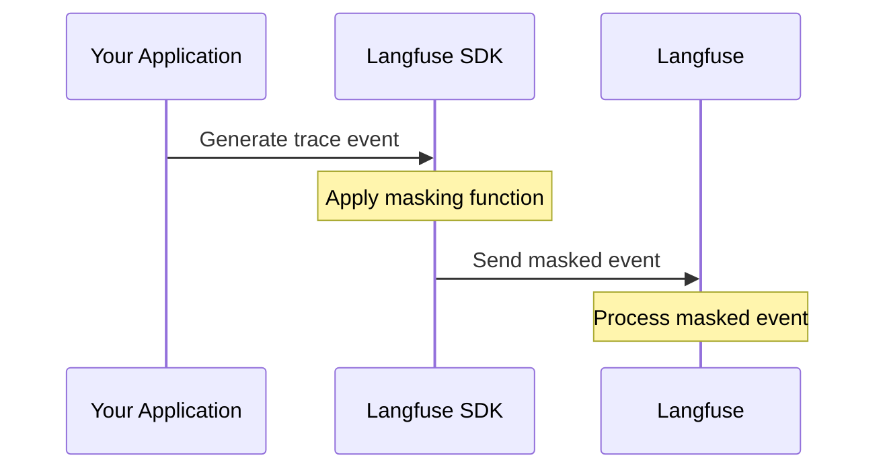
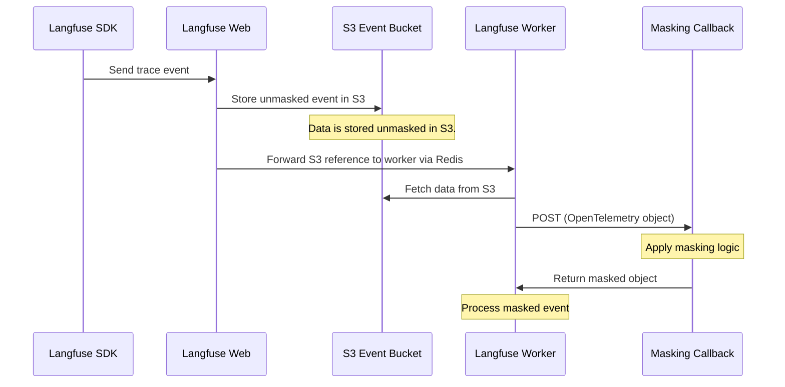

# 데이터 마스킹

민감한 데이터를 마스킹하는 것은 LLM 관측성을 사용할 때 **컴플라이언스**(GDPR, HIPAA, PCI DSS)와 **사용자 프라이버시**를 위해 매우 중요합니다. Langfuse는 데이터 마스킹을 위한 두 가지 상호 보완적인 방식을 제공합니다.

| 방식                                                         | 설명                                     | 적합한 용도                                          |
| ------------------------------------------------------------ | ---------------------------------------- | ---------------------------------------------------- |
| [클라이언트 사이드 마스킹](#client-side-masking)             | 전송 전에 SDK에서 데이터를 마스킹        | 민감한 데이터가 애플리케이션 밖으로 나가는 것을 방지 |
| [서버 사이드 수집 마스킹](#server-side-ingestion-masking-ee) | 수집 시 HTTP 콜백을 통해 데이터를 마스킹 | 모든 클라이언트에 대한 중앙 집중식 정책 적용 (EE)    |

최대한의 보안을 위해서는 두 방식을 함께 사용하는 것을 고려하세요.

## 클라이언트 사이드 마스킹

클라이언트 사이드 마스킹을 사용하면 데이터가 Langfuse로 전송되기 전에 애플리케이션에서 직접 민감한 정보를 삭제할 수 있습니다. 이를 통해 민감한 데이터가 애플리케이션 밖으로 나가지 않도록 보장합니다.



**주요 이점:**

- 전송 전에 데이터가 마스킹되므로 민감한 정보가 Langfuse에 도달하지 않습니다
- 애플리케이션 개발자가 SDK 인스턴스별로 구성합니다
- 추가 인프라가 필요하지 않습니다

코드 예제, 고급 패턴, 통합 가이드를 포함한 전체 문서는 [클라이언트 사이드 마스킹 문서](/docs/observability/features/masking)를 참조하세요.

---

## 서버 사이드 수집 마스킹 (EE) [#server-side-ingestion-masking-ee]

<Callout type="info">
  이 기능은 Enterprise 라이선스가 필요합니다. 활성화하려면 [라이선스
  키](/self-hosting/license-key)를 추가하세요.
</Callout>

서버 사이드 수집 마스킹을 사용하면 셀프 호스팅 Langfuse 관리자가 트레이싱 이벤트가 수집될 때 민감한 데이터를 마스킹하거나 삭제하기 위한 사용자 정의 콜백 로직을 정의할 수 있습니다.
이 기능은 Langfuse Worker 컨테이너 레벨에서 동작하며, 모든 클라이언트에 걸쳐 중앙 집중식 데이터 마스킹을 제공합니다.

<Callout type="warning">

서버 사이드 마스킹은 중앙 집중식 안전망이며, 민감한 데이터가 애플리케이션 경계를 절대 벗어나서는 안 되는 경우 클라이언트 사이드 마스킹을 대체하지 않습니다.
셀프 호스팅 수집 파이프라인에서는 Worker가 마스킹 콜백을 호출하기 전에 이벤트가 이벤트 블롭 스토리지 버킷에 먼저 기록됩니다.
콜백은 데이터가 ClickHouse 및 이후의 Langfuse 뷰로 처리되기 전에 데이터를 마스킹합니다.

</Callout>

**주요 이점:**

- 모든 트레이싱 데이터에 대한 단일 구성 지점
- 플랫폼 관리자의 제어
- 클라이언트 사이드 마스킹을 우회하는 데이터에 대한 안전망

### 동작 방식

1. Langfuse Worker 컨테이너에서 트레이싱 이벤트가 처리될 때, 마스킹 콜백 URL이 구성되어 있는지 확인합니다.
2. 구성되어 있는 경우, Langfuse는 OpenTelemetry 트레이스 객체를 HTTP POST를 통해 콜백 엔드포인트로 전송합니다.
3. 콜백 서비스는 데이터를 처리하고 마스킹된 객체를 반환합니다.
4. Langfuse는 마스킹된 데이터로 처리를 계속합니다.



### 구성

마스킹 구성은 Langfuse Web 컨테이너와 Worker 컨테이너에 나뉘어 있습니다.
Web 컨테이너는 수신 요청에서 전달된 헤더를 추출하고, Worker 컨테이너는 외부로 나가는 콜백 요청을 수행합니다. 아래 목록에 따라 각 변수를 해당 컨테이너에 설정하세요. 두 컨테이너 모두에 모든 변수를 설정해도 안전합니다.

**Langfuse Worker** 컨테이너에 다음 환경 변수를 구성하세요.

| 변수                                              | 필수 / 기본값     | 설명                                                                                                                                                                             |
| ------------------------------------------------- | ----------------- | -------------------------------------------------------------------------------------------------------------------------------------------------------------------------------- |
| `LANGFUSE_INGESTION_MASKING_CALLBACK_URL`         | 활성화하려면 필수 | 마스킹 콜백 엔드포인트의 HTTP(S) URL입니다. 설정하면 모든 수집 이벤트가 처리 전에 마스킹을 위해 이 엔드포인트로 전송됩니다.                                                      |
| `LANGFUSE_INGESTION_MASKING_CALLBACK_TIMEOUT_MS`  | `500`             | 콜백 요청의 타임아웃(밀리초)입니다. 콜백이 이 시간 내에 응답하지 않으면 fail mode 설정에 따라 동작이 결정됩니다.                                                                 |
| `LANGFUSE_INGESTION_MASKING_CALLBACK_FAIL_CLOSED` | `false`           | `true`로 설정하면 콜백이 실패하거나 타임아웃될 때 이벤트가 폐기되고 경고가 로그에 기록됩니다. `false`(기본값, fail open)인 경우 콜백이 실패해도 마스킹 없이 이벤트가 처리됩니다. |
| `LANGFUSE_INGESTION_MASKING_MAX_RETRIES`          | `1`               | 실패한 콜백 요청에 대한 최대 재시도 횟수입니다. 이 횟수만큼 시도한 후에도 콜백이 실패하면 fail mode 설정에 따라 동작이 결정됩니다.                                               |

**Langfuse Web** 컨테이너에 다음 환경 변수를 구성하세요.

| 변수                                            | 필수 / 기본값 | 설명                                                                                                                                                                                  |
| ----------------------------------------------- | ------------- | ------------------------------------------------------------------------------------------------------------------------------------------------------------------------------------- |
| `LANGFUSE_INGESTION_MASKING_PROPAGATED_HEADERS` | `''`          | Web 컨테이너로 들어오는 OpenTelemetry 수집 요청에서 추출하여 Worker 컨테이너의 마스킹 콜백으로 전달할 헤더 이름의 쉼표로 구분된 목록입니다. 헤더 이름은 대소문자를 구분하지 않습니다. |

### 콜백 인터페이스

#### 요청

Langfuse는 다음과 함께 콜백 URL로 `POST` 요청을 전송합니다.

**헤더:**

| 헤더                    | 설명                                        |
| ----------------------- | ------------------------------------------- |
| `Content-Type`          | `application/json`                          |
| `X-Langfuse-Org-Id`     | 트레이스 이벤트와 연관된 조직 ID입니다.     |
| `X-Langfuse-Project-Id` | 트레이스 이벤트와 연관된 프로젝트 ID입니다. |

**본문:**

요청 본문에는 JSON 형식의 OpenTelemetry 트레이스 객체가 포함됩니다. 이는 Langfuse에 저장될 원본 트레이싱 데이터입니다.
이벤트 본문은 [OpenTelemetry Trace Request Proto](https://github.com/open-telemetry/opentelemetry-proto/blob/main/opentelemetry/proto/trace/v1/trace.proto)를 따릅니다.

#### 응답

콜백은 다음을 반환해야 합니다.

- **HTTP 상태**: 마스킹이 성공하면 `200 OK`
- **본문**: 입력과 **정확히 동일한 스키마**의 마스킹된 OpenTelemetry 객체

<Callout type="warning">
  응답 객체는 입력과 동일한 구조를 유지해야 합니다.
  마스킹하려는 값만 수정하고, 필드를 추가, 제거, 이름 변경하지 마세요. Langfuse는 콜백 응답을 JSON으로 파싱하며 이후 처리 과정에서 OpenTelemetry 형식을 기대하지만, 콜백 경계에서 별도의 구조적 검증을 수행하지는 않습니다.
</Callout>

#### 오류 처리

오류 처리 동작은 `LANGFUSE_INGESTION_MASKING_CALLBACK_FAIL_CLOSED`를 통해 구성됩니다.

| 시나리오             | Fail open (기본값, `false`)                        | Fail closed (`true`)                   |
| -------------------- | -------------------------------------------------- | -------------------------------------- |
| 콜백 타임아웃        | 이벤트가 마스킹 없이 처리되고 경고가 로그에 기록됨 | 이벤트가 폐기되고 경고가 로그에 기록됨 |
| HTTP 오류 (4xx, 5xx) | 이벤트가 마스킹 없이 처리되고 경고가 로그에 기록됨 | 이벤트가 폐기되고 경고가 로그에 기록됨 |
| 잘못된 JSON 응답     | 이벤트가 마스킹 없이 처리되고 경고가 로그에 기록됨 | 이벤트가 폐기되고 경고가 로그에 기록됨 |
| 네트워크 오류        | 이벤트가 마스킹 없이 처리되고 경고가 로그에 기록됨 | 이벤트가 폐기되고 경고가 로그에 기록됨 |

### 제한 사항

서버 사이드 수집 마스킹은 [OpenTelemetry 엔드포인트](/integrations/native/opentelemetry)(`/api/public/otel`)를 통해 수집된 이벤트에만 적용됩니다. 여기에는 다음이 포함됩니다.

- **Python SDK v3+** 및 **TypeScript SDK v4+** (OTEL 네이티브)
- 타사 OpenTelemetry 계측 라이브러리 (OpenLLMetry, OpenLIT 등)

레거시 `/api/public/ingestion` 엔드포인트를 통해 수집된 이벤트는 마스킹 콜백을 거치지 않습니다.

<Callout type="info">
  프로젝트 또는 조직별 마스킹 요구 사항이 있는 경우, `X-Langfuse-Org-Id` 및 `X-Langfuse-Project-Id` 헤더나
  `LANGFUSE_INGESTION_MASKING_PROPAGATED_HEADERS`를 사용해 마스킹 결정을 사용자 정의하는 것을 권장합니다.
</Callout>

### 구현 예제

다음은 FastAPI를 사용한 Python 마스킹 콜백 서비스 예제입니다.

```python
from fastapi import FastAPI, Request, Header
from typing import Optional
import re

app = FastAPI()

def mask_pii(data):
    """Recursively mask PII in the data structure."""
    if isinstance(data, str):
        # Mask email addresses
        data = re.sub(r'\b[\w.-]+?@\w+?\.\w+?\b', '[REDACTED_EMAIL]', data)
        # Mask phone numbers
        data = re.sub(r'\b\d{3}[-.]?\d{3}[-.]?\d{4}\b', '[REDACTED_PHONE]', data)
        # Mask credit card numbers
        data = re.sub(r'\b\d{4}[-\s]?\d{4}[-\s]?\d{4}[-\s]?\d{4}\b', '[REDACTED_CC]', data)
        return data
    elif isinstance(data, dict):
        return {k: mask_pii(v) for k, v in data.items()}
    elif isinstance(data, list):
        return [mask_pii(item) for item in data]
    return data

@app.post("/mask")
async def mask_trace(
    request: Request,
    x_langfuse_org_id: Optional[str] = Header(None),
    x_langfuse_project_id: Optional[str] = Header(None)
):
    """
    Masking callback endpoint for Langfuse ingestion.

    Receives OpenTelemetry trace objects and returns masked versions.
    """
    body = await request.json()

    # Apply masking logic
    masked_body = mask_pii(body)

    # Optionally, apply different rules based on org/project
    # if x_langfuse_project_id == "specific-project-id":
    #     masked_body = apply_special_masking(masked_body)

    return masked_body
```

이 서비스를 배포하고 Langfuse가 이를 사용하도록 구성하세요.

```bash
LANGFUSE_INGESTION_MASKING_CALLBACK_URL=https://your-masking-service.internal/mask
LANGFUSE_INGESTION_MASKING_CALLBACK_TIMEOUT_MS=500
LANGFUSE_INGESTION_MASKING_CALLBACK_FAIL_CLOSED=true
```

### 성능 고려 사항

- **지연 시간**: 마스킹 콜백은 수집 경로에 지연 시간을 추가합니다. 콜백 서비스를 최대한 빠르게 유지하세요(이상적으로는 100ms 미만).
- **타임아웃**: 기본 500ms 타임아웃은 안정성과 성능의 균형을 고려해 설계되었습니다. 마스킹 복잡도에 따라 조정하세요.
- **가용성**: 특히 fail-closed 모드가 활성화된 경우 마스킹 서비스는 높은 가용성을 유지해야 합니다.
- **배치 위치**: 네트워크 지연을 최소화하기 위해 마스킹 서비스를 Langfuse 배포와 가깝게 배포하세요. 사이드카 컨테이너를 사용하는 것을 권장합니다.

### 문제 해결

- 이벤트가 예상치 못하게 폐기되는 경우
  1. 마스킹 서비스가 구성된 타임아웃 내에 응답하는지 확인하세요.
  2. 응답 스키마가 입력 스키마와 정확히 일치하는지 확인하세요.
  3. 경고 메시지를 확인하기 위해 Langfuse Worker 컨테이너 로그를 검토하세요.
  4. 문제를 진단하기 위해 일시적으로 `LANGFUSE_INGESTION_MASKING_CALLBACK_FAIL_CLOSED=false`로 설정하세요.
- 트레이스 수집 시 지연 시간이 높은 경우
  1. 마스킹 서비스의 응답 시간을 모니터링하세요.
  2. 마스킹 로직에 더 많은 시간이 필요하다면 `LANGFUSE_INGESTION_MASKING_CALLBACK_TIMEOUT_MS`를 늘리는 것을 고려하세요.
  3. 마스킹 로직을 최적화하거나 적절한 곳에 캐싱을 추가하세요.
  4. Langfuse와 마스킹 서비스 간의 네트워크 지연이 최소화되어 있는지 확인하세요.
- 마스킹이 적용되지 않는 경우
  1. `LANGFUSE_INGESTION_MASKING_CALLBACK_URL`이 Langfuse Worker 컨테이너에 올바르게 설정되어 있는지 확인하세요.
  2. 마스킹 서비스가 Langfuse Worker 컨테이너에서 접근 가능한지 확인하세요.
  3. 마스킹 로직이 데이터를 올바르게 수정하고 반환하는지 확인하세요.
