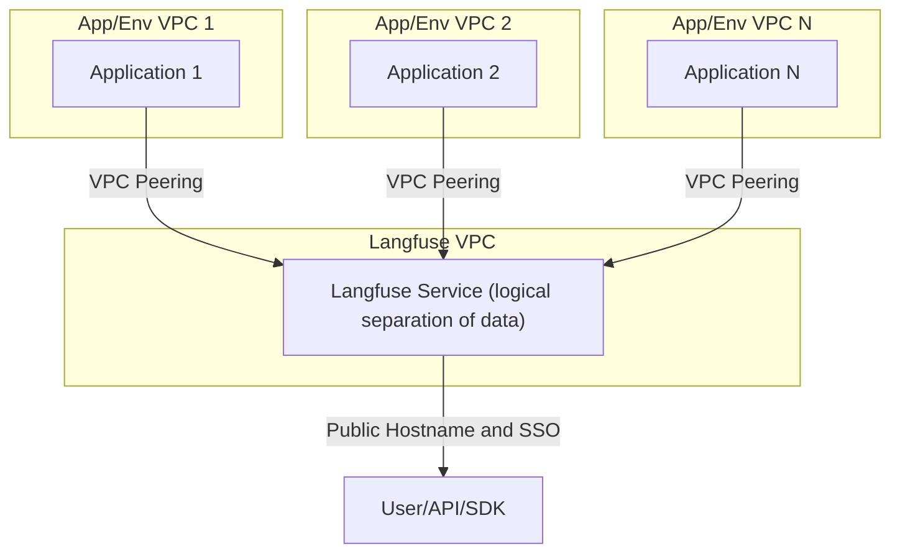
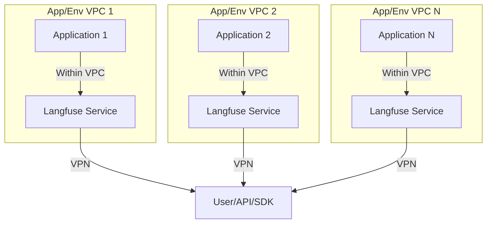

# 배포 전략

이 가이드를 통해 Langfuse를 효과적으로 관리하는 방법을 알아봅니다. 여러 프로젝트와 환경을 처리하기 위한 전략을 다룹니다.

Langfuse를 셀프 호스팅할 때 프로젝트와 환경을 관리하는 데 사용할 수 있는 여러 전략이 있습니다. 이 가이드에서는 다양한 접근 방식과 그 트레이드오프, 그리고 자신의 사용 사례에 가장 적합한 전략을 결정하는 데 도움이 되는 구현 세부 사항을 설명합니다.

대부분의 경우 단일 Langfuse 배포가 가장 좋은 접근 방식입니다. RBAC(역할 기반 접근 제어)를 활용하여 조직, 프로젝트, 사용자 역할별로 데이터를 분리합니다. 하지만 특정 사용 사례에서는 아키텍처 또는 조직적 요구 사항에 따라 여러 배포가 필요할 수 있습니다.

## 단일 Langfuse 배포

단일 Langfuse 배포는 표준이자 권장되는 설정입니다. 관리를 중앙화하고, 프로젝트와 환경 전반에 걸쳐 효율적으로 확장되며, Langfuse의 내장 RBAC 기능을 최대한 활용합니다.

### 사용 시기

- 팀이 데이터 격리를 강제하기 위해 Langfuse의 RBAC에 의존할 수 있는 경우.
- 인프라 복잡성과 운영 오버헤드를 최소화하고자 하는 경우.

### 구현 단계

1. [셀프 호스팅 가이드](/self-hosting)에 따라 Langfuse를 배포합니다.
2. 각 논리 단위(예: 팀, 클라이언트, 부서)에 대해 조직과 프로젝트를 구성합니다.
3. 선택 사항: [조직 생성자](/self-hosting/administration/organization-creators)와 [프로젝트 수준 RBAC](/docs/rbac) 역할을 사용하여 팀과 환경 전반의 권한 관리를 최적화합니다.

### 추가 고려 사항

- 적절한 데이터 격리를 보장하려면 RBAC이 중요합니다. 접근 제어 정책을 신중하게 계획하세요.
- Langfuse는 공개적으로 노출되도록 설계되었습니다(네트워킹 문서 참조). 이 방식은 이해관계자의 접근을 단순화하고 복잡한 네트워크 구성을 제거하여 팀과 프로젝트 전반에 걸쳐 원활하게 통합할 수 있게 해줍니다.
- VPC 피어링을 사용하면 프로젝트와 환경 전반에서 Langfuse에 비공개로 접근할 수 있어, 중앙화된 배포에서 보안과 연결성을 향상시킵니다.

## 서비스 또는 프로젝트별 Langfuse 배포

이 접근 방식에서는 서비스, 프로젝트, 또는 환경별로 별도의 Langfuse 배포를 운영합니다. 이는 인프라 수준에서 완전한 격리를 제공하지만 추가적인 복잡성이 따릅니다.

Langfuse는 Terraform이나 Helm과 같은 IaC(Infrastructure as Code) 도구를 통해 배포할 수 있어 이 접근 방식을 더 관리하기 쉽게 만들어 줍니다.

### 사용 시기

- 컴플라이언스 또는 규제 요구 사항으로 엄격한 데이터 분리가 필요한 경우.

### 구현 단계

1. [셀프 호스팅 가이드](/self-hosting)에 따라 각 프로젝트 또는 서비스별로 Langfuse 인스턴스를 배포합니다. 예를 들어 Helm 차트를 사용하여 애플리케이션 스택에 Langfuse를 원활하게 통합할 수 있습니다.
2. [헤드리스 초기화](/self-hosting/administration/headless-initialization)를 사용하여 애플리케이션 스택과 함께 배포할 때 각 Langfuse 인스턴스에 기본 조직, 프로젝트, API 키를 프로비저닝합니다.
3. 각 개별 배포의 사용자에게 접근 권한을 제공하고, 어떤 Langfuse 인스턴스를 사용할 수 있는지 안내합니다.

### 고려 사항

- **높은 비용:** 각 배포마다 인프라, 유지 관리, 업데이트를 포함한 전용 리소스가 필요합니다.
- **운영 복잡성:** 여러 배포를 관리하면 DevOps 팀이 확장하고 지속적으로 [업그레이드](/self-hosting/upgrade)하는 데 부담이 늘어날 수 있습니다.
- **도입이 더 어려움**: 새로운 팀은 바로 시작할 수 없고, 해당 프로젝트나 환경을 위한 인스턴스 배포를 요청해야 합니다.
- **프로젝트 간 가시성:** 외부 집계 솔루션을 구축하지 않는 한 프로젝트나 환경 전반에 걸친 공유 뷰가 없습니다. 환경을 분리하면 인스턴스 간 프롬프트 배포가 더 복잡해집니다. 또한 프로덕션, 스테이징, 개발 환경 간에 데이터셋을 동기화하기가 더 어려워져 엣지 케이스를 테스트하고 프로덕션 데이터로부터 학습하는 능력이 제한됩니다.
- **비엔지니어링 팀의 혼란:** 비엔지니어링 팀은 Langfuse 인스턴스 간의 차이와 사용 방법을 이해하지 못할 수 있습니다.

## 올바른 전략 선택하기

| 요소                       | 단일 배포                                     | 다중 배포                                     |
| -------------------------- | --------------------------------------------- | --------------------------------------------- |
| **유지 관리 용이성**       | 중앙화되고 단순화된 관리                      | 운영 오버헤드가 높은 복잡한 관리              |
| **도입 용이성**            | UI에서 프로젝트 생성을 통한 빠른 셀프서비스   | 배포 요청과 인프라 프로비저닝 필요            |
| **비용 효율성**            | 공유 인프라를 통한 비용 최적화                | 중복된 인프라와 유지 관리로 인한 높은 비용    |
| **데이터 격리**            | RBAC 제어를 통한 프로젝트 수준 격리           | 배포 간 완전한 물리적, 논리적 분리            |
| **확장성**                 | 중앙화된 인프라의 통합 확장                   | 각 배포마다 독립적이지만 중복되는 확장        |
| **컴플라이언스 요구 사항** | 표준 컴플라이언스 요구 사항에 적합            | 엄격한 규제 격리 요구 사항에 필요             |
| **사용자 경험**            | 원활한 프로젝트 접근이 가능한 단일 인터페이스 | 추가적인 사용자 교육이 필요한 여러 인터페이스 |

### 일반 권장 사항

단일 Langfuse 배포로 시작하여 확장성과 데이터 격리 능력을 평가하세요. 격리된 환경이 필요한 특정 요구 사항이 발생하면 해당 경우에 한해 다중 배포 접근 방식으로의 전환을 고려하세요. 하지만 이는 일반적으로 권장되지 않습니다.

Langfuse 배포를 어떻게 가장 잘 설계할지에 대해 궁금한 점이 있으시면 [문의](/support)해 주세요.
